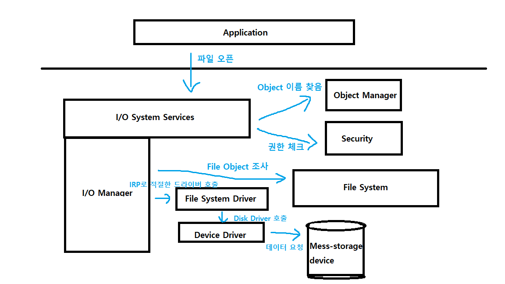

# 파일 시스템 드라이버

### 정의
* 디스크와 램 사이에서 중개하는 드라이버.
* 하드웨어에 독립적인 상위레벨 드라이버.

### 동작
1. 응용프로그램이 I/O 요청을 한다.
* I/O 관리자가 해당 요청을 받는다.
* I/O 관리자는 파일 시스템 드라이버에게 IRP(I/O request packet)를 전달한다.
* 파일 시스템 드라이버는 해당 디바이스 드라이버에 대해서 IoCallDriver() 함수를 호출하여 IRP를 전달한다.  

#### reference
드라이버 개발자를 위한 윈도우 파일 시스템
