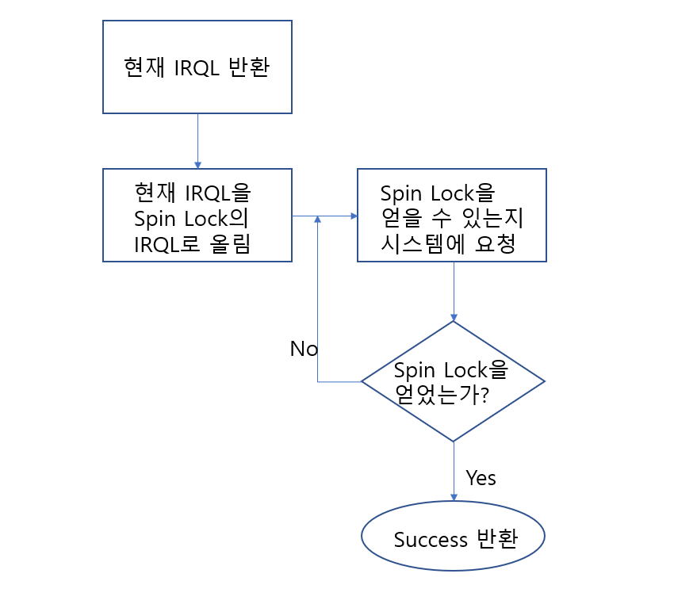

# 동기화

### 스핀록
* 가장 기본적이고 많이 사용되는 방식
* 상호배제방식(하나의 스레드가 자원을 사용하고 있으면 다른 스레드는 대기)
* 대기스레드는 spin lock을 얻을 때까지 test and set 과정을 반복

  

#### 사용규칙

* 스핀록을 얻은 스레드는 DISPATCH_LEVEL의 IRLQ를 갖는다.
* DISPATCH_LEVEL IRLQ를 갖는 스레드는(이 스레드가 속한 프로세서는) 스케쥴러가 선점할 수 없다.
* 스핀록을 사용하고 있는 드라이버는 페이징 가능한 데이터를 참조할 수 없다.
* 스핀록을 얻는 스레드는 가능한 빨리 스핀록을 해제해야 한다.

#### 스핀록 종류

* 인터럽트 스핀록 vs 익스큐티브 스핀록
* 익스큐티브 스핀록은 DISPATCH_LEVEL 이하의 스레드에서 획득한다.
* 따라서 파일 시스템 필터 드라이버 같은 하이 레벨 드라이버 개발시 사용된다.
* 해당 드라이버는 익스큐티브 스핀록을 페이징 불가능한 영역에 할당해야 한다.
* 초기화는 KeInitializeSpinLock(), 획득은 KeAcquireSpinLock(), 해제는 KeReleaseSpinLock()을 호출한다.
