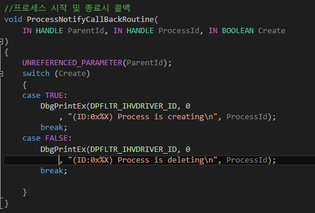
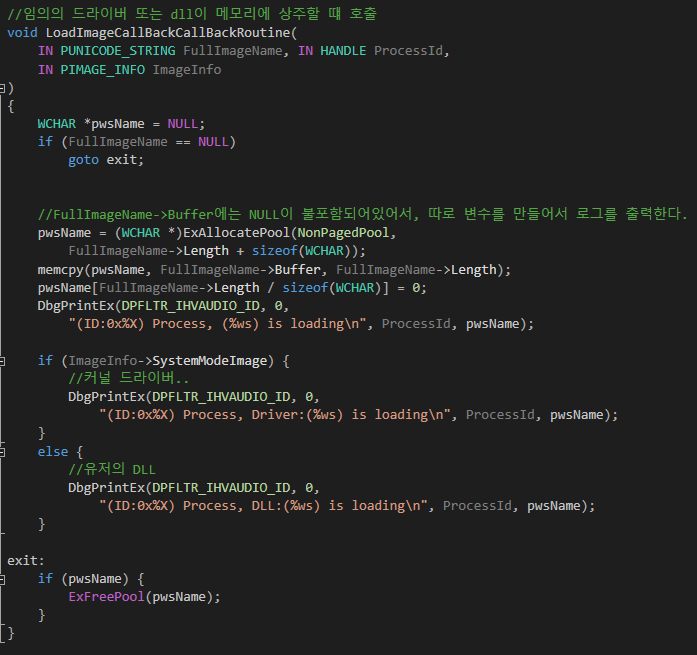
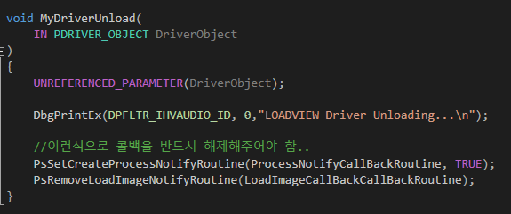
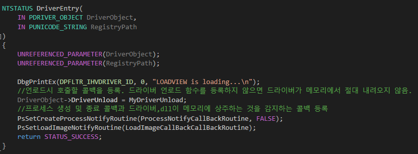

# 루트킷

* 운영체제는 커널을 조작할 수 있는 함수를 제공

### 프로세스 실행 및 종료

#### PsSetCreateProcessNotifyRoutine()
* 새로운 프로세스 실행 및 종료시 운영체제가 커널 드라이버 루틴을 호출한다.


* 첫번째 인자 : 콜백함수
* 두번째 인자 : FALSE : 루틴 등록, TRUE : 루틴 해제
```
//콜백함수 원형
VOID (*PCREATE_PROCESS_NOTIFY_ROUTINE)(
    IN HANDLE ParentId,
    IN HANDLE ProcessId,
    IN BOOLEAN Create
    )
```
* 첫번째 인자 : 부모 프로세스아이디
* 두번째 인자 : 자신 프로세스 아이디
* 세번째 인자 : 생성되는지(TRUE) 종료되는지(FALSE)


#### PsSetLoadImageNotifyRoutine()

* 다른 드라이버 또는 동적라이브러리가 메모리에 상주할 때마다 운영체제가 커널 드라이버의 루틴을 호출

```
//콜백 원형
void PloadImageNotifyRoutine(
  PUNICODE_STRING FullImageName,
  HANDLE ProcessId,
  PIMAGE_INFO ImageInfo
)
```


#### PsRemoveLoadImageNotifyRoutine()
* 위 함수와 반대되는 개념.

### 예제 코드
* 예제는 프로세스가 로드될 때 같이 로드되는 dll이나 드라이버를 탐색합니다.

#### 프로세스 시작 및 종료시 콜백

  

```
//프로세스 시작 및 종료시 콜백
void ProcessNotifyCallBackRoutine(
	IN HANDLE ParentId, IN HANDLE ProcessId, IN BOOLEAN Create
)
{
	UNREFERENCED_PARAMETER(ParentId);
	switch (Create)
	{
	case TRUE:
		DbgPrintEx(DPFLTR_IHVDRIVER_ID, 0, "(ID:0x%X) Process is creating\n", ProcessId);
		break;
	case FALSE:
		DbgPrintEx(DPFLTR_IHVDRIVER_ID, 0, "(ID:0x%X) Process is deleting\n", ProcessId);
		break;

	}
}
```

#### dll이나 드라이버 상주시 콜백

  

```
//임의의 드라이버 또는 dll이 메모리에 상주할 떄 호출
void LoadImageCallBackCallBackRoutine(
	IN PUNICODE_STRING FullImageName, IN HANDLE ProcessId,
	IN PIMAGE_INFO ImageInfo
)
{
	WCHAR *pwsName = NULL;
	if (FullImageName == NULL)
		goto exit;


	//FullImageName->Buffer에는 NULL이 불포함되어있어서, 따로 변수를 만들어서 로그를 출력한다.
	pwsName = (WCHAR *)ExAllocatePool(NonPagedPool,
		FullImageName->Length + sizeof(WCHAR));
	memcpy(pwsName, FullImageName->Buffer, FullImageName->Length);
	pwsName[FullImageName->Length / sizeof(WCHAR)] = 0;
	DbgPrintEx(DPFLTR_IHVAUDIO_ID, 0,
		"(ID:0x%X) Process, (%ws) is loading\n", ProcessId, pwsName);

	if (ImageInfo->SystemModeImage) {
		//커널 드라이버
		DbgPrintEx(DPFLTR_IHVAUDIO_ID, 0,
			"(ID:0x%X) Process, Driver:(%ws) is loading\n", ProcessId, pwsName);
	}
	else {
		//유저의 DLL
		DbgPrintEx(DPFLTR_IHVAUDIO_ID, 0,
			"(ID:0x%X) Process, DLL:(%ws) is loading\n", ProcessId, pwsName);
	}

exit:
	if (pwsName) {
		ExFreePool(pwsName);
	}
}
```

#### 언로드시 콜백
  

```
void MyDriverUnload(
	IN PDRIVER_OBJECT DriverObject
)
{
	UNREFERENCED_PARAMETER(DriverObject);

	DbgPrintEx(DPFLTR_IHVAUDIO_ID, 0,"LOADVIEW Driver Unloading...\n");

	//이런식으로 콜백을 반드시 해제해주어야 함..
	PsSetCreateProcessNotifyRoutine(ProcessNotifyCallBackRoutine, TRUE);
	PsRemoveLoadImageNotifyRoutine(LoadImageCallBackCallBackRoutine);
}
```

#### 드라이버 엔트리

  

```
NTSTATUS DriverEntry(
	IN PDRIVER_OBJECT DriverObject,
	IN PUNICODE_STRING RegistryPath
)
{
	UNREFERENCED_PARAMETER(DriverObject);
	UNREFERENCED_PARAMETER(RegistryPath);

	DbgPrintEx(DPFLTR_IHVDRIVER_ID, 0, "LOADVIEW is loading...\n");
	//언로드시 호출할 콜백을 등록. 드라이버 언로드 함수를 등록하지 않으면 드라이버가 메모리에서 절대 내려오지 않음.
	DriverObject->DriverUnload = MyDriverUnload;
	//프로세스 생성 및 종료 콜백과 드라이버,dll이 메모리에 상주하는 것을 감지하는 콜백 등록
	PsSetCreateProcessNotifyRoutine(ProcessNotifyCallBackRoutine, FALSE);
	PsSetLoadImageNotifyRoutine(LoadImageCallBackCallBackRoutine);
	return STATUS_SUCCESS;
}
```

#### reference
하제소프트 https://www.youtube.com/channel/UC7Ek4hbKRdWT1idaZLz-F_Q
