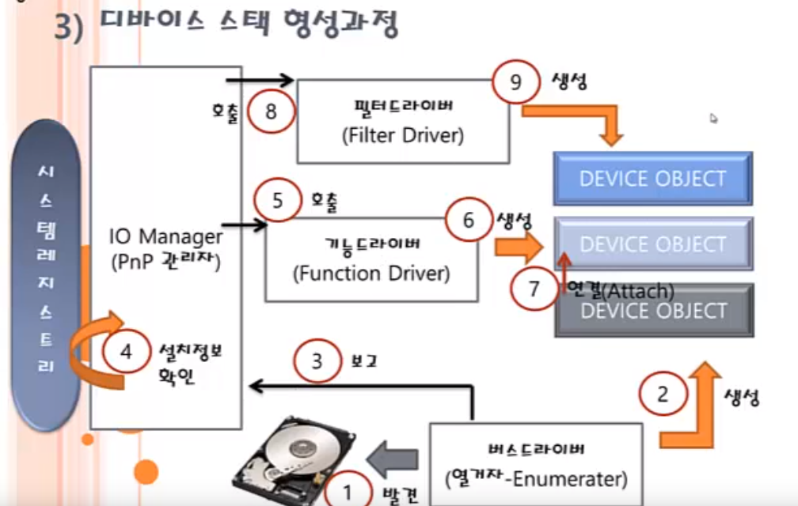
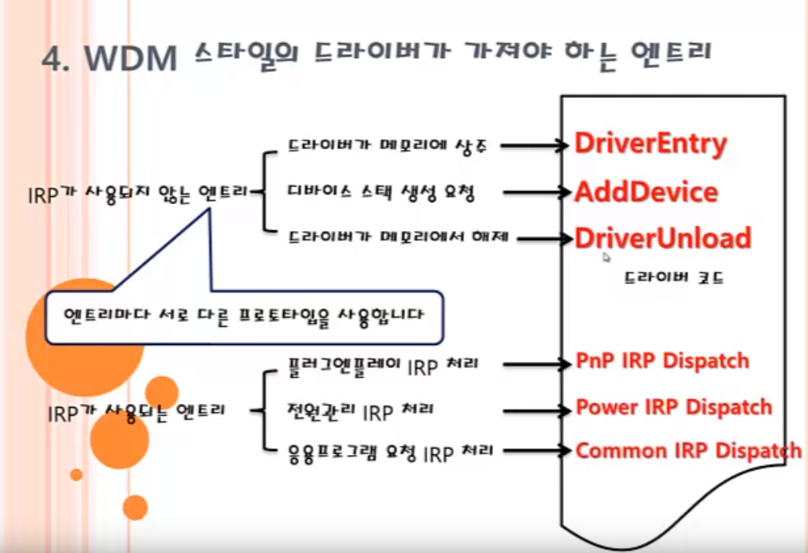
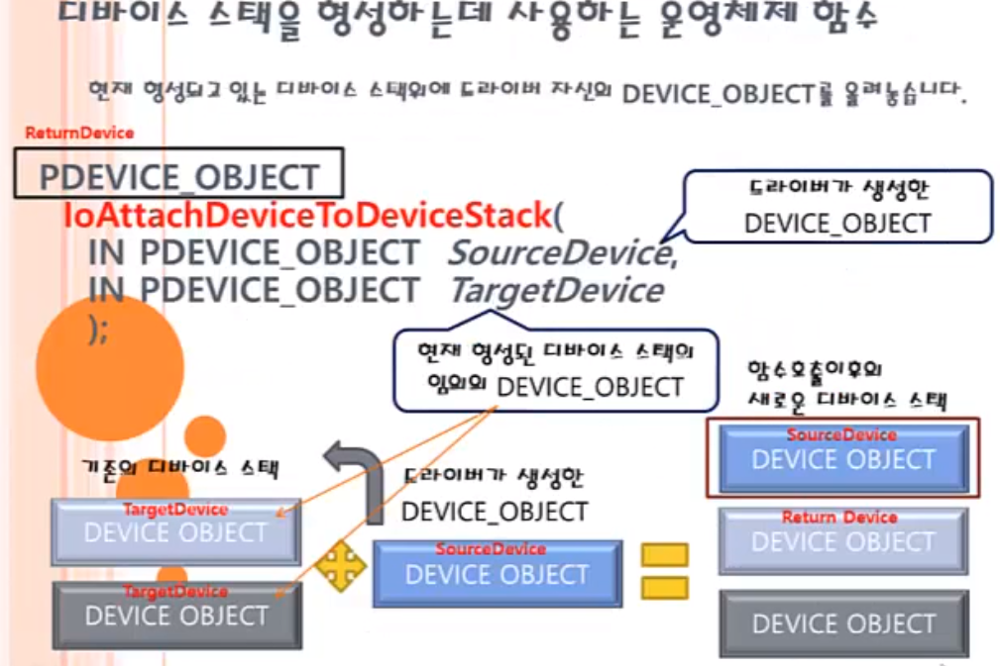

# WDM 스타일 드라이버

* WDM 스타일 : 디바이스 스택 기반으로 동작하는 드라이버
* NT Legacy 스타일 : 커널 레벨에서 동작하는 코드를 개발자가 가지는 목적을 갖는 드라이버
* 헬로우월드, 루트킷 모두 NT Legacy 스타일 드라이버이다.

### WDM, WDF 드라이버
* 주로 하드웨어 드라이버에 접근하기 위해 작성
* 레거시 드라이버의 기능도 구현할 수 있음
* 응용프로그램은 심볼릭 링크 이름을 사용하여 디바이스 스택의 오브젝트를 선택한다.
* 심볼릭 링크 이름은 CreateFile()의 첫 번째 인자로 명시하며, 디바이스 스택의 최상위 오브젝트에 붙여진다.
* CreateFile()를 호출하면, 내부적으로 IRP를 전달한다.

### WDM과 WDF 차이
* WDM : 디바이스 스택 기반 드라이버
* WDF : WDM을 위한 프레임워크를 제공

### WDF의 분류
* KDMF : 커널 레벨 드라이버를 위해 제공되는 WDF 프레임워크
* UMDF : 사용자레벨 드라이버를 위해 제공되는 WDF 프레임워크
* UMDF는 USB 같은 특별한 버스를 위해 제공. 물론 커널 코드도 존재
* UDMF는 dll 형태로 로드되기 때문에 Driver Host Process가 생성되어 그 공간 안에서 실행된다.

### DRIVER_OBJECT VS DEVICE_OBEJCT
* DRIVER_OBJECT는 드라이버를 상징하는 자료구조
* DEVICE_OBEJCT는 드라이버가 관여하는 디바이스를 상징하는 자료구조
* 하나의 드라이버 오브젝트는 여러 개의 디바이스 오브젝트를 가질 수 있다.

### 디바이스 오브젝트

  
* AttachedDevice : 같은 디바이스 스택에서 다른 드라이버에 대한 포인터
* NextDevice : 같은 드라이버의 다른 디바이스 오브젝트

### 디바이스 스택 형성 과정

* 열거자(버스 드라이버)가 하드웨어를 발견(실제든 가상으로 발견된 것처럼 하든)
* 버스 드라이버는 디바이스 오브젝트 생성
* 버스 드라이버는 디바이스 오브젝트를 PnP관리자(I/O 관리자)에게 보고
* PnP관리자는 해당 디바이스 오브젝트를 갖고 시스템 레지스트리에서 설치 정보 확인
* I/O 매니저는 펑션 드라이버(Function Driver)를 호출
* 펑션 드라이버는 이 하드웨어에 관여하겠다는 의도로, 다른 디바이스 오브젝트를 생성
* 스택 형성을 위해 새롭게 만든 디바이스 오브젝트에 Attach
* 만약 필터드라이버가 관여되어 있다면, I/O 매니저는 필터 드라이버를 호출
* 필터 드라이버는 자신의 디바이스 오브젝트를 생성 및 Attach

  

### WDM 스타일의 드라이버가 가져야 하는 엔트리
* IRP가 사용되는지 여부에 따라 나뉨
* IRP가 사용되지 않는 경우는 엔트리마다 서로 다른 프로토타입을 사용할 경우
* IRP가 사용되는 경우는 엔트리가 같은 프로토타입을 가질 경우

#### IRP가 사용되지 않는 엔트리
* 드라이버가 메모리에 상주 : DriverEntry
* 디바이스 스택 생성 요청 : AddDevice
* 드라이버가 메모리에서 해제 : DriverUnload

#### IRP가 사용되는 엔트리
* 플러그앤플레이 IRP 처리 : PnP IRP Dispatch
* 전원관리 IRP 처리 : Power IRP Dispatch
* 응용프로그램 요청 IRP 처리 : Common IRP Dispatch

  

#### DriverEntry()
* 코드에 반드시 포함되어야 하는 함수
* 초기화 작업 진행

#### AddDevice
* AddDevice는 함수포인터로서, 우리가 작성한 콜백함수를 등록한다.
* 콜백에는 디바이스오브젝트를 생성하고, Attach하는 코드가 들어가야 한다.

#### AddDevice 코드

```
NTSTATUS MyAddDevice(
    // 드라이버 오브젝트 자신
    IN PDRIVER_OBJECT DriverObject
    //버스 드라이버가 생성한 디바이스 오브젝트
    IN PDEVICE_OBJECT PhysicalDeviceObject
    )
    {
        return STATUS_SUCCESS;
    }
```

* 디바이스 오브젝트 생성

```
NTSTATUS IoCreateDevice(
    IN PDRIVER_OBJECT DriverObject //드라이버 자신을 나타내는 드라이버 오브젝트
    IN ULONG DeviceExtentionSize, // 드라이버가 Private하게 사용할 공간의 크기 명시
    IN PUNICODE_STRING DeviceName,
    IN DEVICE_TYPE DeviceType,
    IN ULONG DeviceCharacteristics,
    IN BOOLEAN Exclusive
    OUT PDEVICE_OBJECT *DeviceObject //생성된 디바이스 오브젝트
    );

```

* 디바이스 오브젝트는 디바이스 익스텐션을 갖는다.
* 이곳에 자신이 사용할 정보를 저장해놓는다.

* 디바이스 스택 형성

```
PDEVICE_OBJECT IoAttachDeviceToDeviceStack(
        IN PDEVICE_OBJECT SourceDevice, //드라이버가 생성한 디바이스 오브젝트
        IN PDEVICE_OBJECT TargetDevice // 현재 형성된 디바이스 스택의 임의의 오브젝트
    )
```

  


#### reference
하제소프트 https://www.youtube.com/channel/UC7Ek4hbKRdWT1idaZLz-F_Q
