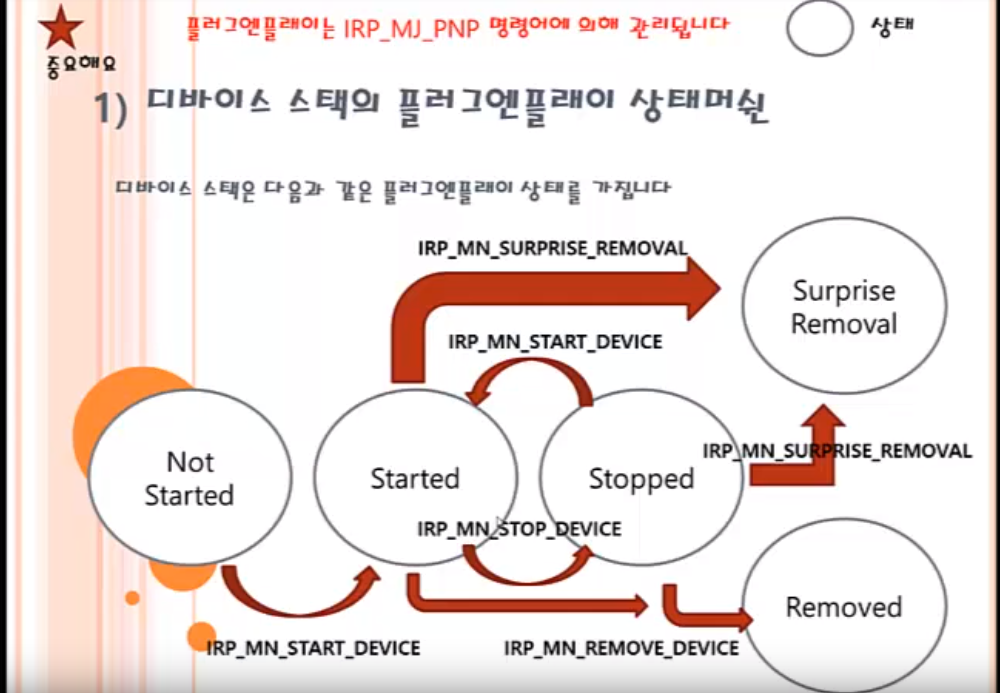

# WDM 개념 정리
* I/O 관리자는 디바이스 드라이버와 응용프로그램 간의 통신 채널을 파일 입출력 방식을 사용하도록 지원
* 파일 입출력 함수는 I/O 관리자에 의해 IRP로 변환되어 디바이스 스택으로 전송
* TOP 디바이스 오브젝트(즉 이 오브젝트를 생성한 드라이버)가 가장 먼저 IRP를 받는다.
* IRP는 여러 개의 I/O 스택엔트리를 갖는다. 이 엔트리는 드라이버가 수행해야 하는 명령어와 파라미터가 보관된다.

* IoCallDriver()는 IRP의 소유권을 다음 드라이버에게 전달
* IoCompleteRequest()는 IRP의 소유권을 이전 소유권자(드라이버 또는 I/O 관리자)에게 되돌려주도록(즉 IRP 종료 과정) 요청
* IRP를 다루는 세 가지 전략
* 1) 종료처리 요청(IoCompleteRequest()) 2) 다른 드라이버에게 전달 (IoCallDriver()) 3) 처리 지연(IoMarkIrpPending)
* IRP를 받는 드라이버의 엔트리를 IRP 디스패치루틴이라고 한다. 모든 종류의 IRP는 동일한 프로토타입을 갖는 엔트리에서 처리

```
NTSTAUS xxxxIRPDispatch(PDEVICE_OBJECT DeviceObject, PIRP Irp);
```

* I/O 관리자는 디바이스 스택의 플러그앤플레이 상태 머신을 관리한다.디바이스 스택이 생성되어 운용되고, 정지되고 해제되는 모든 과정을 관리하고 모니터링한다.. 드라이버는 이와 같은 내용을 플러그앤플레이 IRP(IRP_MJ_PNP)를 통해 지원받는다.

* Not Started - Started - Stopped - (Surprise Removal or Removed)

  

* IRP_MN_REMOVE_DEVICE 명령은 반드시 처리해야 함
