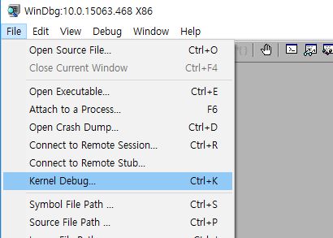

# 커널 디버거

### 덤프파일 만들기
* PS2 키보드 : HKEY_LOCAL_MACHINE\system\CurrentControlSet\Services\\i8042prt\Parameters
* USB 키보드 : HKEY_LOCAL_MACHINE\system\CurrentControlSet\Services\\kbdhid\Parameters
* CrashOnCtrlScroll = REG_DWORD 0x01
* 덤프파일 만들기 : 오른쪽 Ctrl 누른채로, SCROLL LOCK을 따닥 누르면 된다.

### 타깃 피씨와 연결하기
* 부팅옵션을 바꿔야 함. 즉 디버그가 가능한 환경으로 바꿔야 함.
* 이는 bcdedit /debug on 명령으로 가능
* 여기서는 이더넷을 이용하여 디버거와 타겟 피씨를 연결한다.
* 타깃 피씨의 관리자 커맨드 프롬프트에서 아래와 같은 명령을 작성한다.

```
bcdedit /dbgsettings net hostip:[ip] port:[port] key:[key]
```
* ip는 디버거가 설치된 피씨의 아이피이며, 포트는 적당한 값으로 지정한다.
* 키값은 반드시 .을 포함시켜 만든다. 예를 들어, s.o.n.g 같은 식이다.

  

* 위 사진대로 클릭하면 NET 항목에서 디버깅을 진행할 수 있다.

### 심볼 등록하기

  
* 심볼을 저장할 경로를 적고, 명령을 통해 자동으로 버전 업데이트를 할 URL을 등록한다.

```
E:\SYM;srv*E:\SYM\WEBSYM*http://msdl.microsoft.com/download/symbols
```


#### reference
하제소프트 https://www.youtube.com/channel/UC7Ek4hbKRdWT1idaZLz-F_Q
