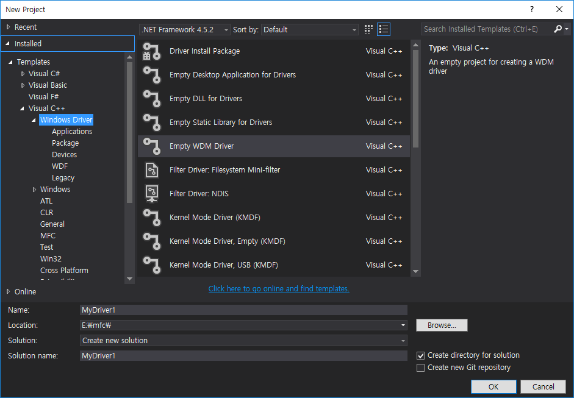
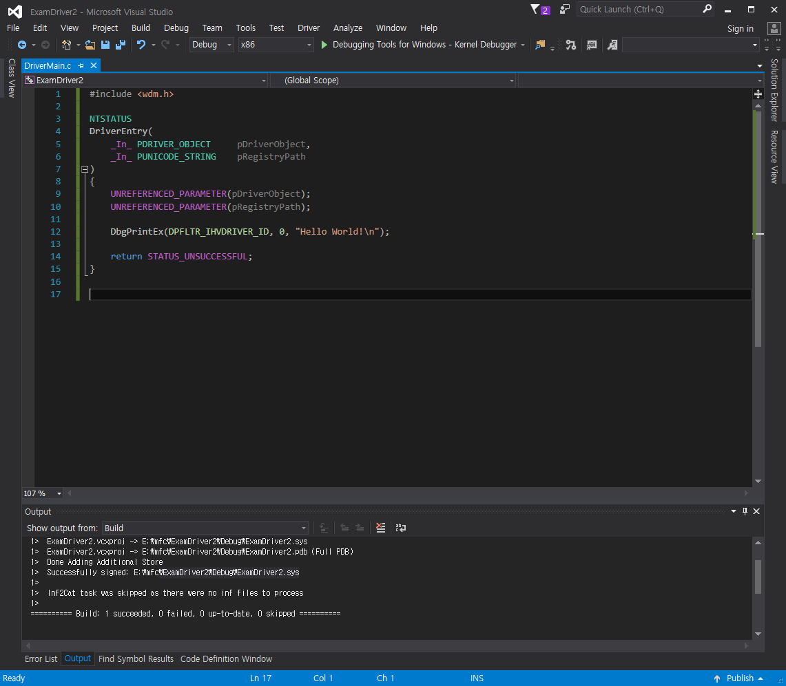
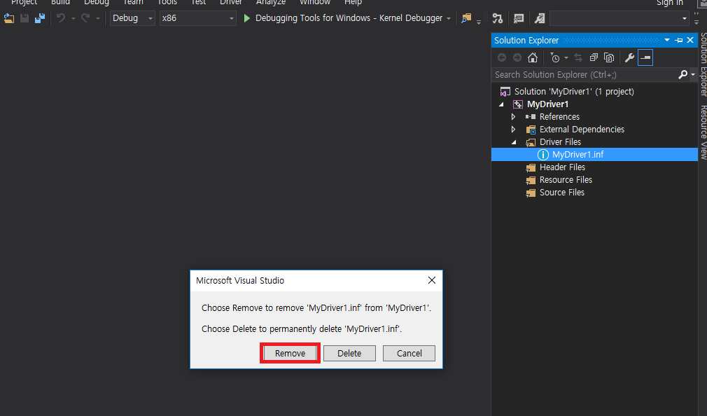
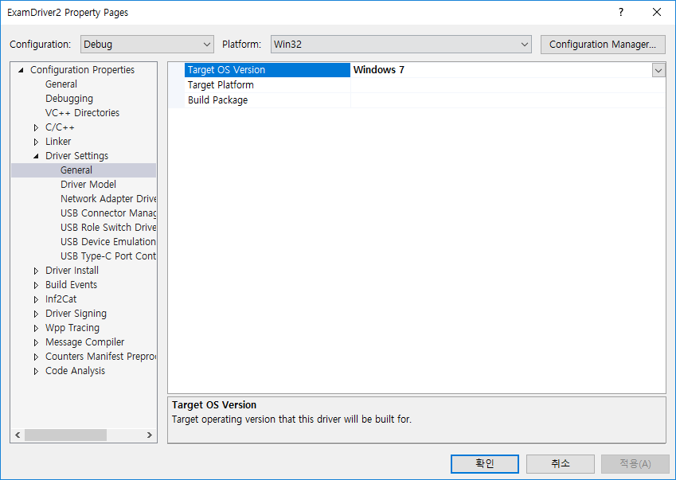
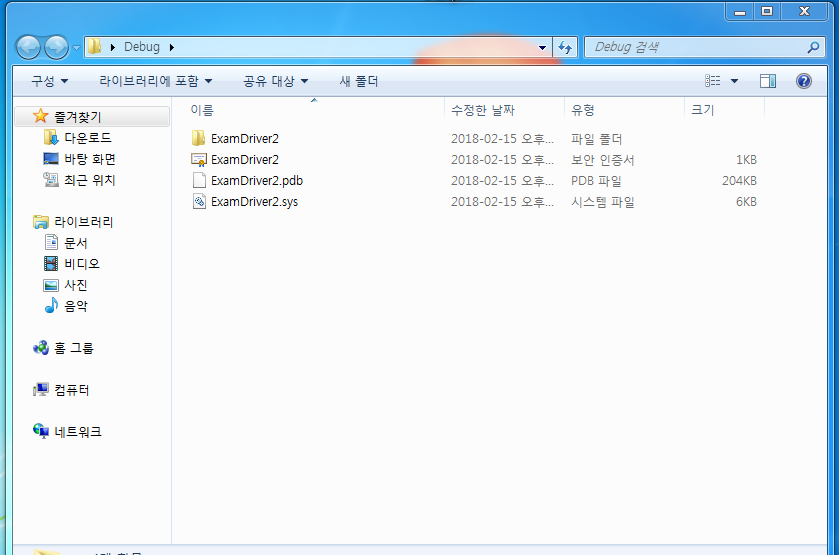
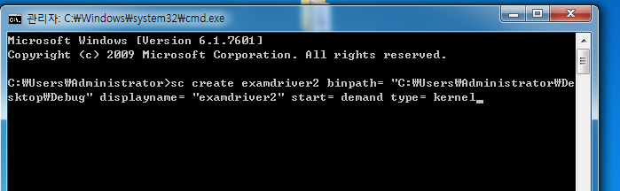
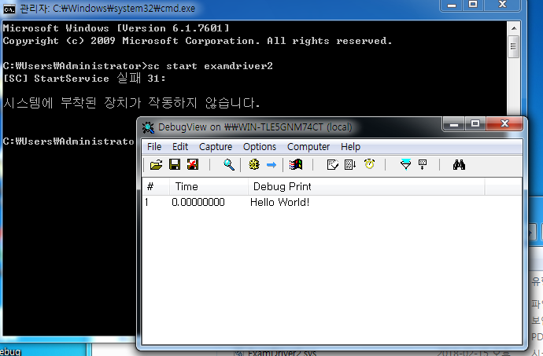
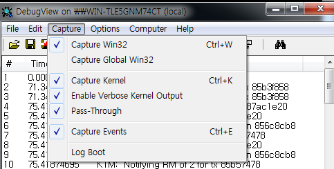

# 드라이버 프로그래밍- Hello World!

### 개발환경
* host computer : Windows 10 64 bits, VS2015, WDK 10
* Target Computer : Windows 7 32 bits

### Hello World!

#### Step 1
* wdk download    
 https://developer.microsoft.com/en-us/windows/hardware/download-kits-windows-hardware-development

* 링크가 존재하지 않는다면 wdk10으로 검색하자.

#### Step 2

  

  

```
#include <wdm.h>

NTSTATUS
DriverEntry(
	_In_ PDRIVER_OBJECT		pDriverObject,
	_In_ PUNICODE_STRING	pRegistryPath
)
{
	UNREFERENCED_PARAMETER(pDriverObject);
	UNREFERENCED_PARAMETER(pRegistryPath);

	DbgPrintEx(DPFLTR_IHVDRIVER_ID, 0, "Hello World!\n");

	return STATUS_UNSUCCESSFUL;
}
```

  

* 빌드 설정을 타겟 컴퓨터에 맞는 환경으로 변경한다.  
* 이 설정을 잘못하면 블루스크린이 뜬다!  

  


* Target Computer로 옮기기  

  

  

```
sc create examdriver2 binpath= "경로" displayname= "examdriver2" start= demand type= kernel
```
* 경로부분에 sys파일이 있는 경로를 적는다.
* 띄어쓰기를 유의하면서 타이핑한다.

  

```
sc start examdriver2
```

* DebugView를 킨 후에 위의 명령을 실행한다.
* 또한 DebugView는 아래와 같이 설정을 미리 해둔다.

  
