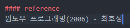

# 이미지 에디트 컨트롤

  

* 에딧 컨트롤 배경을 이미지로 채우는 예제입니다.
* 간단하게 OnEraseBkgnd()에서 이미지를 그려주면 됩니다.
* 혹시 동작이 안 된다면, OnPaint()를 추가해주면 됩니다.

```
BOOL CImageEdit::OnEraseBkgnd(CDC* pDC)
{
	CRect r;
	GetClientRect(&r);
	CDC dcMem;
	BITMAP bmpInfo;
	CBitmap bmp;
	bmp.LoadBitmap(IDB_BITMAP1);
	bmp.GetBitmap(&bmpInfo);

	CBrush brush;
	brush.CreatePatternBrush(&bmp);
	pDC->FillRect(&r, &brush);
	return TRUE;
}


HBRUSH CImageEdit::CtlColor(CDC* pDC, UINT nCtlColor)
{
	// TODO:  Change any attributes of the DC here
	pDC->SetBkMode(TRANSPARENT);
	// TODO:  Return a non-NULL brush if the parent's handler should not be called
	return m_hBkBrush;
}


void CImageEdit::OnEnUpdate()
{
	// TODO:  If this is a RICHEDIT control, the control will not
	// send this notification unless you override the CEdit::OnInitDialog()
	// function to send the EM_SETEVENTMASK message to the control
	// with the ENM_UPDATE flag ORed into the lParam mask.

	// TODO:  Add your control notification handler code here
	//RedrawWindow();
}

void CImageEdit::OnUpdate()
{
	RedrawWindow();
}

void CImageEdit::PreSubclassWindow()
{
	DWORD dwStyle = GetStyle();
	::SetWindowLong(GetSafeHwnd(), GWL_STYLE, dwStyle | SS_NOTIFY);


	CEdit::PreSubclassWindow();
}


void CImageEdit::OnPaint()
{
	CPaintDC dc(this); // device context for painting
					   // TODO: Add your message handler code here
					   // Do not call CEdit::OnPaint() for painting messages
}

```

  
