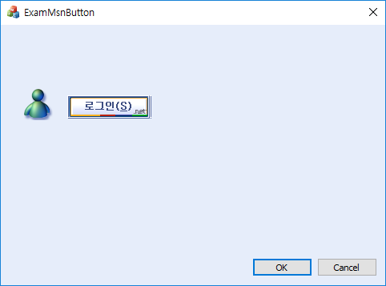

# 오너드로우 버튼

  

* 연속된 비트맵을 갖고, 컨트롤 크기만큼 잘라서 사용한다.
* 비트맵을 DC에 넣는 것은 Bitblt()로 하면 된다.


```
void CExamMsnButtonDlg::OnDrawItem(int nIDCtl, LPDRAWITEMSTRUCT lpDrawItemStruct)
{
	if (nIDCtl == IDC_BUTTON1) {
		CDC *pDC = CDC::FromHandle(lpDrawItemStruct->hDC);
		CDC MemDC;
		MemDC.CreateCompatibleDC(pDC);
		BITMAP bmpInfo;
		CBitmap bmp;
		bmp.LoadBitmapW(IDB_BITMAP1);
		bmp.GetBitmap(&bmpInfo);
		CBitmap *p_old_bmp = MemDC.SelectObject(&bmp);
		if (lpDrawItemStruct->itemState & ODS_SELECTED) {
			pDC->BitBlt(0, 0, bmpInfo.bmWidth, bmpInfo.bmHeight, &MemDC
				, 206, 0, SRCCOPY);
		}
		else {
			pDC->BitBlt(0, 0, bmpInfo.bmWidth, bmpInfo.bmHeight, &MemDC, 0, 0, SRCCOPY);
		}

		MemDC.SelectObject(p_old_bmp);
	}


	//CDialogEx::OnDrawItem(nIDCtl, lpDrawItemStruct);
}
```

  
