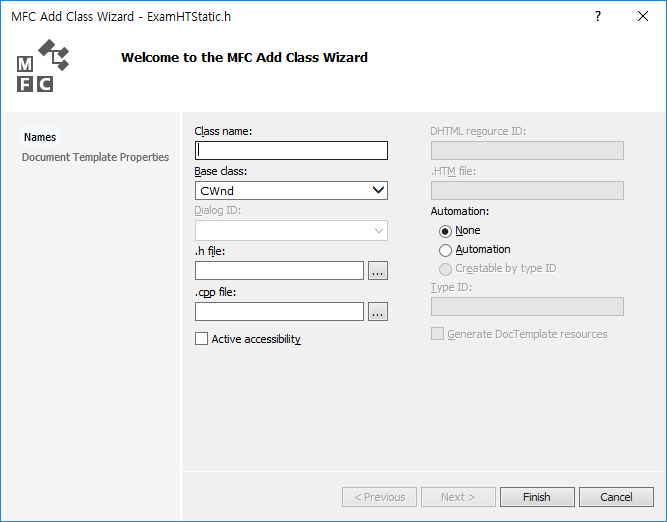

# 스태틱 컨트롤 서브클래싱 1

* 마우스가 스태틱 컨트롤 위에 있을 때  


* 마우스가 스태틱 컨트롤 밖에 있을 때  


* 클릭하면 사이트 연결.

### 서브클래싱 기본 작업
* 클래스 위저드로 하위 클래스 생성  



* 메인 클래스에 인클루드하고, subclassDlgItem() 호출  
* 이때 자식 클래스가 해당 함수를 호출하고, 서브클래싱할 컨트롤은 ID로 연결.

  
  
* 서브클래스 컨트롤이 메시지를 받으려면 윈도우 속성을 아래와 같이 고쳐야 한다.  


  

```
void CHTStatic::PreSubclassWindow()
{
	DWORD dwStyle = GetStyle();
	::SetWindowLong(GetSafeHwnd(), GWL_STYLE, dwStyle | SS_NOTIFY);
	GetWindowRect(&m_rect);
	ScreenToClient(&m_rect);

	CStatic::PreSubclassWindow();
}
```  

### 마우스가 컨트롤 위에 있을 때 색깔 바꾸기

* WM_MOUSELEAVE, WM_MOUSEHOVER 같은 경우 메시지 처리기를 추가한다고 해서 바로 처리되는 게 아니기 때문에 WM_MOUSEMOVE를 통해 구현하는 것도 괜찮은 것 같다.  

#### WM_MOUSEMOVE로 MOUSELEVE와 MOUSEHOVER 구현하기  

* SetCapture()를 통해 윈도우 밖에서도 마우스 메시지를 얻어낼 수 있다.
* 마우스 점유를 최소화하기 위해 플래그를 추가하여 SetCapture()와 ReleaseCapture()를 반복한다.
* 해당 윈도우에 있는가를 체크하는 것은 PtInRect()로 하면 된다.
* 또한 깜빡임을 최소화하기 위해 마우스가 들어오고 나갈 때만 RedrawWindow()를 호출한다.  
* SetCapture() 설명 : http://www.tipssoft.com/bulletin/board.php?bo_table=FAQ&wr_id=101  

  
```
void CHTStatic::OnMouseMove(UINT nFlags, CPoint point)
{
	if (m_bMouseOn) {
		if (!::PtInRect(&m_rect, point)) {
			ReleaseCapture();
			m_color = RGB(0, 0, 0);
			m_bMouseOn = FALSE;
			//깜빡임 최소화.
			RedrawWindow();
		}
	}
	else {
		m_bMouseOn = TRUE;
		SetCapture();
		m_color = RGB(255, 0, 0);
		//깜빡임 최소화.
		RedrawWindow();
	}

	CStatic::OnMouseMove(nFlags, point);
}
```

#### 색깔바꾸기
* WM_CTLCOLOR말고 =WM_CTLCOLOR 를 선택해야 한다.
* 리턴값으로 브러쉬를 줘야 한다. 이 브러쉬는 컨트롤에 백그라운드를 칠하는 데 사용된다.

  

```
HBRUSH CHTStatic::CtlColor(CDC* pDC, UINT nCtlColor)
{
	// TODO:  Change any attributes of the DC here

	if (CTLCOLOR_STATIC == nCtlColor) {
		pDC->SetBkMode(TRANSPARENT);
		pDC->SetTextColor(m_color);
	}
	// TODO:  Return a non-NULL brush if the parent's handler should not be called
	return m_brush;
}

```

#### 커서바꾸기
* 시스템 값인 IDC_HAND 커서 리소스를 로드한다.
* m_hCursor를 로드하는 내용은 생성자에서 해도 괜찮다.
* 부모 함수를 호출하면 적용이 되지 않기 때문에 주의한다.

  
```
BOOL CHTStatic::OnSetCursor(CWnd* pWnd, UINT nHitTest, UINT message)
{
	if(m_hCursor == NULL) m_hCursor = LoadCursor(NULL, IDC_HAND);
	if (m_hCursor) {
		::SetCursor(m_hCursor);
		return TRUE;
	}

	return FALSE;
	//return CStatic::OnSetCursor(pWnd, nHitTest, message);
}
```

#### 버튼 클릭시 사이트 연결
* ShellExecute()로 구현
* 다른 윈도우가 켜지면, 포커스를 잃기 때문에 ReleaseCapture()를 미리 해준다.

  
```
void CHTStatic::OnLButtonDown(UINT nFlags, CPoint point)
{
	CString text;
	GetWindowText(text);
	::ShellExecute(NULL, _T("OPEN"), text, NULL, NULL, SW_SHOW);
	//다른 창 실행시 포커스를 잃기 때문에, ReleaseCapture()를 해줘야 함.
	ReleaseCapture();
	m_bMouseOn = FALSE;

	CStatic::OnLButtonDown(nFlags, point);
}

```


  
