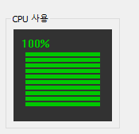
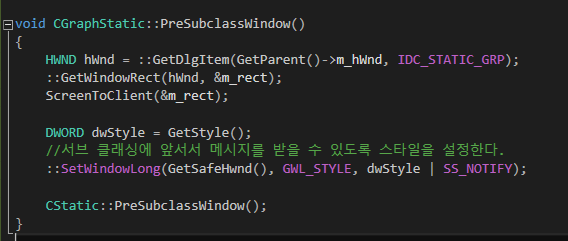
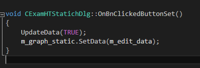
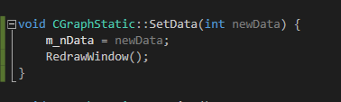
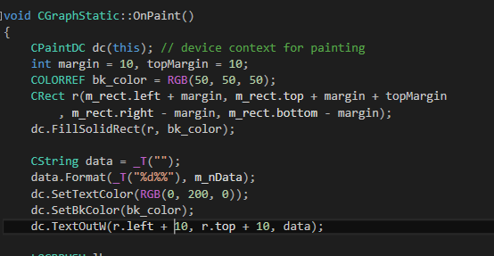
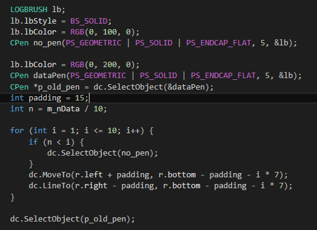

# 스태틱 컨트롤 서브클래싱 2

  

* OnPaint()에서 직접 그리는 예제입니다.
* 1과 마찬가지로 클래스 위저드에서 CStatic을 상속받은 클래스를 생성하고, 작업합니다.
* 그리는 코드는 여러 가지 방식으로 될 수 있으니, 저의 방식을 참고용으로 봐주시면 됩니다.

#### Group Box의 RECT 값 얻기

  

```
void CGraphStatic::PreSubclassWindow()
{
	HWND hWnd = ::GetDlgItem(GetParent()->m_hWnd, IDC_STATIC_GRP);
	::GetWindowRect(hWnd, &m_rect);
	ScreenToClient(&m_rect);

	DWORD dwStyle = GetStyle();
	//서브 클래싱에 앞서서 메시지를 받을 수 있도록 스타일을 설정한다.
	::SetWindowLong(GetSafeHwnd(), GWL_STYLE, dwStyle | SS_NOTIFY);

	CStatic::PreSubclassWindow();
}
```

#### 옵저버 패턴

  
```
void CExamHTStatichDlg::OnBnClickedButtonSet()
{
	UpdateData(TRUE);
	m_graph_static.SetData(m_edit_data);
}

```
  
```
void CGraphStatic::SetData(int newData) {
	m_nData = newData;
	RedrawWindow();
}

```

#### OnPaint()

* 그룹박스 Rect를 기준으로 배경 영역을 설정하고, 회색으로 그린다.
* 텍스트는 적절한 위치에 배치한다.  

  

* 펜을 적절하게 생성하고, moveTo(), LineTo()로 그린다.  

  


```
void CGraphStatic::OnPaint()
{
	CPaintDC dc(this); // device context for painting
	int margin = 10, topMargin = 10;
	COLORREF bk_color = RGB(50, 50, 50);
	CRect r(m_rect.left + margin, m_rect.top + margin + topMargin
		, m_rect.right - margin, m_rect.bottom - margin);
	dc.FillSolidRect(r, bk_color);

	CString data = _T("");
	data.Format(_T("%d%%"), m_nData);
	dc.SetTextColor(RGB(0, 200, 0));
	dc.SetBkColor(bk_color);
	dc.TextOutW(r.left + 10, r.top + 10, data);

	LOGBRUSH lb;
	lb.lbStyle = BS_SOLID;
	lb.lbColor = RGB(0, 100, 0);
	CPen no_pen(PS_GEOMETRIC | PS_SOLID | PS_ENDCAP_FLAT, 5, &lb);

	lb.lbColor = RGB(0, 200, 0);
	CPen dataPen(PS_GEOMETRIC | PS_SOLID | PS_ENDCAP_FLAT, 5, &lb);
	CPen *p_old_pen = dc.SelectObject(&dataPen);
	int padding = 15;
	int n = m_nData / 10;

	for (int i = 1; i <= 10; i++) {
		if (n < i) {
			dc.SelectObject(no_pen);
		}
		dc.MoveTo(r.left + padding, r.bottom - padding - i * 7);
		dc.LineTo(r.right - padding, r.bottom - padding - i * 7);
	}

	dc.SelectObject(p_old_pen);
}

```

### 팁

#### 에딧컨트롤

* 에딧컨트롤의 컨트롤 변수를 지정할 때 CString이 아니라 int로 설정할 수 있다.
* 만약 숫자가 아닌 이상한 값을 입력하면 "정수를 입력하세요"라는 예외처리도 자동으로 제공된다.

#### 엔터시 적용되는 버튼 바꾸기

* 대화상자에서 엔터를 치면 기본적으로 '확인' 버튼이 클릭되는 효과를 갖는다.
* 이것을 바꾸는 방법은 버튼의 'default button' 속성을 바꾸는 것이다.(TRUE로 바꾸면 해당 버튼이 엔터에 대한 디폴트 버튼이 된다.)

  
