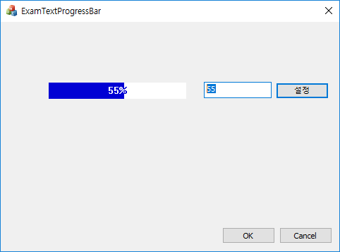

# 텍스트 프로그레스 컨트롤

  

* OnPaint()에서 직접 그린다.
* 두 개의 영역으로 나눈다.(진행부와 남은 부분)
* 각 영역을 독립적으로 생각해서 그려주면 된다.

### 코드

```
void CTextProgressCtrl::OnPaint()
{
	CPaintDC dc(this); // device context for painting
	CRect r, progress, remainder;
	CString number = _T("");
	number.Format(_T("%02d%%"), m_progress);
	GetClientRect(r);
	progress = remainder = r;
	remainder.left = progress.right = r.right * m_progress / 100;
	dc.FillSolidRect(progress, RGB(0, 0, 212));
	dc.FillSolidRect(remainder, RGB(255, 255, 255));

	CRgn rgn1, rgn2;
	rgn1.CreateRectRgn(progress.left, progress.top, progress.right, progress.bottom);
	dc.SetBkMode(TRANSPARENT);
	dc.SetTextColor(RGB(255, 255, 255));
	dc.SelectClipRgn(&rgn1);
	dc.DrawText(number, r, DT_SINGLELINE | DT_CENTER | DT_VCENTER);

	rgn2.CreateRectRgnIndirect(remainder);
	dc.SetTextColor(RGB(0, 0, 212));
	dc.SelectClipRgn(&rgn2);
	dc.DrawText(number, r, DT_SINGLELINE | DT_CENTER | DT_VCENTER);
}
```

* CreateRectRgn()이나 CreateRectRgnIndirect()이나 별 차이는 없다. 편한거 쓰면 된다.
* 영역은 Rgn으로 구현하고, SelectClipRgn()을 통해 클리핑 영역을 정하고, 거기에 그린다.
