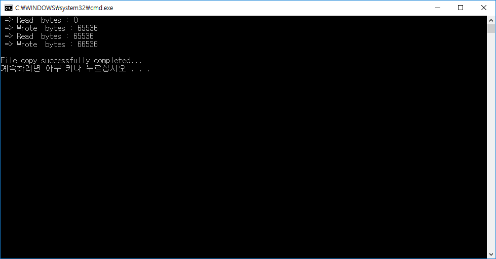

# 비동기 입출력 - APC를 이용한 통보



* APC는 콜백함수의 일종
* 비동기입출력에서 통보 콜백함수로 사용

### 경보 대기 함수
* ~Ex 함수들.
* bAlertable 속성에 있는데, 그것을 TRUE로 만들면 대기 함수로 사용
* APC를 사용하는 비동기 입출력은 반드시 이 속성을 TRUE로 해야 함.
* 반환값으로 WAIT_IO_COMPLETION. 이 값은 입출력 완료 후 APC까지 호출이 끝났을 때 반환되는 값.

```
#include "stdafx.h"
#include "windows.h"
#include "iostream"
using namespace std;

#define BUFF_SIZE	65536

struct COPY_CHUNCK : OVERLAPPED
{
	HANDLE	_hfSrc, _hfDst;
	BYTE	_arBuff[BUFF_SIZE];
	BOOL	_isRead;
	DWORD	_errCode;

	COPY_CHUNCK(HANDLE hfSrc, HANDLE hfDst)
	{
		memset(this, 0, sizeof(*this));
		_hfSrc = hfSrc, _hfDst = hfDst;
		_isRead = TRUE;
	}
};
typedef COPY_CHUNCK* PCOPY_CHUNCK;


VOID WINAPI CopyAPCProc(DWORD dwErrCode, DWORD dwTranBytes, LPOVERLAPPED pOL)
{
	PCOPY_CHUNCK pCC = (PCOPY_CHUNCK)pOL;

	if (dwErrCode != 0)
	{
		pCC->_errCode = dwErrCode;
		return;
	}

	BOOL bIsOK = FALSE;
	if (pCC->_isRead)
	{
		printf(" => Read  bytes : %d\n", pCC->Offset);
		bIsOK = WriteFileEx
		(
			pCC->_hfDst, pCC->_arBuff, dwTranBytes, pOL, CopyAPCProc
		);
		pCC->_isRead = FALSE;
	}
	else
	{
		pCC->Offset += dwTranBytes;

		printf(" => Wrote  bytes : %d\n", pCC->Offset);
		bIsOK = ReadFileEx
		(
			pCC->_hfSrc, pCC->_arBuff, BUFF_SIZE, pOL, CopyAPCProc
		);
		pCC->_isRead = TRUE;
	}
	if (!bIsOK)
	{
		dwErrCode = GetLastError();
		if (dwErrCode != ERROR_IO_PENDING)
			pCC->_errCode = dwErrCode;
	}
}

HANDLE g_hevExit;
BOOL CtrlHandler(DWORD fdwCtrlType)
{
	SetEvent(g_hevExit);
	return TRUE;
}

void _tmain(int argc, _TCHAR* argv[])
{
	if (argc < 3)
	{
		cout << "Uasge : FileCopySync SourceFile TargetFile" << endl;
		return;
	}

	SetConsoleCtrlHandler((PHANDLER_ROUTINE)CtrlHandler, TRUE);
	g_hevExit = CreateEvent(NULL, FALSE, FALSE, NULL);

	HANDLE hSrcFile = CreateFile
	(
		argv[1], GENERIC_READ, 0, NULL, OPEN_EXISTING,
		FILE_FLAG_OVERLAPPED, NULL
	);
	if (hSrcFile == INVALID_HANDLE_VALUE)
	{
		cout << argv[1] << " create failed, code : " << GetLastError() << endl;
		return;
	}

	HANDLE hDstFile = CreateFile
	(
		argv[2], GENERIC_WRITE, 0, NULL, CREATE_ALWAYS,
		FILE_FLAG_OVERLAPPED, NULL
	);
	if (hDstFile == INVALID_HANDLE_VALUE)
	{
		cout << argv[2] << " open failed, code : " << GetLastError() << endl;
		return;
	}

	COPY_CHUNCK cc(hSrcFile, hDstFile);
	DWORD dwErrCode = 0;
	BOOL bIsOK = ReadFileEx
	(
		hSrcFile, cc._arBuff, BUFF_SIZE, &cc, CopyAPCProc
	);
	if (!bIsOK)
	{
		dwErrCode = GetLastError();
		if (dwErrCode != ERROR_IO_PENDING)
		{
			cout << " ~~~ ReadFileEx failed, ErrCode : " << dwErrCode << endl;
			return;
		}
		dwErrCode = 0;
	}

	//ERROR_TIMEOUT;
	while (cc._errCode == ERROR_SUCCESS)
	{
		DWORD dwWaitRet = WaitForSingleObjectEx(g_hevExit, INFINITE, TRUE);
		if (dwWaitRet == WAIT_OBJECT_0)
			break;

		if (dwWaitRet != WAIT_IO_COMPLETION)
		{
			dwErrCode = GetLastError();
			cout << " ~~~ SleepEx failed, ErrCode : " << dwErrCode << endl;
			break;
		}
	}
	if (cc._errCode != ERROR_SUCCESS)
	{
		if (cc._errCode != ERROR_HANDLE_EOF)
			dwErrCode = cc._errCode;
	}
	CloseHandle(hSrcFile);
	CloseHandle(hDstFile);
	CloseHandle(g_hevExit);

	if (dwErrCode != ERROR_SUCCESS)
		cout << endl << "Error occurred in file copying, code=" << dwErrCode << endl;
	else
		cout << endl << "File copy successfully completed..." << endl;
}

```

#### reference

