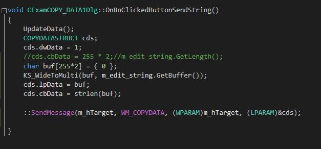
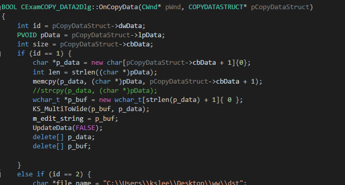

# WM_COPYDATA 메시지를 이용한 IPC

* 세션 간 데이터 전달은 보안을 이유로, 비스타 버전부터 허가되지 않는다.
* 원래 메시지는 포인터를 전달하는 의미가 없지만, WM_COPYDATA는 포인터가 가리키는 값까지 전달해주기 때문에 간단한 데이터를 전달할 때 유용해보인다.
* (...그렇지만 생각보다 까다로운 놈이다 ㅡㅡ;;)


### 사용법  

  

```
void CExamCOPY_DATA1Dlg::OnBnClickedButtonSendString()
{
	UpdateData();
	COPYDATASTRUCT cds;
	cds.dwData = 1;
	//cds.cbData = 255 * 2;//m_edit_string.GetLength();
	char buf[255*2] = { 0 };
	KS_WideToMulti(buf, m_edit_string.GetBuffer());
	cds.lpData = buf;
	cds.cbData = strlen(buf);

	::SendMessage(m_hTarget, WM_COPYDATA, (WPARAM)m_hTarget, (LPARAM)&cds);

}
```

* WM_COPYDATA메시지를 통해 타깃 윈도우 핸들과 COPYDATASTRUCT 구조체를 전달한다.
* COPYDATASTRUCT에는 세 가지 필드가 있다.
* 식별값, 데이터 크기, 데이터이다. 용도에 맞게 적절하게 넣어주면 된다.
* PostMessage()는 보내지지 않았고, SendMessage()를 쉽게 보내졌다. PostMessage()로 보내는 방법은 찾아봐야한다.

  

```
BOOL CExamCOPY_DATA2Dlg::OnCopyData(CWnd* pWnd, COPYDATASTRUCT* pCopyDataStruct)
{
	int id = pCopyDataStruct->dwData;
	PVOID pData = pCopyDataStruct->lpData;
	int size = pCopyDataStruct->cbData;
	if (id == 1) {
		char *p_data = new char[pCopyDataStruct->cbData + 1]{0};
		int len = strlen((char *)pData);
		memcpy(p_data, (char *)pData, pCopyDataStruct->cbData + 1);
		//strcpy(p_data, (char *)pData);
		wchar_t *p_buf = new wchar_t[strlen(p_data) + 1]{ 0 };
		KS_MultiToWide(p_buf, p_data);
		m_edit_string = p_buf;
		UpdateData(FALSE);
		delete[] p_data;
		delete[] p_buf;

	}
```

* 수신측에서는 데이터를 변경할 수 없다.
* 수신하려면 WM_COPYDATA에 대한 핸들러를 등록하면 된다.
* 참고로 KS_MultiToWide()는 내가 만든 함수로, ConvertToCode.md 파일에 코드가 있다.

### 전체 코드
* 위 예제는 파일 전송과 문자열 전송을 WM_COPYDATA로 구현한 것이다.
* 코드는 레포지토리에 올려두었으니 참고하자.

#### reference

