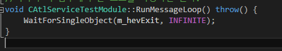

# 서비스
* SCM(Service Control Manager)에 의해 관리되는 응용프로그램.
* 세션0 환경에서 동작한다.

### 예제

  

  

#### 실행 및 정지  

  

#### 재정의 함수들
* PreMessageLoop()
* RunMessageLoop()
* PostMessageLoop()
* OnStop()
* OnPause()
* OnContinue()
* OnShutDown()
* etc...

#### 예제에서 사용한 함수
```
void OnStop();
HRESULT PreMessageLoop(int nShowCmd);
HRESULT PostMessageLoop() throw();
void RunMessageLoop() throw();
```

#### PreMessageLoop()  

  
```
HRESULT CAtlServiceTestModule::PreMessageLoop(int nShowCmd) {
	m_hevExit = CreateEvent(NULL, TRUE, FALSE, NULL);
	if (m_hevExit) {
		//에러값은 HRESULT 형태로 전달해야 처리가 된다.
		return HRESULT_FROM_WIN32(GetLastError());
	}

	//서비스를 시작할 때 '실행중'이라는 표시를 띄우는 코드이다.
	//어지간하면 바꾸지 않고 그대로 사용해도 좋다.
	if (::InterlockedCompareExchange(&m_status.dwCurrentState,
		SERVICE_RUNNING, SERVICE_START_PENDING) == SERVICE_START_PENDING) {
		LogEvent(_T("Service started/resumed"));
		::SetServiceStatus(m_hServiceStatus, &m_status);
	}

	//이 값은 0으로, 서비스를 바로 종료하지 않게 하는 값이다.
	return S_OK;
}
```

* 이 함수는 com 객체를 정의하지 않으면 무조건 재정의해야 하는 함수. 그렇지 않으면 서비스가 바로 종료되어 버린다.
* 초기화할 것들은 이 함수에서 작성하면 된다.

#### RunMessageLoop()
  

```
void CAtlServiceTestModule::RunMessageLoop() throw() {
	WaitForSingleObject(m_hevExit, INFINITE);
}
```
* 실제 작업을 수행하는 함수
* 따라서 이 함수에서 본 코드를 작성하면 된다.

#### PostMessageLoop()
  
```
HRESULT CAtlServiceTestModule::PostMessageLoop() throw() {
	if(m_hevExit != NULL) {
		CloseHandle(m_hevExit);
	}
	return __super::PostMessageLoop();
}
```
* RunMessageLoop()가 끝난 후 호출되는 함수
* 뒤처리를 담당한다.

#### OnStop()
  

```
void CAtlServiceTestModule::OnStop() {
	SetEvent(m_hevExit);

	//상위 클래스에서 서비스 중지 후 처리를 해주기 때문에 꼭 상위클래스의 함수를 호출해야 한다.
	__super::OnStop();
}
```
* SCM에서 정지 명령을 내렸을 때 RunMessageLoop() 스레드와 다른 스레드에서 이 함수를 호출된다.
* 따라서 RunMessageLoop()에서 이 함수가 불렸다는 것을 알 수 있고, 적절한 동작을 취할 수 있도록
* 통보용 커널 객체가 필요하다.

#### reference

