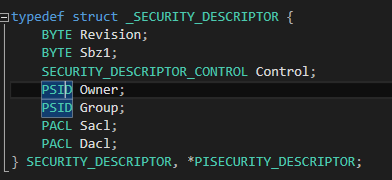
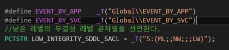
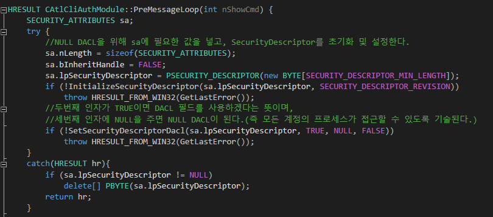
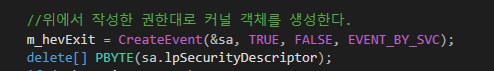
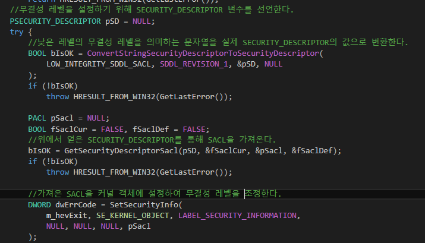
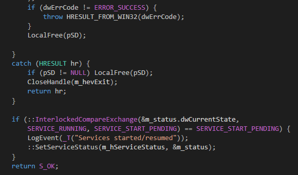

# 서비스 - 보안기술자

### 보안기술자에 대한 큰 그림

  


### SECURITY_ATTRIBUTES 구조체의 lPSecurityDescriptor 필드

  

```
typedef struct _SECURITY_DESCRIPTOR {
	BYTE Revision;
	BYTE Sbz1;
	SECURITY_DESCRIPTOR_CONTROL Control;
	PSID Owner;
	PSID Group;
	PACL Sacl;
	PACL Dacl;
} SECURITY_DESCRIPTOR, *PISECURITY_DESCRIPTOR;
```
#### SECURITY_DESCRIPTOR_CONTROL
* 필드의 존재 여부를 나타내는 플래그 집합
* Dacl 필드에 값이 존재한다면 SE_DACL_PRESENT라는 플래그를 작성하는 식이다.
* 이 플래그가 설정된 상태에서 Dacl 필드가 NULL이면 해당 객체에 대해 모든 계정의 프로세스가 접근가능함을 의미한다.  

#### PSID Owner, Group
* CreateXXX를 호출한 프로세스가 소속된 계정과 그룹의 SID
* SID는 로그인한 계정을 식별하는 바이너리값

#### PACL Dacl
* 커널 객체에 대한 접근 허용 여부 기준을 갖고 있는 필드
* PACL == ACL *
* ACL은 ACE의 리스트
* ACE는 해당 객체에 접근 가능한 SID와 접근 모드를 담고 있는 구조체
* 생성된 커널 객체에 대한 접근 허용은 접근을 위해 관련 함수를 호출한 프로세스의 액세스 토큰의 소유 계정 SID가, 커널 객체가 갖고 있는 이 보안 기술자의 DACL에 존재하고 호출된 함수의 행위가 접근 모드와 배치되지 않을 때에만 가능하다.
* 세션 0의 경우, 생성되는 객체의 DACL 필드는 "세션0의 SID와 ACCESS_ALL 접근 모드를 담은 ACE"와 "관리자 계정 그룹 SID와 읽기 전용 모드를 담은 ACE"가 존재하는 ACL을 갖게 된다.
* 따라서 일반 계정의 프로그램에서 서비스 프로그램이 생성한 객체를 참조할 수 없는 것이다.

### 서비스와 응용프로그램 객체 공유하기

* DACL을 모든 계정에 속한 프로세스가 접근할 수 있도록 바꿔야 한다.
* 커널 객체에 대한 무결성레벨을 낮춰야 한다.

#### DACL
* ACL에 대한 포인터.
* 위에서 설명한대로 커널 객체에 대한 접근 허용 여부를 판단하는 기준을 갖고 있다.

#### 무결성레벨
* 비스타 이후, 커널 객체 자체에 '접근레벨'을 지정
* MSDN : https://msdn.microsoft.com/en-us/library/bb625963.aspx?f=255&MSPPError=-2147217396
* SACL(System Access Control Level)에 포함되었다.
* 서비스가 생성한 커널 객체는 무결성 레벨이 가장 높은 '시스템 레벨'을 가지고, 일반 프로그램에서 생성한 객체는 그 미만의 레벨을 갖는다.

#### 커널 객체 권한 낮추는 코드

  

  

  

  

  

```
#define EVENT_BY_APP	_T("Global\\EVENT_BY_APP")
#define EVENT_BY_SVC	_T("Global\\EVENT_BY_SVC")
//낮은 레벨의 무결성 레벨 문자열을 선언한다.
PCTSTR LOW_INTEGRITY_SDDL_SACL = _T("S:(ML;;NW;;;LW)");

HRESULT CAtlCliAuthModule::PreMessageLoop(int nShowCmd) {
	SECURITY_ATTRIBUTES sa;
	try {
		//NULL DACL을 위해 sa에 필요한 값을 넣고, SecurityDescriptor를 초기화 및 설정한다.
		sa.nLength = sizeof(SECURITY_ATTRIBUTES);
		sa.bInheritHandle = FALSE;
		sa.lpSecurityDescriptor = PSECURITY_DESCRIPTOR(new BYTE[SECURITY_DESCRIPTOR_MIN_LENGTH]);
		if (!InitializeSecurityDescriptor(sa.lpSecurityDescriptor, SECURITY_DESCRIPTOR_REVISION))
			throw HRESULT_FROM_WIN32(GetLastError());
		//두번째 인자가 TRUE이면 DACL 필드를 사용하겠다는 뜻이며,
		//세번째 인자에 NULL을 주면 NULL DACL이 된다.(즉 모든 계정의 프로세스가 접근할 수 있도록 기술된다.)
		if (!SetSecurityDescriptorDacl(sa.lpSecurityDescriptor, TRUE, NULL, FALSE))
			throw HRESULT_FROM_WIN32(GetLastError());
	}
	catch(HRESULT hr){
		if (sa.lpSecurityDescriptor != NULL)
			delete[] PBYTE(sa.lpSecurityDescriptor);
		return hr;
	}

	//위에서 작성한 권한대로 커널 객체를 생성한다.
	m_hevExit = CreateEvent(&sa, TRUE, FALSE, EVENT_BY_SVC);
	delete[] PBYTE(sa.lpSecurityDescriptor);
	if (m_hevExit == NULL)
		return HRESULT_FROM_WIN32(GetLastError());
	//무결성 레벨을 설정하기 위해 SECURITY_DESCRIPTOR 변수를 선언한다.
	PSECURITY_DESCRIPTOR pSD = NULL;
	try {
		//낮은 레벨의 무결성 레벨을 의미하는 문자열을 실제 SECURITY_DESCRIPTOR의 값으로 변환한다.
		BOOL bIsOK = ConvertStringSecurityDescriptorToSecurityDescriptor(
			LOW_INTEGRITY_SDDL_SACL, SDDL_REVISION_1, &pSD, NULL
		);
		if (!bIsOK)
			throw HRESULT_FROM_WIN32(GetLastError());

		PACL pSacl = NULL;
		BOOL fSaclCur = FALSE, fSaclDef = FALSE;
		//위에서 얻은 SECURITY_DESCRIPTOR를 통해 SACL을 가져온다.
		bIsOK = GetSecurityDescriptorSacl(pSD, &fSaclCur, &pSacl, &fSaclDef);
		if (!bIsOK)
			throw HRESULT_FROM_WIN32(GetLastError());

		//가져온 SACL을 커널 객체에 설정하여 무결성 레벨을 조정한다.
		DWORD dwErrCode = SetSecurityInfo(
			m_hevExit, SE_KERNEL_OBJECT, LABEL_SECURITY_INFORMATION,
			NULL, NULL, NULL, pSacl
		);
		if (dwErrCode != ERROR_SUCCESS) {
			throw HRESULT_FROM_WIN32(dwErrCode);
		}
		LocalFree(pSD);

	}
	catch (HRESULT hr) {
		if (pSD != NULL) LocalFree(pSD);
		CloseHandle(m_hevExit);
		return hr;
	}

	if (::InterlockedCompareExchange(&m_status.dwCurrentState,
		SERVICE_RUNNING, SERVICE_START_PENDING) == SERVICE_START_PENDING) {
		LogEvent(_T("Services started/resumed"));
		::SetServiceStatus(m_hServiceStatus, &m_status);
	}
	return S_OK;
}

```

#### 전체 코드
* 깃헙에 첨부했습니다.

#### reference
https://msdn.microsoft.com/ko-kr/library/windows/desktop/aa446597(v=vs.85).aspx

