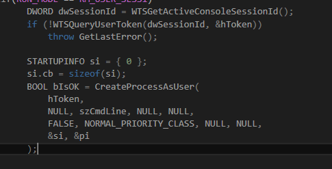
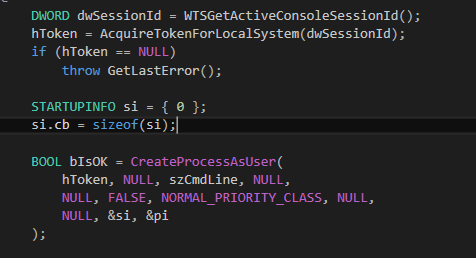
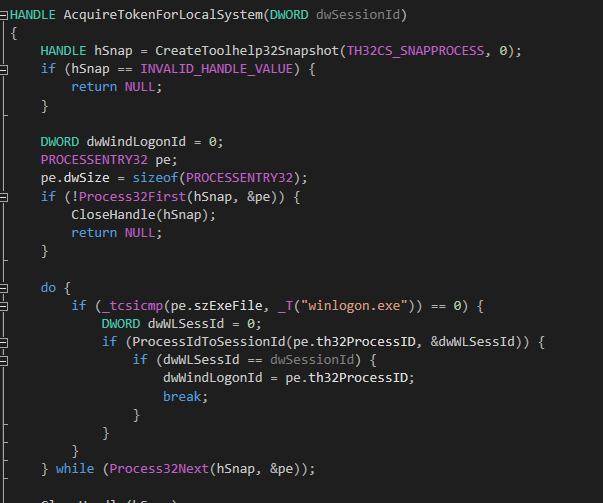
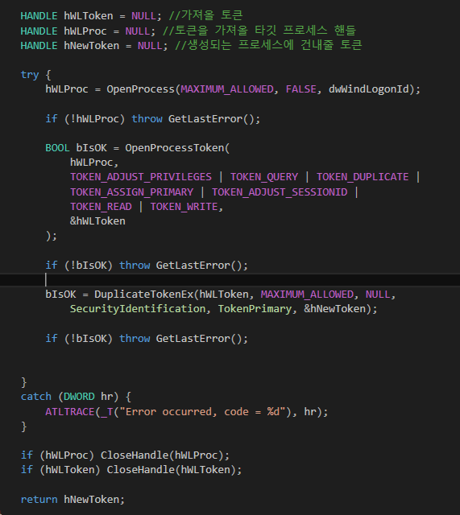

# 서비스 - 프로세스 생성

* 서비스에서는 UI가 되지 않으므로, UI가 되는 프로세스를 생성해서 실행되곤 한다.
* 그러나 아무런 작업없이 그냥 CreateProcess()를 호출하게 되면, 프로세스는 로드되지만 윈도우가 뜨지 않게 된다.
* 이는 서비스가 작동하는 세션이 프로세스가 로드되어 윈도우가 나타나는 세션과 다르기 때문이다.
* 따라서 세션을 맞춰줄 필요가 있다.

### 현재 활성화된 세션에 프로세스 생성

  


```
DWORD dwSessionId = WTSGetActiveConsoleSessionId();
if (!WTSQueryUserToken(dwSessionId, &hToken))
    throw GetLastError();

STARTUPINFO si = { 0 };
si.cb = sizeof(si);
BOOL bIsOK = CreateProcessAsUser(
    hToken,
    NULL, szCmdLine, NULL, NULL,
    FALSE, NORMAL_PRIORITY_CLASS, NULL, NULL,
    &si, &pi
);
```
* WTSGetActiveConsoleSessionId()를 통해 현재 활성화된 세션의 id를 얻는다.
* 활성화된 세션이란 마우스나 키보드 같은 입력 장치에 현재 반응하는 세션을 말한다.
* WTSQueryUserToken()으로 세션 id에 해당하는 액세스 토큰을 얻는다.
* CreateProcessAsUser()로 액세스 토큰을 지정하며 프로세스를 생성한다.

### 로컬 시스템 권한으로 프로세스 생성

* 여기서는 활성화 세션 id이면서 시스템 권한을 갖는 프로세스를 찾아서 그 프로세스의 토큰을 얻어옮으로써 생성할 프로세스가 로컬 시스템 권한을 갖도록 해본다.  




```
DWORD dwSessionId = WTSGetActiveConsoleSessionId();
hToken = AcquireTokenForLocalSystem(dwSessionId);
if (hToken == NULL)
    throw GetLastError();

STARTUPINFO si = { 0 };
si.cb = sizeof(si);

BOOL bIsOK = CreateProcessAsUser(
    hToken, NULL, szCmdLine, NULL,
    NULL, FALSE, NORMAL_PRIORITY_CLASS, NULL,
    NULL, &si, &pi
);
```

* AcquireTokenForLocalSystem() 함수는 만든 함수로, 이 함수를 통해 얻은 토큰으로 CreateProcessAsUser()를 통해 프로세스를 생성한다.

  

```
HANDLE AcquireTokenForLocalSystem(DWORD dwSessionId)
{
	HANDLE hSnap = CreateToolhelp32Snapshot(TH32CS_SNAPPROCESS, 0);
	if (hSnap == INVALID_HANDLE_VALUE) {
		return NULL;
	}

	DWORD dwWindLogonId = 0;
	PROCESSENTRY32 pe;
	pe.dwSize = sizeof(PROCESSENTRY32);
	if (!Process32First(hSnap, &pe)) {
		CloseHandle(hSnap);
		return NULL;
	}

	do {
		if (_tcsicmp(pe.szExeFile, _T("winlogon.exe")) == 0) {
			DWORD dwWLSessId = 0;
			if (ProcessIdToSessionId(pe.th32ProcessID, &dwWLSessId)) {
				if (dwWLSessId == dwSessionId) {
					dwWindLogonId = pe.th32ProcessID;
					break;
				}
			}
		}
	} while (Process32Next(hSnap, &pe));

	CloseHandle(hSnap);
	if (dwWindLogonId == 0) return NULL;
```
* 스냅샷을 찍어서, 현재 실행 중인 프로세스 목록을 얻는다.
* winlogon.exe는 로그온/오프를 담당하는 시스템 프로세스로, 로그온하면서 현재 세션 id를 얻기 때문에 로컬 시스템 권한을 갖으면서 활성화된 세션 id를 갖는다.
* PROCESSENTRY32 구조체 변수를 통해 winlogon.exe를 찾고, pid를 통해 세션 id를 얻는다.

  

```
HANDLE hWLToken = NULL; //가져올 토큰
HANDLE hWLProc = NULL; //토큰을 가져올 타깃 프로세스 핸들
HANDLE hNewToken = NULL; //생성되는 프로세스에 건내줄 토큰

try {
    hWLProc = OpenProcess(MAXIMUM_ALLOWED, FALSE, dwWindLogonId);

    if (!hWLProc) throw GetLastError();

    BOOL bIsOK = OpenProcessToken(
        hWLProc,
        TOKEN_ADJUST_PRIVILEGES | TOKEN_QUERY | TOKEN_DUPLICATE |
        TOKEN_ASSIGN_PRIMARY | TOKEN_ADJUST_SESSIONID |
        TOKEN_READ | TOKEN_WRITE,
        &hWLToken
    );

    if (!bIsOK) throw GetLastError();

    bIsOK = DuplicateTokenEx(hWLToken, MAXIMUM_ALLOWED, NULL,
        SecurityIdentification, TokenPrimary, &hNewToken);

    if (!bIsOK) throw GetLastError();


}
catch (DWORD hr) {
    ATLTRACE(_T("Error occurred, code = %d"), hr);
}

if (hWLProc) CloseHandle(hWLProc);
if (hWLToken) CloseHandle(hWLToken);

return hNewToken;
}
```
* 위에서 얻은 pid로 프로세스 핸들을 얻고, 이 핸들을 통해 OpenProcessToken()으로 액세스 토큰을 얻는다.
* 얻은 액세스 토큰을 복제한 뒤, 그 복제된 토큰을 반환한다.

### 핵심 코드
```
HANDLE AcquireTokenForLocalSystem(DWORD dwSessionId)
{
	HANDLE hSnap = CreateToolhelp32Snapshot(TH32CS_SNAPPROCESS, 0);
	if (hSnap == INVALID_HANDLE_VALUE) {
		return NULL;
	}

	DWORD dwWindLogonId = 0;
	PROCESSENTRY32 pe;
	pe.dwSize = sizeof(PROCESSENTRY32);
	if (!Process32First(hSnap, &pe)) {
		CloseHandle(hSnap);
		return NULL;
	}

	do {
		if (_tcsicmp(pe.szExeFile, _T("winlogon.exe")) == 0) {
			DWORD dwWLSessId = 0;
			if (ProcessIdToSessionId(pe.th32ProcessID, &dwWLSessId)) {
				if (dwWLSessId == dwSessionId) {
					dwWindLogonId = pe.th32ProcessID;
					break;
				}
			}
		}
	} while (Process32Next(hSnap, &pe));

	CloseHandle(hSnap);
	if (dwWindLogonId == 0) return NULL;

	HANDLE hWLToken = NULL; //가져올 토큰
	HANDLE hWLProc = NULL; //토큰을 가져올 타깃 프로세스 핸들
	HANDLE hNewToken = NULL; //생성되는 프로세스에 건내줄 토큰

	try {
		hWLProc = OpenProcess(MAXIMUM_ALLOWED, FALSE, dwWindLogonId);

		if (!hWLProc) throw GetLastError();

		BOOL bIsOK = OpenProcessToken(
			hWLProc,
			TOKEN_ADJUST_PRIVILEGES | TOKEN_QUERY | TOKEN_DUPLICATE |
			TOKEN_ASSIGN_PRIMARY | TOKEN_ADJUST_SESSIONID |
			TOKEN_READ | TOKEN_WRITE,
			&hWLToken
		);

		if (!bIsOK) throw GetLastError();

		bIsOK = DuplicateTokenEx(hWLToken, MAXIMUM_ALLOWED, NULL,
			SecurityIdentification, TokenPrimary, &hNewToken);

		if (!bIsOK) throw GetLastError();


	}
	catch (DWORD hr) {
		ATLTRACE(_T("Error occurred, code = %d"), hr);
	}

	if (hWLProc) CloseHandle(hWLProc);
	if (hWLToken) CloseHandle(hWLToken);

	return hNewToken;
}

void CAtlSvcRunModule::RunMessageLoop() {
	TCHAR szCmdLine[MAX_PATH] = _T("E:\\mfc\\TestCustomControl\\Debug\\TestCustomControl.exe");

	HANDLE hToken = NULL;
	PROCESS_INFORMATION pi = { 0 };

	try {
#if (RUN_MODE == RM_SYSTEM_SESS0)
		STARTUPINFO si = { 0 };
		si.cb = sizeof(si);

		BOOL bIsOK = CreateProcess(
			NULL, szCmdLine, NULL, NULL,
			FALSE, NORMAL_PRIORITY_CLASS, NULL, NULL,
			&si, &pi
		);
#elif(RUN_MODE == RM_USER_SESS1)
		DWORD dwSessionId = WTSGetActiveConsoleSessionId();
		if (!WTSQueryUserToken(dwSessionId, &hToken))
			throw GetLastError();

		STARTUPINFO si = { 0 };
		si.cb = sizeof(si);
		BOOL bIsOK = CreateProcessAsUser(
			hToken,
			NULL, szCmdLine, NULL, NULL,
			FALSE, NORMAL_PRIORITY_CLASS, NULL, NULL,
			&si, &pi
		);

#else
		DWORD dwSessionId = WTSGetActiveConsoleSessionId();
		hToken = AcquireTokenForLocalSystem(dwSessionId);
		if (hToken == NULL)
			throw GetLastError();

		STARTUPINFO si = { 0 };
		si.cb = sizeof(si);

		BOOL bIsOK = CreateProcessAsUser(
			hToken, NULL, szCmdLine, NULL,
			NULL, FALSE, NORMAL_PRIORITY_CLASS, NULL,
			NULL, &si, &pi
		);

#endif

		if (!bIsOK) throw GetLastError();
		CloseHandle(pi.hThread);
		WaitForInputIdle(pi.hProcess, INFINITE);
		CloseHandle(hToken);
		CloseHandle(pi.hProcess);
	}
	catch (DWORD hr) {
		ATLTRACE(_T("Error occurred, code = %d"), hr);
		if (hToken != NULL) CloseHandle(hToken);
	}

	WaitForSingleObject(m_hevExit, INFINITE);
}
```
### 전체 소스
* 깃헙에 올렸습니다.

#### reference
  
