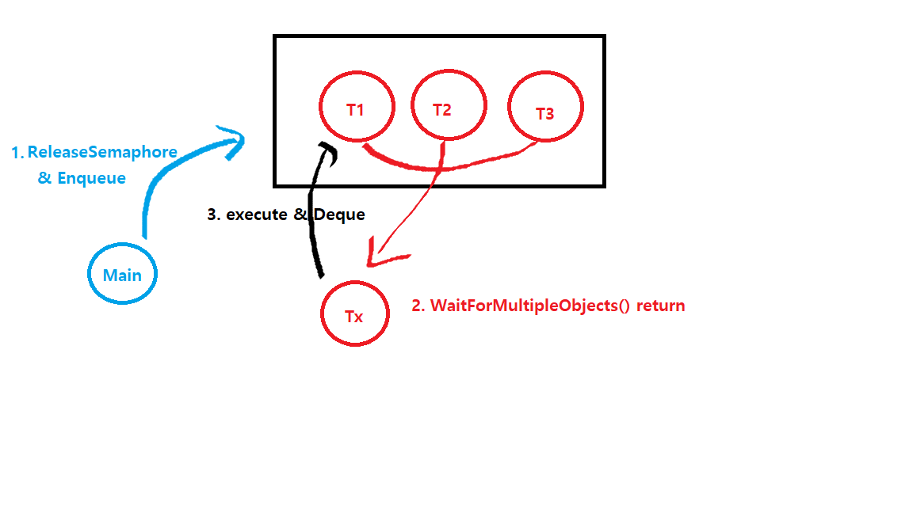

# Semaphore와 Mutex로 스레드풀 구현하기


* 세마포어를 통해 스레드풀을 구현한 예제입니다.
* 통지는 ReleaseSemaphore()를 통해, 대기는 WaitForMultipleObjects()를 통해 구현되었습니다.
* 큐를 통해 순차적인 데이터 처리도 가능합니다.




```
#include <Windows.h>
#include <iostream>
#include <stdio.h>
#include <list>
#include <string>
using namespace std;
typedef list<string> TP_Q;

typedef struct _THREAD_POOL{
	HANDLE m_hMutex;
	HANDLE m_hSema;
	TP_Q m_Queue;
} THREAD_POOL;
typedef THREAD_POOL *PTHREAD_POOL;

#define MAX_USE_THREAD_NUM	3

HANDLE g_hMutex = NULL;

DWORD WINAPI ThreadProc(PVOID pParam) {
	PTHREAD_POOL pTP = (PTHREAD_POOL)pParam;
	HANDLE hSigObjArr[2] = { g_hMutex, pTP->m_hSema };
	while (true) {
		DWORD dwWaitCode = WaitForMultipleObjects(2, hSigObjArr, FALSE, INFINITE);
		if (dwWaitCode == WAIT_FAILED) {
			cout << "WaitForMultipleObjects가 실패...error code : " << GetLastError() << endl;
			break;
		}
		if (dwWaitCode == WAIT_OBJECT_0) {
			ReleaseMutex(hSigObjArr[0]);
			break;
		}

		WaitForSingleObject(pTP->m_hMutex, INFINITE);
		DWORD dwThreadId = GetCurrentThreadId();
		printf("[%d] Thread is working...\t", dwThreadId);
		cout << "string : " << pTP->m_Queue.front() << endl;
		pTP->m_Queue.pop_front();
		Sleep(1000);
		printf("[%d] Thread completed...\n", dwThreadId);
		ReleaseMutex(pTP->m_hMutex);

	}

	printf("[%d] Thread Exit!\n", GetCurrentThreadId());
	return 0;
}

void main() {
	g_hMutex = CreateMutex(NULL, TRUE, NULL);
	THREAD_POOL tp;
	tp.m_hMutex = CreateMutex(NULL, FALSE, NULL);
	tp.m_hSema = CreateSemaphore(NULL, 0, MAX_USE_THREAD_NUM, NULL);


	SYSTEM_INFO si = { 0 };
	GetSystemInfo(&si);


	PHANDLE h_thread_list = new HANDLE[si.dwNumberOfProcessors];
	for (int i = 0; i < si.dwNumberOfProcessors; i++) {
		*(h_thread_list + i) = CreateThread(NULL, 0, (LPTHREAD_START_ROUTINE)ThreadProc, &tp, 0, NULL);
	}
	string cmd;
	while (true) {
		cin >> cmd;
		if (cmd == "quit") {
			getchar();
			break;
		}
		WaitForSingleObject(tp.m_hMutex, INFINITE);
		tp.m_Queue.push_back(cmd);
		ReleaseMutex(tp.m_hMutex);
		ReleaseSemaphore(tp.m_hSema, 1, NULL);
	}

	ReleaseMutex(g_hMutex);
	WaitForMultipleObjects(si.dwNumberOfProcessors, h_thread_list, TRUE, INFINITE);
	printf("All Sub Thread exited...\n");
	CloseHandle(g_hMutex);
	CloseHandle(tp.m_hMutex);
	CloseHandle(tp.m_hSema);
	for (int i = 0; i < si.dwNumberOfProcessors; i++) {
		CloseHandle(h_thread_list[i]);
	}
	delete[] h_thread_list;

	getchar();

}
```

#### reference

