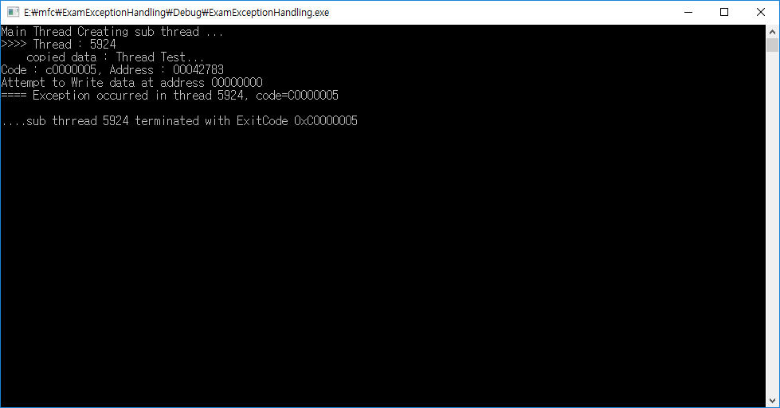

# Thread 1

* 윈도우즈의 스케쥴링 기본 단위


### 스레드의 요소

#### Thread Context
* 스레드 입장에서 CPU와 레지스터는 자원
* 스케쥴링시 자신만의 '자원'을 보관 및 복원해야 함.
* 이 자원을 '스레드 문맥'이라고 한다.

```
typedef struct _CONTEXT{
    DWORD ContextFlags;
    ...
    DWORD Edi;
    DWORD Esi;
    DWORD Ebx;
    ...
    DWORD Ebp;
    DWORD Eip;
    DWORD Esp;
    ...
} CONTEXT;
```
* CONTEXT 구조체는 CPU의 모든 레지스터를 멤버로 갖고 있다.

#### Thread Stack
* 스레드는 자신만의 스택을 가상 주소 공간에 갖게 됨.
* 기본크기는 1MB

#### Thread Local Storage
* 스레드는 고유한 저장 공간을 가짐
* 고유 정보 저장. 예를 들어 MFC에서 CWnd::FromHandle(HWND)를 호출할 때, HWND와 CWnd \*의 매핑 정보를 저장함.

#### Thread Message Queue
* 윈도우즈 메시지 큐.
* 스레드마다 메시지큐를 갖는다.

### 스레드의 생성

```
HANDLE WINAPI CreateThread
(
    LPSECURITY_ATTRIBUTES lpThreadAttributes,
    SIZE_T dwStackSize,
    LPTHREAD_START_ROUTINE lpStartAddress,
    LPVOID lpParameter
    DWORD dwCreateFlags
    LPDWORD lpThreadId
    )
```
#### dwStackSize
* 0이면 디폴트값이 1MB가 설정

#### lpParameter
* 실행할 코드
* 넘길 함수는 보통 0을 리턴시킨다.
* 리턴시 스레드 커널 객체는 시그널 상태가 됨


### 스레드의 종료

* return으로 끝내는 것이 가장 좋음

#### ExitThread()
* 스스로 종료
* C++의 경우 지역변수가 해제되지 않을 수 있음.
* 예를 들어 지역변수로 객체가 있을 경우, 소멸자가 호출되지 않을 수도 있음.

#### TerminateThread()
* 다른 스레드 죽이기
* 크리티컬 섹션 해제되지 않음
* 힙의 락이 해제되지 않음
* 공유 DLL 상태가 비정상적으로 됨


### 예외 처리

```
__try{

}__except(EXCEPTION_FILTER)
```

#### EXCEPTION_FILTER
* EXCEPTION_EXCUTE_HANDLER : 사용자가 예외 처리, 정상 종료
* EXCEPTION_CONTINUE_SEARCH : 시스템이 예외 처리, 비정상 종료
* EXCEPTION_CONTINUE_EXCUTION : 예외 극복 후 재실행

#### 예외처리 예제
```
#ifdef _MSC_VER
#define  _CRT_SECURE_NO_WARNINGS
#endif

#include <Windows.h>
#include <cstdio>
#include <iostream>
using namespace std;
LONG ExpFilter(LPEXCEPTION_POINTERS pEx) {
	PEXCEPTION_RECORD pER = pEx->ExceptionRecord;
	CHAR szOut[512];

	int nLen = sprintf(szOut, "Code : %x, Address : %p",
		pER->ExceptionCode, pER->ExceptionAddress);
	if (pER->ExceptionCode == EXCEPTION_ACCESS_VIOLATION) {
		sprintf(szOut + nLen, "\nAttempt to %s data at address %p",
			pER->ExceptionInformation[0] ? "Write" : "Read",
			pER->ExceptionInformation[1]);
	}

	cout << szOut << endl;
	return EXCEPTION_EXECUTE_HANDLER;
}

DWORD WINAPI ThreadProc(PVOID pParam) {
	PCSTR pszTest = (PCSTR)pParam;
	PINT pnVal = NULL;

	PSTR pBuff = new char[strlen(pszTest) + 1];
	strcpy(pBuff, pszTest);

	__try {
		cout << ">>>> Thread : " << GetCurrentThreadId() << endl;
		cout << "    copied data : " << pBuff << endl;

		*pnVal = strlen(pszTest); //예외 발생!

		delete[] pBuff;
	}
	__except (ExpFilter(GetExceptionInformation())) {
		DWORD dwExCode = GetExceptionCode();
		printf("==== Exception occurred in thread %d, code=%08X\n",
			GetCurrentThreadId(), dwExCode);

        //예외 처리하면, 예외 발생시 메모리 해제를 못하는 경우를 막을 수 있다.
		delete[] pBuff;

		return dwExCode;
	}
	return 0;
}

void main() {
	cout << "Main Thread Creating sub thread ... " << endl;

	PCSTR pszTest = "Thread Test...";
	DWORD dwThrID = 0;
	HANDLE hThread = CreateThread(NULL, 0, ThreadProc, (PVOID)pszTest, 0, &dwThrID);

	getchar();
	WaitForSingleObject(hThread, INFINITE);

	DWORD dwExitCode = 0;
	GetExitCodeThread(hThread, &dwExitCode);
	printf("....sub thrread %d terminated with ExitCode 0x%08X\n",
		dwThrID, dwExitCode);
	CloseHandle(hThread);
	getchar();
}
```



### 스레드 사용 팁
* CreateThread의 lpParameter를 적극적으로 활용하라(ex) 클래스 멤버를 스레드로 돌릴 때 this를 넘겨준다.)
* 종료를 알리는 수단을 제공하라. 이 때 flag 변수보다 event가 더 안전하다.
* main함수는 자신을 제외한 모든 스레드가 종료된 것을 확인한 뒤에야 종료돼야 한다. 이를 위해 WaitForSingleObject()를 사용하라.


#### reference
윈도우 시스템 프로그램을 구현하는 기술
