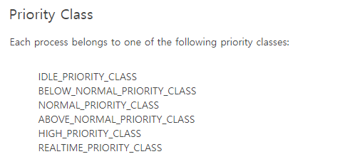
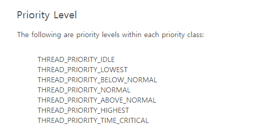

# Thread 2

### 우선순위
* 0~31까지. 값이 클수록 우선순위가 높다.
* 우선순위 클래스에서 상대적 우선순위를 정하는 방식으로 우선순위를 변경할 수 있다.

```
스레드 기본 우선순위 = 우선순위 클래스 + 상대적 우선순위
```





* 우선순위 설정은 아래의 링크를 참고하면 된다.  
https://msdn.microsoft.com/ko-kr/library/windows/desktop/ms685100(v=vs.85).aspx

### Context Switching

#### 퀀텀 종료
* CPU를 반환하고, 레디큐 끝에 추가됨. 해당 스레드는 Ready 상태
#### 선점
* 빼앗긴 스레드는 레디큐의 맨 앞에 추가됨. 해당 스레드는 Ready 상태
* 퀀텀 동안 더 높은 우선순위 스레드가 깨어나면 선점됨
* 인위적으로(예를 들어 SetThreadPriority() 호출 등) 스레드 우선 순위가 변경되면 선점이 발생

#### 자발적 전환
* 특히 동기화시, 스레드는 커널 객체에 대해 특정 신호를 기다릴 수 있음.
* 이 때 스레드는 준비가 아니라 대기 상태로 전환.
* 신호가 오면(즉 해당 커널 객체가 시그널 상태가 되면), 바로 실행되거나 우선순위가 높은 스레드가 실행되고 있다면 준비상태로 전환됨.
* 대기 상태에서 깨어난 스레드는 남은 퀀텀이 아닌 새롭게 온전한 퀀텀을 할당받는다.


### 스레드 중지를 통한 상태 전환
* 동기화 처리시에는 SuspendThread()를 되도록 사용하지 말아야 함. 동기화 커널 객체를 기다리는 스레드에게 데드락을 유발할 수 있기 때문.
* Sleep()의 인자가 0보다 크면 무조건 Context Switching이 일어난다. 0일 경우, 호출 스레드보다 우선순위가 같거나 큰 스레드가 실행 가능한 상태인 경우에만 대기 상태로 전환된다.
* SwitchToThread()를 통해 우선순위에 상관없는 퀀텀 양보가 가능하다. 양보받는 스레드는 양보한 스레드가 점유했던 CPU에서 실행된다.


### 우선순위 부스팅

* 해당 스레드의 '기본 우선순위'에 근거하여 수행.
* 가변 레벨의 우선순위(1~15)를 갖는 스레드에 대해 수행.
* 퀀텀당 1씩 감소하여 원래 우선순위로 돌아감.

#### 부스팅을 수행하는 경우
* 입출력 작업 완료시 1만큼 증가
* 이벤트나 세마포어에 대한 대기에서 깨어나면 1만큼 증가
* GUI 스레드에 대해서 메시지큐로 인해 깨어나면 2만큼 증가
* 포그라운드 스레드가 대기에서 깨어나면 '현재 우선순위'를 기준으로 1 또는 2 만큼 증가
* 기아 스레드를 위한 부스팅.


#### reference

