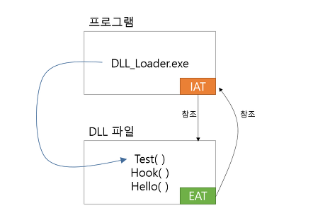

# DLL과 EXE 파일

* exe가 로드될 때, 코드 내에서 사용하는 dll도 같이 로드한다.
* 이 때 dll은 exe 파일 안에 포함되는 개념이 아니라 다른 영역에서 존재하며, dll에 있는 함수를 호출할 때 IAT(Import Address Table)를 통해 접근하는 개념이다.

#### reference
http://hyeonnii.tistory.com/75