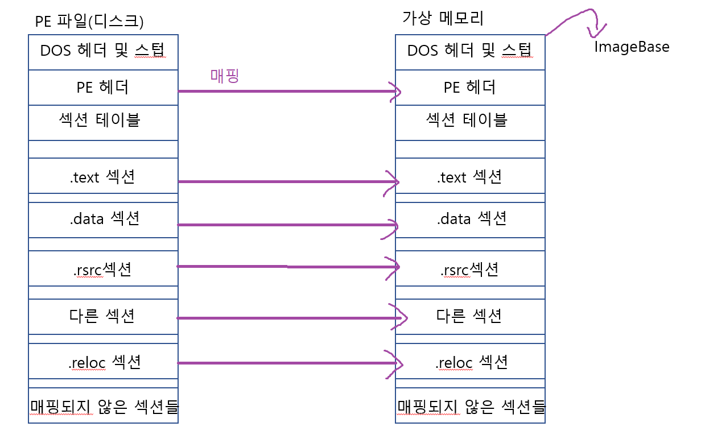

# PE 파일 원리

* PE 파일은 MMF 기술이 적용된 특별한 파일이다.
* MMF를 이해하려면 가상메모리 구조에 대한 지식이 있어야 한다.

### 가상메모리

* 프로그램이 로딩되면 VMM(Virtual Memory Manager)에 의해 가상메모리를 할당받는다.
* 가상메모리는 물리메모리와 매핑되고 이러한 동작 또한 VMM이 관리한다.
* 물리메모리란 RAM과 하드디스크 등을 말한다. 하드디스크의 경우 더 정확히 말해 윈도우즈가 설치된 논리디스크의 PageFile.sys(이후 페이지 파일)를 의미한다.

##### 참고- 페이지

* free, reserve, commit 이라는 상태로 나뉜다.
* 가상메모리와 매핑된 상태가 commit이다.
* 즉 특정 스레드가 페이지에 대해 엑세스할 때 해당 페이지는 commit된 상태여야 한다. 그렇지 않다면 commit된 상태로 만든다.

### MMF

* Memory Mapping File
* 일반 파일을 페이지 파일처럼 동작하게 만드는 기술이다.
* EXE와 DLL 파일의 로드 및 실행, 프로그래머에 의한 직접적인 디스크 엑세스, IPC 용도로 사용된다.
* 따라서 디스크에 있는 PE 파일은 페이지 파일처럼 가상 메모리에 매핑된다.

#### 참고 - EXE 파일의 실행 과정

* 시스템은 사용 갯수가 1인 새로운 프로세스 커널 객체를 생성
* 시스템은 새로운 프로세스를 위해 4G 또는 16E 크기의 가상 주소 공간을 생성
* 시스템은 가상 기억 공간에 EXE 파일을 포함할 만큼의 충분히 큰 주소 공간을 예약. 이 공간의 시작 주소는 PE 파일의 ImageBase 필드를 의미한다.
* 시스템은 예약된 영역이 실제 구현되는 물리적 기억 장소는 시스템의 페이지 파일이 아니라 디스크에 있는 EXE 파일 내라는 것을 기억.
* DLL이 있다면 당연히 import해야 함.
* DLL 로딩 과정은 EXE와 동일하다.

#### 참고 - 이미지란?

* 실행 파일을 가리켜 이미지라는 표현을 쓸 때가 있다.
* 이미지란 '상(像)'이며, 디스크에 있는 PE 파일에 대한 가상메모리로의 투영을 의미한다.

#### reference
윈도우 실행 파일의 구조와 원리로 배우는 리버스 엔지니어링 1권 파일구조편
