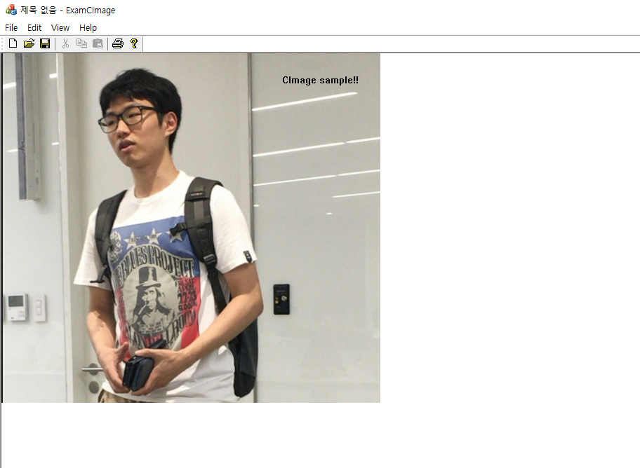
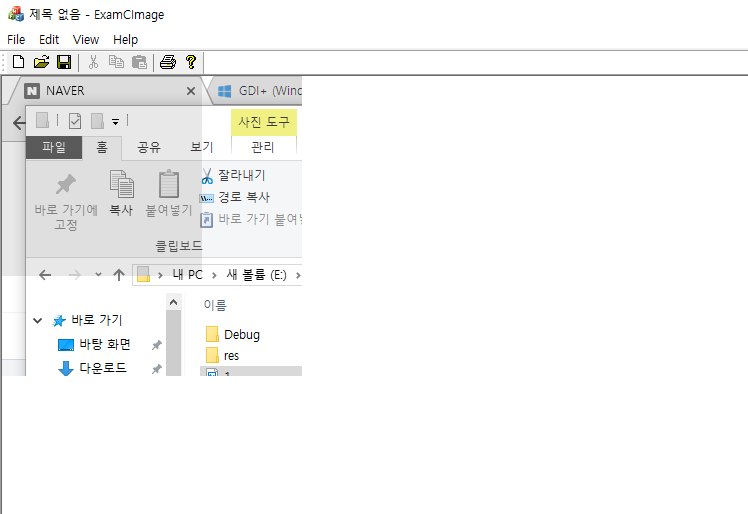
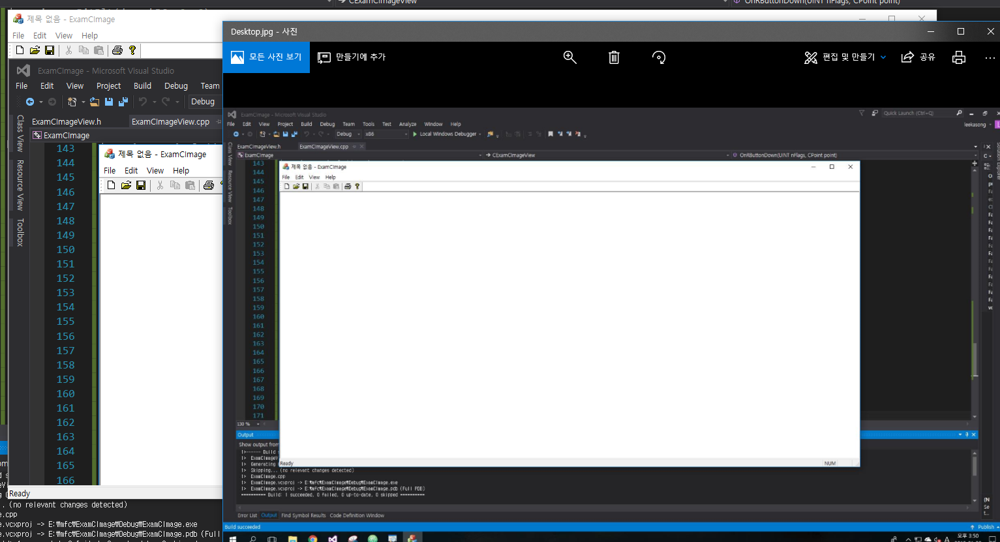

# CImage

### 기본 사용법

```
void CExamCImageView::OnPaint()
{
	CPaintDC dc(this); // device context for painting
	CString path = _T("1.jpg");
	CImage image;
	HRESULT hResult = image.Load(path);
	if (FAILED(hResult)) {
		CString strtmp = _T("Failed to load ");
		strtmp += path + _T("\n");
		TRACE(strtmp);
		return;
	}
	CDC *p_dc = CDC::FromHandle(image.GetDC());
	p_dc->SetBkMode(TRANSPARENT);
	p_dc->TextOutW(400, 30, _T("CImage sample!!"));
	image.ReleaseDC();
	image.BitBlt(dc.m_hDC, 0, 0);
}
```


### 컬러를 흑백으로 바꾸기

```
void CExamCImageView::OnLButtonDown(UINT nFlags, CPoint point)
{
	CWnd *p_desk = GetDesktopWindow();
	CWindowDC ScrDC(p_desk);
	CClientDC dc(this);

	CImage image;
	image.Create(300, 300, ScrDC.GetDeviceCaps(BITSPIXEL));


	CDC *p_dc = CDC::FromHandle(image.GetDC());
	p_dc->BitBlt(0, 0, 300, 300, &ScrDC, 0, 0, SRCCOPY);
	image.ReleaseDC();

	COLORREF rgb;
	for (int x = 0; x < 200; x++) {
		for (int y = 0; y < 200; y++) {
			rgb = image.GetPixel(x, y);
			RGBtoGray(rgb);
			image.SetPixel(x, y, rgb);
		}
	}

	image.BitBlt(dc.m_hDC, 0, 0);
	CView::OnLButtonDown(nFlags, point);
}

inline void RGBtoGray(COLORREF& rgb) {
		BYTE byGray = (GetRValue(rgb) * 30 + GetGValue(rgb) * 50 + GetBValue(rgb) * 11) / 100;
		rgb = RGB(byGray, byGray, byGray);
}

```

### 바탕화면 캡쳐 및 저장, 저장된 이미지 파일 열기

```
void CExamCImageView::OnLButtonDown(UINT nFlags, CPoint point)
{
	CWnd *p_desk = GetDesktopWindow();
	CWindowDC ScrDC(p_desk);
	CClientDC dc(this);

	CImage image;
	image.Create(300, 300, ScrDC.GetDeviceCaps(BITSPIXEL));


	CDC *p_dc = CDC::FromHandle(image.GetDC());
	p_dc->BitBlt(0, 0, 300, 300, &ScrDC, 0, 0, SRCCOPY);
	image.ReleaseDC();

	COLORREF rgb;
	for (int x = 0; x < 200; x++) {
		for (int y = 0; y < 200; y++) {
			rgb = image.GetPixel(x, y);
			RGBtoGray(rgb);
			image.SetPixel(x, y, rgb);
		}
	}

	image.BitBlt(dc.m_hDC, 0, 0);


	CView::OnLButtonDown(nFlags, point);
}


void CExamCImageView::OnRButtonDown(UINT nFlags, CPoint point)
{
	CWnd *p_desk = GetDesktopWindow();
	CWindowDC wnd_dc(p_desk);
	CClientDC dc(this);
	CImage image;
	CRect r;
	p_desk->GetWindowRect(&r);
	int cx = r.Width();
	int cy = r.Height();
	image.Create(cx, cy, wnd_dc.GetDeviceCaps(BITSPIXEL));

	CDC *p_dc = CDC::FromHandle(image.GetDC());
	p_dc->BitBlt(0, 0, cx, cy, &wnd_dc, 0, 0, SRCCOPY);
	dc.BitBlt(0, 0, cx, cy, p_dc, 0, 0, SRCCOPY);
	image.ReleaseDC();

	image.Save(_T("Desktop.jpg"), Gdiplus::ImageFormatJPEG);
	::ShellExecute(NULL, _T("open"), _T("Desktop.jpg"), NULL, NULL, SW_SHOW);
	CView::OnRButtonDown(nFlags, point);
}
```


#### reference
Visual C++ 2008 MFC 윈도우 프로그래밍
