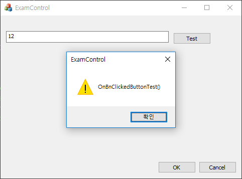

# 윈도우 메시지로 자식컨트롤 제어하기

* 사용자의 입력을 메시지 형태로 구현하는 예제입니다.
* 다양한 컨트롤, 다양한 메시지에 따라 계속적으로 추가될 수 있습니다.

### Edit control

* WM_KEYDOWN 메시지를 사용합니다.  
* 에딧컨트롤의 핸들값을 얻을 수 있으면 WM_KEYDOWN 메시지를 통해 키를 입력할 수 있습니다.
* 두번째인자에서 가싱키값을 전달합니다.
* 가상키값은 http://seongunism.tistory.com/23 에서 참고하였습니다. 

```
m_edit.PostMessageW(WM_KEYDOWN, 48 + 1, 0);

```


### Button

* WM_LBUTTONDOWN과 WM_LBUTTONUP을 사용합니다.


```
m_btn.PostMessageW(WM_LBUTTONDOWN, 0, 0);
m_btn.PostMessageW(WM_LBUTTONUP, 0, 0);
```

### 예제 코드

```
BOOL CExamControlDlg::OnInitDialog()
{
	CDialog::OnInitDialog();

	// Add "About..." menu item to system menu.

	// IDM_ABOUTBOX must be in the system command range.
	ASSERT((IDM_ABOUTBOX & 0xFFF0) == IDM_ABOUTBOX);
	ASSERT(IDM_ABOUTBOX < 0xF000);

	// Set the icon for this dialog.  The framework does this automatically
	//  when the application's main window is not a dialog
	SetIcon(m_hIcon, TRUE);			// Set big icon
	SetIcon(m_hIcon, FALSE);		// Set small icon

	m_edit.PostMessageW(WM_KEYDOWN, 48 + 1, 0);
	m_edit.PostMessageW(WM_KEYDOWN, 48 + 2, 0);
	m_btn.PostMessageW(WM_LBUTTONDOWN, 0, 0);
	m_btn.PostMessageW(WM_LBUTTONUP, 0, 0);

	return TRUE;  // return TRUE  unless you set the focus to a control
}

void CExamControlDlg::OnBnClickedButtonTest()
{
	AfxMessageBox(_T("OnBnClickedButtonTest()"));
}


void CAboutDlg::OnLButtonDown(UINT nFlags, CPoint point)
{
	AfxMessageBox(_T("OnLButtonDown()"));
	CDialogEx::OnLButtonDown(nFlags, point);
}
```


