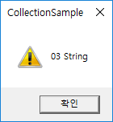

# Collection & File

### Collection classes

* CStringArray

we can consider it is same as linked list

```

	CStringArray arData;

	arData.Add(_T("01 Data"));
	arData.Add(_T("02 Data"));
	arData.Add(_T("03 Data"));

	arData.InsertAt(1, _T("04 New Data"));
	arData.RemoveAt(2);
	int nCount = arData.GetCount();
	for (int i = 0; i < nCount; i++) {
		AfxMessageBox(arData[i]);
	}
```


* CPtrList

it seems like Hash map

```

	CPtrList list;

	list.AddTail(new CString(_T("01 String")));
	list.AddTail(new CString(_T("02 String")));
	list.AddTail(new CString(_T("03 String")));


	/* traverse */
    //POSITION == void *, class *...
	POSITION pos = list.GetHeadPosition();
	CString *pstrData;
	while (pos) {
		pstrData = (CString *)list.GetNext(pos);
		AfxMessageBox(*pstrData);
	}


	/* clear */
	pos = list.GetHeadPosition();
	pstrData = NULL;
    //delete value
	while (pos) {
		pstrData = (CString *)list.GetAt(pos);
		AfxMessageBox(*pstrData);

		delete pstrData;
		list.GetNext(pos);
	}

    //remove nodes
	int nCount = list.GetCount();
	list.RemoveAll();
```




* CMapPtrToPtr

```

	CPtrList list; //for storage
	CMapPtrToPtr map; //for effective searching

	CString *pString1 = new CString(_T("01 String"));
	CString *pString2 = new CString(_T("02 String"));
	CString *pString3 = new CString(_T("03 String"));

	map.SetAt(pString1, pString1);
	list.AddTail(pString1);
	map.SetAt(pString2, pString2);
	list.AddTail(pString2);
	map.SetAt(pString3, pString3);
	list.AddTail(pString3);

	CString *pResult = (CString *)map.GetValueAt(pString1);
	if (pResult != NULL) {
		AfxMessageBox(*pResult);
	}
```


* CMapStringToPtr

```

	CMapStringToPtr map;
	CString *pString1 = new CString(_T("01 String"));
	CString *pString2 = new CString(_T("02 String"));
	CString *pString3 = new CString(_T("03 String"));

	map.SetAt(_T("index01"), pString1);
	map.SetAt(_T("index02"), pString2);
	map.SetAt(_T("index03"), pString3);

	void *pResult = NULL;
	//if (map.Lookup(_T("index02"), pResult) == TRUE) {
	//	AfxMessageBox(*(CString *)pResult);
	//}


	CString key;
	for (POSITION pos = map.GetStartPosition(); pos != NULL;) {
		map.GetNextAssoc(pos, key, pResult);
		AfxMessageBox(*(CString *)pResult);
	}

```


