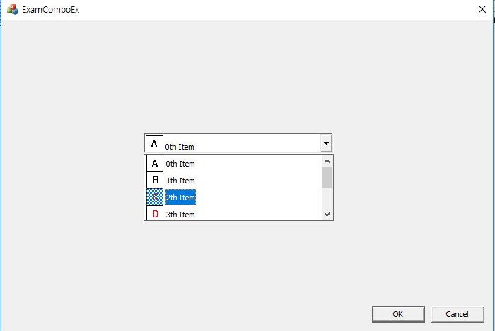

# ComboBoxEx

```

	CBitmap bmp;
	bmp.LoadBitmapW(IDB_BITMAP1);

	m_imglist.Create(24, 24, ILC_COLOR24, 6, 6);
	m_imglist.Add(&bmp, RGB(0, 0, 0));
	m_combo.SetImageList(&m_imglist);

	CString str;
	COMBOBOXEXITEM cbi;
	::ZeroMemory(&cbi, sizeof(cbi));

	cbi.mask = CBEIF_IMAGE | CBEIF_SELECTEDIMAGE | CBEIF_TEXT;
	for (int i = 0; i < 6; i++) {
		str.Format(_T("%dth Item"), i);
		cbi.iItem = i;
		cbi.iImage = i;
		cbi.iSelectedImage = i;

		cbi.pszText = (LPWSTR)(LPCTSTR)str;
		m_combo.InsertItem(&cbi);
	}
	m_combo.SetCurSel(0);
```


* mask에는 COMBOBOXEXITEM 구조체의 멤버 중 유효하게 할 값을 명시한다.
* iItem은 인덱스를, iImage는 평상시 이미지로 사용할 인덱스, iSelectedImage는 선택시 사용할 이미지에 대한 인덱스이다.




#### reference
Visual C++ 2008 MFC 윈도우 프로그래밍
