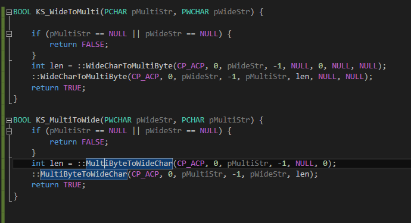

# 멀티바이트 -> 유니코드, 유니코드 -> 멀티바이트

### 함수


```
//wchar_t * -> char *
BOOL KS_WideToMulti(PCHAR pMultiStr, PWCHAR pWideStr) {

	if (pMultiStr == NULL || pWideStr == NULL) {
		return FALSE;
	}
	int len = ::WideCharToMultiByte(CP_ACP, 0, pWideStr, -1, NULL, 0, NULL, NULL);
	::WideCharToMultiByte(CP_ACP, 0, pWideStr, -1, pMultiStr, len, NULL, NULL);
	return TRUE;
}

//char * -> wchar_t *
BOOL KS_MultiToWide(PWCHAR pWideStr, PCHAR pMultiStr) {
	if (pMultiStr == NULL || pWideStr == NULL) {
		return FALSE;
	}
	int len = ::MultiByteToWideChar(CP_ACP, 0, pMultiStr, -1, NULL, 0);
	::MultiByteToWideChar(CP_ACP, 0, pMultiStr, -1, pWideStr, len);
	return TRUE;
}
```

### char -> CString
* CString으로 변환할 때는 VS 환경에 따라 적절한 문자 코드를 그냥 대입해주면 된다.
* 기본은 유니코드이기 때문에 아래와 같이 보통 사용한다.

```
char *p = "안녕하세요. hello :)";
wchar_t *p_buf = new wchar_t[strlen(p) + 1]{0};
KS_WideToMulti(p_buf, p);
CString str = p_buf;
delete[] p_buf;
```

### CString -> char
* CString의 GetBuffer()를 이용하여 내부 포인터를 얻어낸다.

```
CString str = _T("아... ah...");
wchar_t *p_buf = str.GetBuffer();
char *p = new char[wcslen(p_buf) + 1]{0};
KS_WideToMulti(p, p_buf);
delete[] p;
```

#### reference
http://egloos.zum.com/diefish/v/2424730
