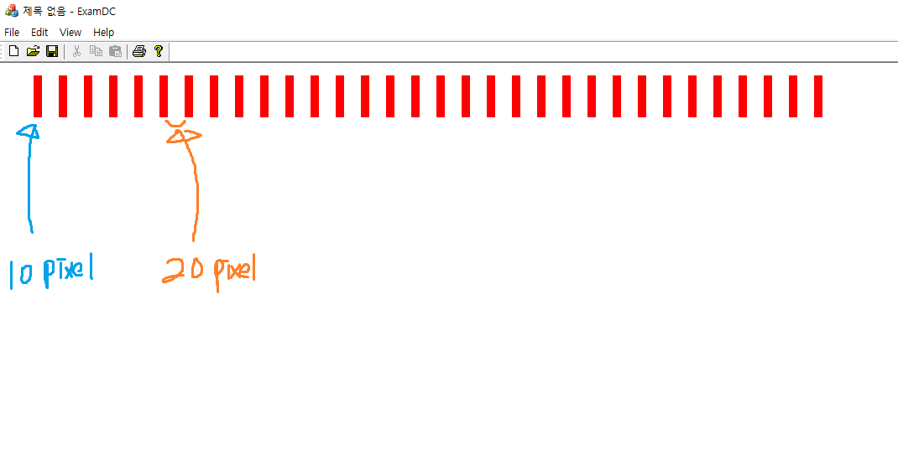
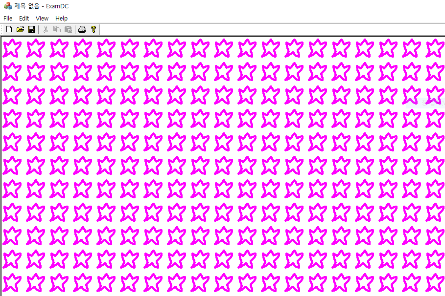
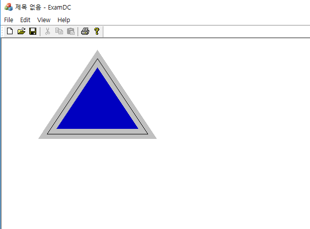
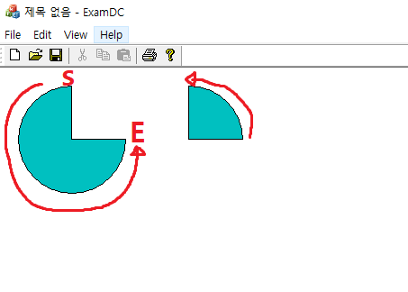

# GDI programming

### pen

* 펜 끝이 둥글지 않게 그리기  

```
void CExamDCView::OnPaint()
{
	CPaintDC dc(this); // device context for painting

	DWORD style[] = { 6,3 };
	LOGBRUSH lb;
	lb.lbStyle = BS_SOLID;
	lb.lbColor = RGB(255, 0, 0);

	CPen newPen;
	newPen.CreatePen(PS_GEOMETRIC | PS_USERSTYLE | PS_ENDCAP_FLAT,
		50, &lb, 2, style);

	CPen *p_old_pen = dc.SelectObject(&newPen);

	dc.MoveTo(40, 40);
	dc.LineTo(1000, 40);
	dc.SelectObject(p_old_pen);
}
```

* PS_USERSTYLE을 통해 사용자가 원하는 펜 스타일로 그릴 수 있음
* 이를 위해 style을 통해 간격 조절
* PS_ENDCAP_FLAT으로 펜의 끝을 사각형으로




CreatePen() : https://msdn.microsoft.com/library/93175a3a-d46c-4768-be8d-863254f97a5f.aspx#cpen__createpen


### Brush

* PatternBrush

```
void CExamDCView::OnPaint()
{
	CPaintDC dc(this); // device context for painting
	CBrush Brush;
	CBitmap Bmp;
	Bmp.LoadBitmapW(IDB_BITMAP1);
	Brush.CreatePatternBrush(&Bmp);
	CBrush *p_old_brush = dc.SelectObject(&Brush);

	CRect Rect;
	GetClientRect(&Rect);
	dc.Rectangle(&Rect);
	dc.SelectObject(p_old_brush);
}
```

  

  


* Join!

```
void CExamDCView::OnPaint()
{
	CPaintDC dc(this); // device context for painting
	DWORD style[] = { 6,3 };
	LOGBRUSH lb;
	lb.lbStyle = BS_SOLID;
	lb.lbColor = RGB(192, 192, 192);

	CPen newPen;
	newPen.CreatePen(PS_GEOMETRIC | PS_SOLID | PS_ENDCAP_FLAT | PS_JOIN_MITER, 20, &lb);
	CPen *p_old_pen = dc.SelectObject(&newPen);

	CBrush NewBrush(RGB(0, 0, 192));
	CBrush *p_old_brush = dc.SelectObject(&NewBrush);

	dc.BeginPath();
	dc.MoveTo(190, 40);
	dc.LineTo(290, 190);
	dc.LineTo(90, 190);
	dc.LineTo(190, 40);
	dc.EndPath();
	dc.StrokeAndFillPath();

	dc.SelectObject(p_old_pen);
	dc.SelectObject(p_old_brush);

	dc.MoveTo(190, 40);
	dc.LineTo(290, 190);
	dc.LineTo(90, 190);
	dc.LineTo(190, 40);
}
```
* PS_JOIN_MITER
* BeginPath(), EndPath() 사이의 코드는 폐곡선으로 인지된다.
* StrokeAndFillPath() 함수를 통해 CreatePen() 호출시 지정한 PS_JOIN_xxx 값을 적용한다.

  

* CDC의 Rectangle() 같은 도형 함수들은 위와 같은 형태로 구현되어 있다.

```
POINT arPt[4] = {{190,40},{290,190},{90,190}};
dc.Polygon(arPt, 3);
```

### 파이 그리기

```
void CExamDCView::OnPaint()
{
	CPaintDC dc(this); // device context for painting
	CBrush brush(RGB(0, 192, 192));
	CBrush *p_old_brush = dc.SelectObject(&brush);
	CRect pie(20, 20, 140, 140);
	dc.Pie(pie, CPoint(pie.CenterPoint().x, pie.top), CPoint(pie.right, pie.CenterPoint().y));

	pie = CRect(150, 20, 270, 140);
	dc.Pie(pie, CPoint(pie.right, pie.CenterPoint().y), CPoint(pie.CenterPoint().x, pie.top));
	dc.SelectObject(p_old_brush);
}
```
  
