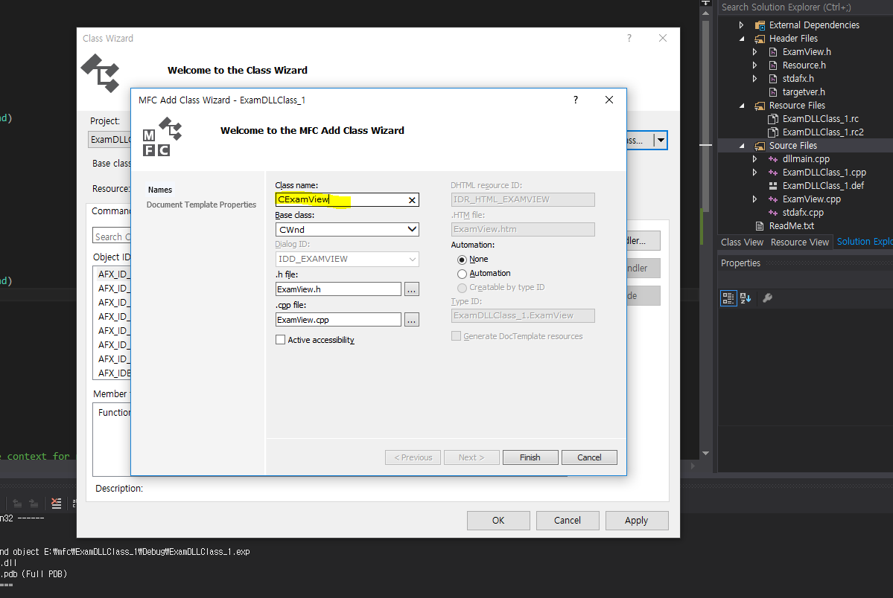
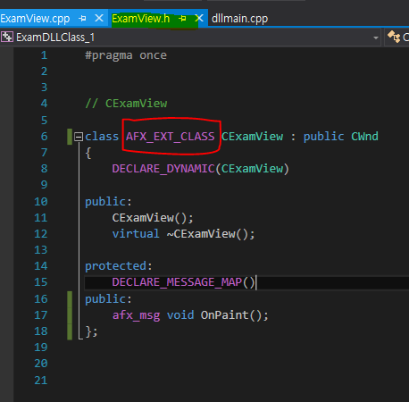
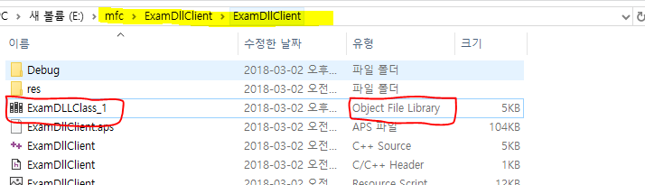
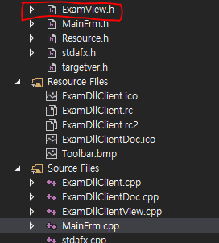
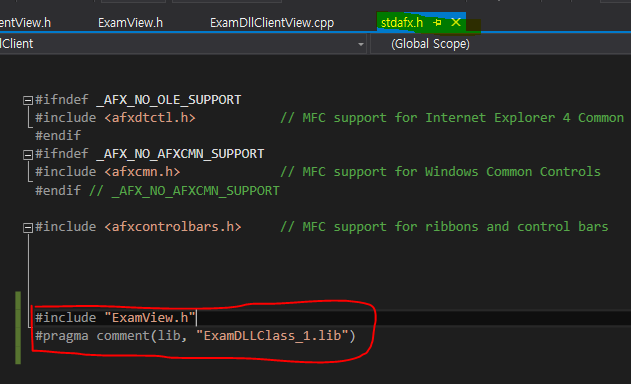
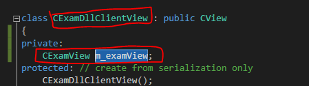
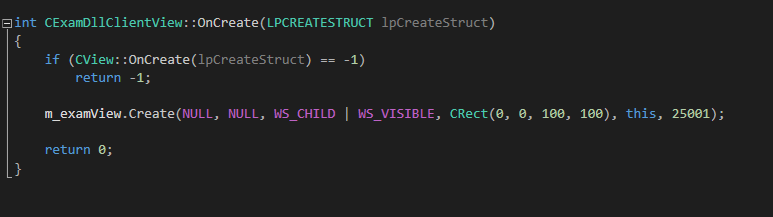
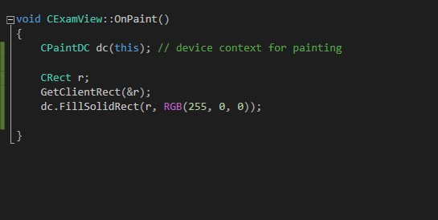
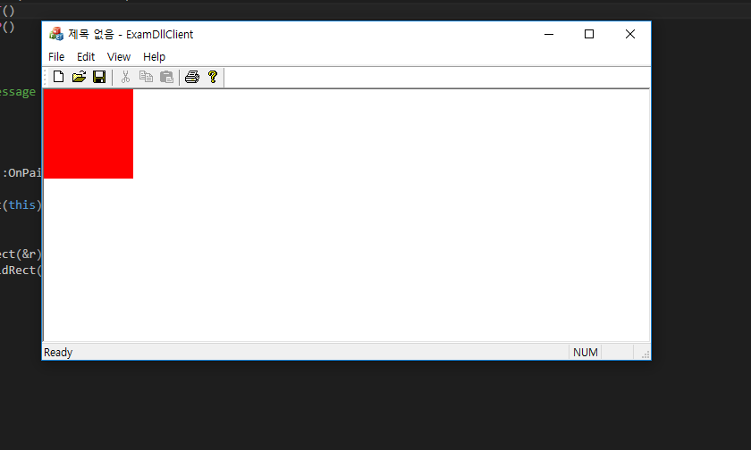

# 내가 만든 MFC 클래스를 다른 프로젝트의 dll로 가져오기

* 일반적인 dll 파일을 만드는 것과 거의 같습니다.(잘 모른다면 md 폴더에 implicit_DLL 파일을 참고하세요)
* 다만 클래스 파일명 앞에 "AFX_EXT_CLASS" 키워드를 붙이면 됩니다.

  

* 저는 테스트용도로 dll 프로젝트에서 직접 클래스를 만들었습니다.

  

* 위와 같이 본인이 만든 클래스 이름 앞에 AFX_EXT_CLASS 키워드를 붙이고 빌드합니다.

  
  

* ExamDLLClient는 dll 파일을 불러와서 사용할 프로젝트입니다.
* 빌드 후 dll 파일을 실행 파일 경로에, lib 파일을 소스 파일 경로에 붙여넣습니다.

  

* 프로젝트에 본인이 만든 윈도우 클래스의 헤더파일을 가져옵니다.  

  

* stdafx.h에서 인클루드 및 라이브러리 포함 명령을 작성합니다.  

  

* 테스트용도로, View 클래스에 멤버변수로 만들어놓고,

  

* 윈도우를 생성합니다.

### 결과화면

  

* 제가 만든 윈도우 클래스는 빨간색으로 칠해졌습니다.

  

* 위 사진처럼 제가 만든 윈도우가 정상적으로 동작하는 것을 확인할 수 있습니다.

#### reference

http://www.tipssoft.com/bulletin/board.php?bo_table=update&wr_id=288
