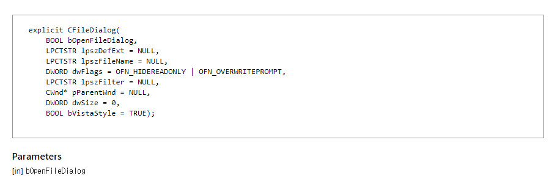

# Common Dialog Box

### FileDialog

  

* bOpenFileDialog : TRUE면 열기, FALSE면 저장
* lpszDefExt : 확장명 명시
* lpszFileName :  경로입력필드에 들어갈 기본값
* dwFlags : OFN_FILEMUSTEXIST, OFN_PATHMUSTEXIST 등 대화상자 속성 명시
* lpszFilter : 파이프(|)를 이용하여 파일 형식 지정 문자열을 설정. 맨 마지막에 ||를 넣어서 끝임을 명시
* 파이프 앞이 표시되는 문자열, 파이프 뒤가 적용될 파일 형식이다.

```
CFileDialog dlg(TRUE, _T("All"), NULL, OFN_FILEMUSTEXIST | OFN_PATHMUSTEXIST, _T("All files(*.*)|*.*||"), this);
if (dlg.DoModal() == IDOK) {
    CString str = dlg.GetPathName();
    AfxMessageBox(str);
}
```

  


### 폴더다이올로그 띄우기

  

  


```
BROWSEINFO bi = { 0 };
TCHAR szBuffer[MAX_PATH] = { 0 };
bi.hwndOwner = m_hWnd;
bi.lpszTitle = _T("파일이 저장될 폴더를 선택해주세요");
bi.ulFlags = BIF_NEWDIALOGSTYLE | BIF_EDITBOX | BIF_RETURNONLYFSDIRS;


LPITEMIDLIST pItemIdList = ::SHBrowseForFolder(&bi);
if (::SHGetPathFromIDList(pItemIdList, szBuffer)) {
    AfxMessageBox(szBuffer);
}

```
