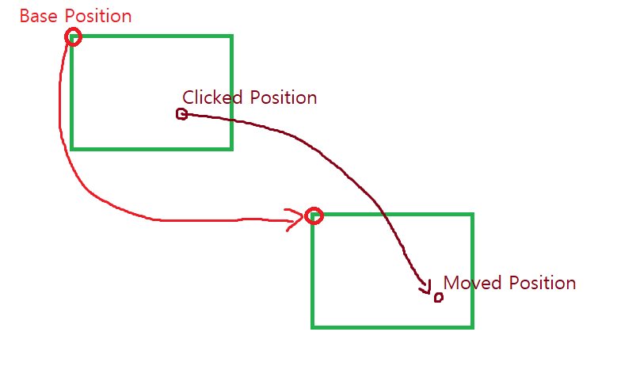

# 물체를 마우스로 드래그하는 기능 구현

* OnLButtonDown(), OnMouseMove(), OnLButtonUp() 같은 마우스 처리기에서 CPoint point는 '클라이언트 영역' 좌표!

### 코드

```
void CExamMouseMoveDlg::OnLButtonDown(UINT nFlags, CPoint point) //클라이언트 좌표
{
	m_bClicked = TRUE;
	SetCapture();
	m_clicked_pos = point;
	PrintPos();
	CDialogEx::OnLButtonDown(nFlags, point);
}


void CExamMouseMoveDlg::OnLButtonUp(UINT nFlags, CPoint point)
{
	m_cur_pos += m_moved_pos - m_clicked_pos;
	ReleaseCapture();
	m_bClicked = FALSE;
	PrintPos();
	CDialogEx::OnLButtonUp(nFlags, point);
}


void CExamMouseMoveDlg::OnMouseMove(UINT nFlags, CPoint point)
{
	if (m_bClicked) {
		m_moved_pos = point;
		PrintPos();
		RedrawWindow();
	}
	CDialogEx::OnMouseMove(nFlags, point);
}

void CExamMouseMoveDlg::OnPaint()
{
	CPaintDC dc(this); // device context for painting
	if (IsIconic())
	{
		SendMessage(WM_ICONERASEBKGND, reinterpret_cast<WPARAM>(dc.GetSafeHdc()), 0);

		// Center icon in client rectangle
		int cxIcon = GetSystemMetrics(SM_CXICON);
		int cyIcon = GetSystemMetrics(SM_CYICON);
		CRect rect;
		GetClientRect(&rect);
		int x = (rect.Width() - cxIcon + 1) / 2;
		int y = (rect.Height() - cyIcon + 1) / 2;

		// Draw the icon
		dc.DrawIcon(x, y, m_hIcon);
	}
	else
	{

		dc.FillSolidRect(m_cur_pos.x + m_moved_pos.x - m_clicked_pos.x, m_cur_pos.y + m_moved_pos.y - m_clicked_pos.y,
			100, 100, RGB(255, 255, 0));
		//CDialogEx::OnPaint();
	}
}
```
  
* m_cur_pos는 베이스 포지션. 이 위치에 m_moved_pos와 m_clicked_pos의 차이를 더하여 사각형을 그린다.
* m_moved_pos와 m_clicked_pos는 각각 OnMouseMove()와 OnLButtonDown()에서 얻으면 된다.
* m_cur_pos는 드래그가 끝났을 때 m_moved_pos와 m_clicked_pos의 차이만큼 더해준다. 
