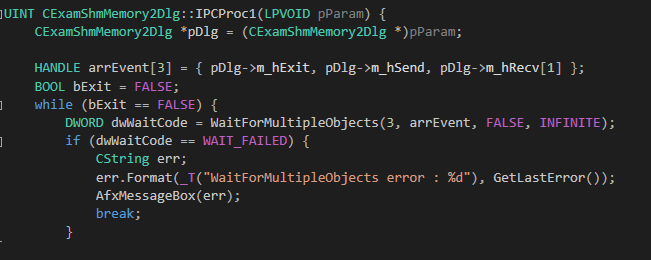
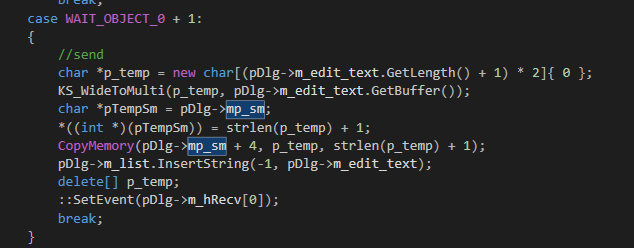
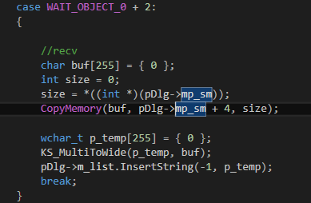
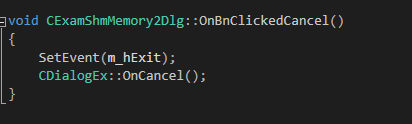

# 공유메모리를 이용한 양방향 통신 예제

* 공유메모리를 이용하여 채팅 프로그램을 만들었습니다.
* 1대1방식이며, 양방향 통신입니다.


### 루틴

* 공유메모리를 사용하기 위해 파일 매핑을 합니다.
* 동기화를 위해, 이벤트 객체 4개를 선언합니다. 각각은 send 1개, recv 2개, 종료 1개입니다.
* recv 이벤트 2개는 각각 내가 읽어야할 시점을 알려주는 것과 상대방이 읽어야 할 때를 알려주는 용도입니다.
* 종료이벤트는 수동리셋방식과 이름있는객체로 만들어서 타 윈도우가 종료할 때 통신 스레드를 종료하도록 합니다.
* 특정 윈도우가 데이터를 전송하려면, send 이벤트를 발생시키고 공유메모리에 데이터를 쓴뒤 상대방의 읽기 이벤트를 시그널합니다.
* 공유메모리에 작성할 데이터는 크기 + 내용으로 구성됩니다.

#### 통신스레드 이벤트 정의  



#### 종료처리


#### 전송처리



#### 수신처리



#### 종료하기



#### 통신스레드 전체 소스

```
UINT CExamShmMemory2Dlg::IPCProc1(LPVOID pParam) {
	CExamShmMemory2Dlg *pDlg = (CExamShmMemory2Dlg *)pParam;

	HANDLE arrEvent[3] = { pDlg->m_hExit, pDlg->m_hSend, pDlg->m_hRecv[1] };
	BOOL bExit = FALSE;
	while (bExit == FALSE) {
		DWORD dwWaitCode = WaitForMultipleObjects(3, arrEvent, FALSE, INFINITE);
		if (dwWaitCode == WAIT_FAILED) {
			CString err;
			err.Format(_T("WaitForMultipleObjects error : %d"), GetLastError());
			AfxMessageBox(err);
			break;
		}

		switch (dwWaitCode)
		{
		case WAIT_OBJECT_0:
			bExit = TRUE;
			break;
		case WAIT_OBJECT_0 + 1:
		{
			//send
			char *p_temp = new char[(pDlg->m_edit_text.GetLength() + 1) * 2]{ 0 };
			KS_WideToMulti(p_temp, pDlg->m_edit_text.GetBuffer());
			char *pTempSm = pDlg->mp_sm;
			*((int *)(pTempSm)) = strlen(p_temp) + 1;
			CopyMemory(pDlg->mp_sm + 4, p_temp, strlen(p_temp) + 1);
			pDlg->m_list.InsertString(-1, pDlg->m_edit_text);
			delete[] p_temp;
			::SetEvent(pDlg->m_hRecv[0]);
			break;
		}
		case WAIT_OBJECT_0 + 2:
		{

			//recv
			char buf[255] = { 0 };
			int size = 0;
			size = *((int *)(pDlg->mp_sm));
			CopyMemory(buf, pDlg->mp_sm + 4, size);

			wchar_t p_temp[255] = { 0 };
			KS_MultiToWide(p_temp, buf);
			pDlg->m_list.InsertString(-1, p_temp);
			break;
		}
		}

	}

	return 0;
}
```

#### 전체 소스
* 깃헙에 전체 코드를 올려놓았으니 참고하시기 바랍니다.
