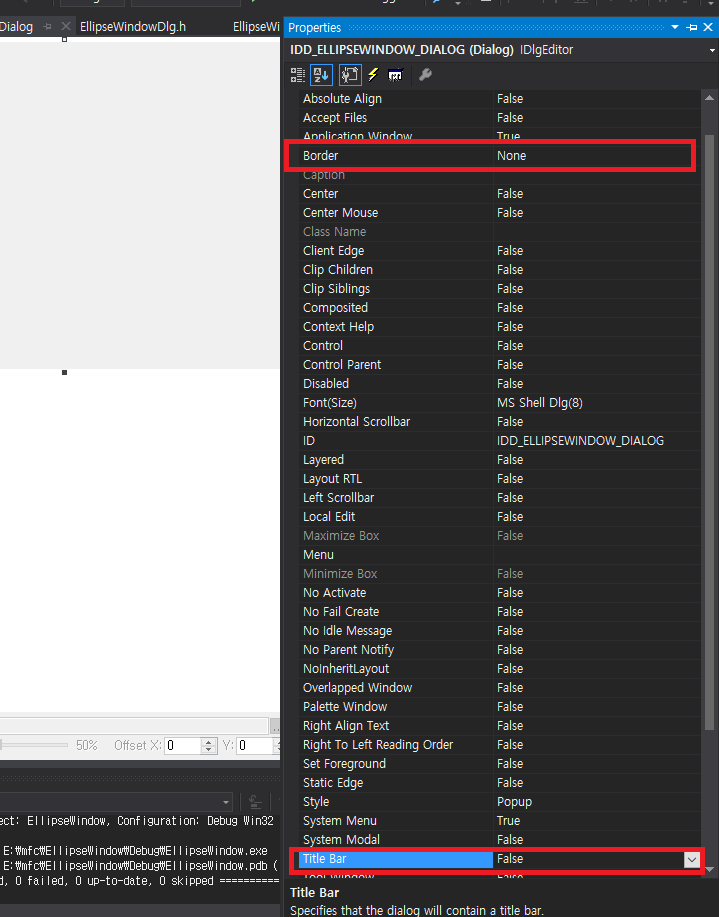

# EllipseWindow

#### step1

<br />



#### step2

<br />

```
    /* OninitialDialog() */
    HRGN h_region;
	h_region = ::CreateEllipticRgn(0, 0, 150, 150);
	SetWindowRgn(h_region, TRUE);
	DeleteObject(h_region);
```

#### reference
https://blog.naver.com/tipsware/221139737602
