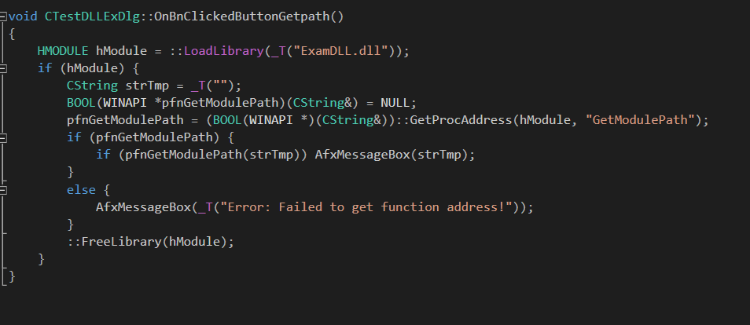

# Explicit DLL (명시적 DLL)

  

```
void CTestDLLExDlg::OnBnClickedButtonGetpath()
{
    //LoadLibrary()를 통해 dll 핸들을 얻어낸다.
	HMODULE hModule = ::LoadLibrary(_T("ExamDLL.dll"));
	if (hModule) {
		CString strTmp = _T("");
		BOOL(WINAPI *pfnGetModulePath)(CString&) = NULL;
        //GetProcAddress()를 통해 dll에 있는 함수의 주소를 얻어낸다.
		pfnGetModulePath = (BOOL(WINAPI *)(CString&))::GetProcAddress(hModule, "GetModulePath");
		if (pfnGetModulePath) {
			if (pfnGetModulePath(strTmp)) AfxMessageBox(strTmp);
		}
		else {
			AfxMessageBox(_T("Error: Failed to get function address!"));
		}
		::FreeLibrary(hModule);
	}
}
```

### 모듈 작업시 유의해야 할 점
* 암시적, 명시적 링크가 모두 가능하도록 개발한다.
* 함수 선언과 Lib 파일을 링크하는 별도의 헤더파일을 만든다.
* 라이브러리 활용에 필요한 도움말과 예제를 작성한다. + PDB 파일을 주면 사용자가 라이브러리의 오류를 찾기 편리하다.
* 디버그, 릴리즈 모드 라이브러리를 모두 전달한다.
