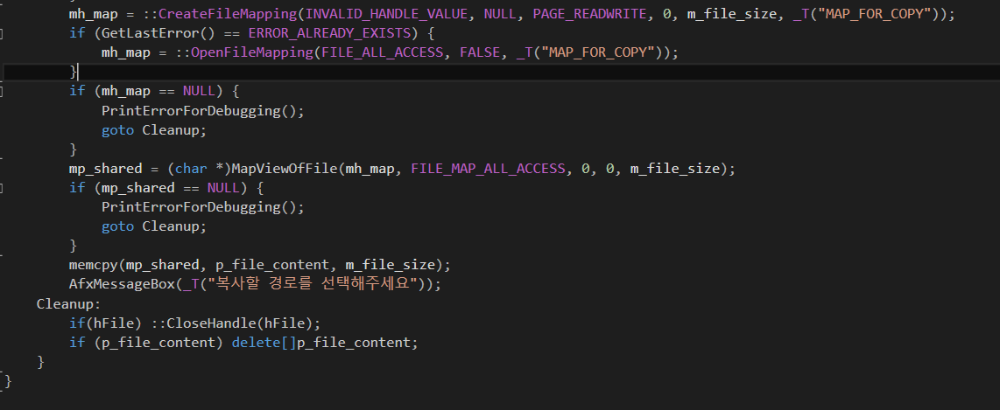

# 공유메모리를 이용하여 파일복사하기

* 파일다이올로그에서 src 파일의 경로 얻어서 파일 열기
* 파일의 내용을 공유메모리에 복사
* 공유메모리의 내용을 새로운 파일에 복사

### 파일 읽기

  

```
CFileDialog dlg(TRUE, _T("All"), NULL, OFN_FILEMUSTEXIST | OFN_PATHMUSTEXIST, _T("All files(*.*)|*.*||"), this);
if (dlg.DoModal() == IDOK) {
    m_src_path = dlg.GetPathName();
    m_file_name = dlg.GetFileName();
    UpdateData(FALSE);
    HANDLE hFile = ::CreateFile(m_src_path, GENERIC_READ, 0, NULL, OPEN_EXISTING, FILE_ATTRIBUTE_NORMAL, 0);
    if (hFile == INVALID_HANDLE_VALUE){
        PrintErrorForDebugging();
        return;
    }
    m_file_size = GetFileSize(hFile, NULL);
    char *p_file_content = new char[m_file_size];
    ::ZeroMemory(p_file_content, 0);
    DWORD read_size = 0;
    if (!::ReadFile(hFile, p_file_content, m_file_size, &read_size, NULL)) {
        PrintErrorForDebugging();
        goto Cleanup;
    }
```

### 공유메모리 복사

  

```
mh_map = ::CreateFileMapping(INVALID_HANDLE_VALUE, NULL, PAGE_READWRITE, 0, m_file_size, _T("MAP_FOR_COPY"));
if (GetLastError() == ERROR_ALREADY_EXISTS) {
    mh_map = ::OpenFileMapping(FILE_ALL_ACCESS, FALSE, _T("MAP_FOR_COPY"));
}
if (mh_map == NULL) {
    PrintErrorForDebugging();
    goto Cleanup;
}
mp_shared = (char *)MapViewOfFile(mh_map, FILE_MAP_ALL_ACCESS, 0, 0, m_file_size);
if (mp_shared == NULL) {
    PrintErrorForDebugging();
    goto Cleanup;
}
memcpy(mp_shared, p_file_content, m_file_size);
AfxMessageBox(_T("복사할 경로를 선택해주세요"));
Cleanup:
if(hFile) ::CloseHandle(hFile);
if (p_file_content) delete[]p_file_content;
```

### 파일 복사


```
void CExamFileCopyDlg::OnBnClickedButtonDstCopy()
{
	if (mp_shared == NULL) {
		AfxMessageBox(_T("복사 파일을 선택하세요"));
		return;
	}
	BROWSEINFO bi = { 0 };
	TCHAR szBuffer[MAX_PATH] = { 0 };
	bi.hwndOwner = m_hWnd;
	bi.lpszTitle = _T("파일이 저장될 폴더를 선택해주세요");
	bi.ulFlags = BIF_NEWDIALOGSTYLE | BIF_EDITBOX | BIF_RETURNONLYFSDIRS;

	LPITEMIDLIST pItemIdList = ::SHBrowseForFolder(&bi);
	if (::SHGetPathFromIDList(pItemIdList, szBuffer)) {
		m_dst_path = szBuffer;
		m_dst_path += _T("\\") + m_file_name;
		FILE *fp = _tfopen(m_dst_path.GetBuffer(), _T("w"));
		int write_size = 0;
		while ((write_size += fwrite(mp_shared, 1, m_file_size, fp)) < m_file_size);
		fclose(fp);
		UpdateData(FALSE);
		MessageBox(_T("복사가 완료되었습니다."));
	}

}
```

### OnDestroy()

  

```
void CExamFileCopyDlg::OnDestroy()
{
	CDialogEx::OnDestroy();

	if (m_file_name) UnmapViewOfFile(mp_shared);
	if (mh_map) ::CloseHandle(mh_map);

}
```
