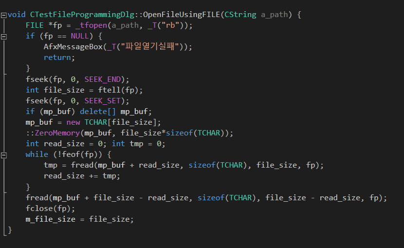
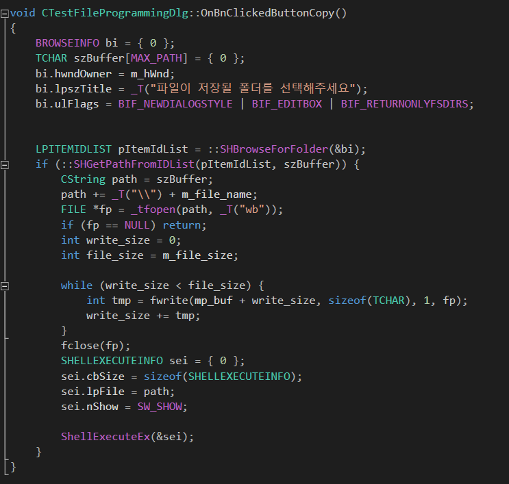

# Standard File I/O 방식으로 입출력하기
* 위 코드는 Windows가 기본적으로 제공하는 파일 형식(ANSI, 유니코드, UTF)에 모두 대응할 수 있는 코드입니다.
* 아래의 예제는 파일을 복사하는 예제입니다.


#### Open & Read



```
void CTestFileProgrammingDlg::OpenFileUsingFILE(CString a_path) {
	FILE *fp = _tfopen(a_path, _T("rb"));
	if (fp == NULL) {
		AfxMessageBox(_T("파일열기실패"));
		return;
	}
	fseek(fp, 0, SEEK_END);
	int file_size = ftell(fp);
	fseek(fp, 0, SEEK_SET);
	if (mp_buf) delete[] mp_buf;
	mp_buf = new TCHAR[file_size];
	::ZeroMemory(mp_buf, file_size*sizeof(TCHAR));
	int read_size = 0; int tmp = 0;
	while (!feof(fp)) {
		tmp = fread(mp_buf + read_size, sizeof(TCHAR), file_size, fp);
		read_size += tmp;
	}
	fread(mp_buf + file_size - read_size, sizeof(TCHAR), file_size - read_size, fp);
	fclose(fp);
	m_file_size = file_size;
}

```


* 외부 변수로 m_file_size와 mp_buf가 필요합니다.
* 즉 파일 크기와 파일의 내용을 담을 변수가 필요합니다. 상황에 따라 적절히 선언하여 사용하세요.

#### Write

  

```
void CTestFileProgrammingDlg::OnBnClickedButtonCopy()
{
	BROWSEINFO bi = { 0 };
	TCHAR szBuffer[MAX_PATH] = { 0 };
	bi.hwndOwner = m_hWnd;
	bi.lpszTitle = _T("파일이 저장될 폴더를 선택해주세요");
	bi.ulFlags = BIF_NEWDIALOGSTYLE | BIF_EDITBOX | BIF_RETURNONLYFSDIRS;


	LPITEMIDLIST pItemIdList = ::SHBrowseForFolder(&bi);
	if (::SHGetPathFromIDList(pItemIdList, szBuffer)) {
		CString path = szBuffer;
		path += _T("\\") + m_file_name;
		FILE *fp = _tfopen(path, _T("wb"));
		if (fp == NULL) return;
		int write_size = 0;
		int file_size = m_file_size;

		while (write_size < file_size) {
			int tmp = fwrite(mp_buf + write_size, sizeof(TCHAR), 1, fp);
			write_size += tmp;
		}
		fclose(fp);
		SHELLEXECUTEINFO sei = { 0 };
		sei.cbSize = sizeof(SHELLEXECUTEINFO);
		sei.lpFile = path;
		sei.nShow = SW_SHOW;

		ShellExecuteEx(&sei);
	}
}
```

#### 주의할점
* 윈도우즈에서 엔터라는 텍스트는 \r\n으로 입력됩니다.
* 이는 파일에 출력할 때에도 마찬가지입니다.
* 이 때문에 출력 파일의 내용이 깨지는 현상이 발생하게 되는데, 특히 유니코드를 사용하면 그렇습니다.
* 유니코드에서는 \n이 0x0a0d로 입력됩니다. (아래의 링크를 참고하세요)
* https://yumichan.net/programming/avoid-writing-0x0a-as-0x0d0a/
* 해결하는 방법은 위 링크에서도 나와있듯이, 바이너리 모드로 입출력을 하는 것입니다.
