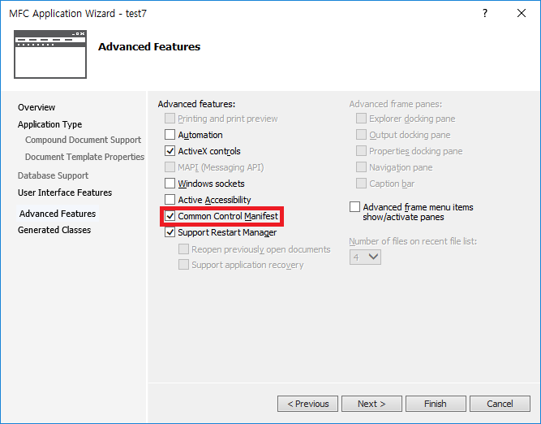

# List control

```

m_imageList.Create(48, 48, ILC_COLOR32, 1, 1);
m_imageList.Add(AfxGetApp()->LoadIcon(IDR_MAINFRAME));
m_list.SetImageList(&m_imageList, LVSIL_NORMAL);
m_list.InsertItem(0, _T("1th Test Item"));

```
* CImageList 클래스는 리스트 컨트롤에 연동되었더라도 객체 파괴시 이미지를 없앤다.
* 따라서 멤버변수나 스태틱으로 선언해줘야 한다.

### 큰 아이콘

```
m_imageList.Create(48, 48, ILC_COLOR32, 5, 0);
CString item;
for (int i = 0; i < 5; i++) {
    m_imageList.Add(AfxGetApp()->LoadIconW(IDI_ICON1 + i));
    item.Format(_T("%dth item"), i + 1);
    m_list.InsertItem(i, item, i);
}
m_list.SetImageList(&m_imageList, LVSIL_NORMAL);

```


### 작은 아이콘

```
BOOL CExamListCtrlDlg::OnInitDialog()
{
	CDialogEx::OnInitDialog();

	// Set the icon for this dialog.  The framework does this automatically
	//  when the application's main window is not a dialog
	SetIcon(m_hIcon, TRUE);			// Set big icon
	SetIcon(m_hIcon, FALSE);		// Set small icon


	m_imageList.Create(48, 48, ILC_COLOR32, 5, 0);
	m_smallList.Create(16, 16, ILC_COLOR32, 5, 0);
	CString item;
	for (int i = 0; i < 5; i++) {
		m_imageList.Add(AfxGetApp()->LoadIconW(IDI_ICON1 + i));
		m_smallList.Add(AfxGetApp()->LoadIconW(IDI_ICON1 + i));
		item.Format(_T("%dth item"), i + 1);
		m_list.InsertItem(i, item, i);
	}
	m_list.SetImageList(&m_imageList, LVSIL_NORMAL);
	m_list.SetImageList(&m_smallList, LVSIL_SMALL);

	m_list.InsertColumn(0, _T("NAME"), LVCFMT_LEFT, 200);
	m_list.InsertColumn(1, _T("DESCRIPTION"), LVCFMT_LEFT, 300);
	m_list.ModifyStyle(LVS_TYPEMASK, LVS_REPORT);

	m_list.SetItemText(0, 0, _T("New Name"));
	m_list.SetItemText(0, 1, _T("Test String"));
	return TRUE;  // return TRUE  unless you set the focus to a control
}
```


### 에딧컨트롤 출력 및 텍스트 수정

```
void CExamListCtrlDlg::OnLvnEndlabeleditList1(NMHDR *pNMHDR, LRESULT *pResult)
{
	NMLVDISPINFO *pDispInfo = reinterpret_cast<NMLVDISPINFO*>(pNMHDR);

	CString str;
	CEdit *p_edit = m_list.GetEditControl();
	p_edit->GetWindowText(str);
	m_list.SetItemText(pDispInfo->item.iItem, 0, str);
	*pResult = 0;
}

```


### 체크박스 넣기, 삭제하기

```
//체크박스 넣기
DWORD dwExStyle = m_list.GetExtendedStyle();
m_list.SetExtendedStyle(dwExStyle | LVS_EX_CHECKBOXES | LVS_EX_BORDERSELECT);

//삭제하기
void CExamListCtrlDlg::OnBnClickedButton1()
{
	int nCount = m_list.GetItemCount();
	for (int i = nCount-1; i >= 0; i--) {
		if (m_list.GetCheck(i)) {
			m_list.DeleteItem(i);
		}
	}
}

```
* 삭제할 때에는 가장 뒤의 아이템부터 삭제한다. 그렇지 않으면 인덱스가 꼬여서 다른 것이 삭제될 수 있음.

### 그룹화

```
//1.컬럼 추가
m_List.InsertColumn(0, _T("Name"), LVCFMT_LEFT, 200);

//2.아이콘 이미지 리스트 생성 및 설정
static CImageList ImgList, ImgListSmall;
ImgList.Create(48, 48, ILC_COLOR32, 5, 0);
ImgListSmall.Create(16, 16, ILC_COLOR32, 5, 0);

m_List.SetImageList(&ImgList, LVSIL_NORMAL);
m_List.SetImageList(&ImgListSmall, LVSIL_SMALL);

//3.그룹 생성 및 추가
LVGROUP group;
::ZeroMemory(&group, sizeof(group));
group.cbSize = sizeof(group);
group.mask = LVGF_HEADER | LVGF_GROUPID;
group.pszHeader = _T("First Group");
group.iGroupId = 10;
m_List.InsertGroup(-1, &group);

group.pszHeader = _T("Second Group");
group.iGroupId = 20;
m_List.InsertGroup(-1, &group);

//4.아이템 추가
LVITEM item;
::ZeroMemory(&item, sizeof(item));
item.mask = LVIF_TEXT | LVIF_IMAGE | LVIF_GROUPID;
CString strItem = _T("");
for (int i = 0; i < 5; ++i)
{
    ImgList.Add(AfxGetApp()->LoadIcon(IDI_ICON1 + i));
    ImgListSmall.Add(AfxGetApp()->LoadIcon(IDI_ICON1 + i));
    strItem.Format(_T("%dth Item"), i);

    item.pszText = strItem.GetBuffer();
    item.iItem = i;
    item.iImage = i;
    item.iGroupId = 10;
    m_List.InsertItem(&item);

    item.iGroupId = 20;
    m_List.InsertItem(&item);
}

//5.그룹 뷰 활성화 및 확장 스타일 적용
m_List.EnableGroupView(TRUE);

DWORD dwExStyle = m_List.GetExtendedStyle();
m_List.SetExtendedStyle(dwExStyle |
    LVS_EX_CHECKBOXES | LVS_EX_BORDERSELECT);
```


* 대화상자에서 작업시, 프로젝트 만들 때 common control manifest를 꼭 체크할 것!!!!
* 그래야 XP 이후의 기술인 그룹화를 사용할 수 있음.
* 컬럼 추가는 리스트컨트롤의 스타일이 report 모드일 때만 적용됨  



### 리스트뷰 실험

* InsertItem을 호출하고나면 pszText가 가리키는 값을 바꿔도 해당 아이템의 문자열이 바뀌지 않음
* 아마 값만 복사되고 끝나는 듯.

```
for (int i = 0; i < 5; i++) {
		m_imageList.Add(AfxGetApp()->LoadIconW(IDI_ICON1 + i));
		item.iImage = i;
		item.iItem = i;
		str.Format(_T("%dth item"), i);
		item.pszText = str.GetBuffer();
		str.Format(_T("%dth item"), i + 5);
		m_list.InsertItem(&item);

}
```
* 위와 같은 코드에선 5th item, 6th item ... 9th item 으로 출력


### 정렬

```
BOOL CExamHeadCtrlDlg::OnInitDialog()
{
	CDialogEx::OnInitDialog();

	// Set the icon for this dialog.  The framework does this automatically
	//  when the application's main window is not a dialog
	SetIcon(m_hIcon, TRUE);			// Set big icon
	SetIcon(m_hIcon, FALSE);		// Set small icon

	m_list.InsertColumn(0, _T("name"), LVCFMT_LEFT, 200);
	m_list.InsertColumn(1, _T("data"), LVCFMT_LEFT, 200);
	m_list.InsertColumn(2, _T("desc"), LVCFMT_LEFT, 200);
	m_list.ModifyStyle(LVS_TYPEMASK, LVS_REPORT);

	m_imageList.Create(16, 16, ILC_COLOR32, 5, 0);
	m_list.SetImageList(&m_imageList, LVSIL_SMALL);
	DWORD dwSpeed = ::GetTickCount();
	CString str;
	LVITEM item;
	::ZeroMemory(&item, sizeof(item));
	item.mask = LVIF_TEXT | LVIF_IMAGE | LVIF_PARAM;
	for (int i = 0; i < 5; i++) {
		m_imageList.Add(AfxGetApp()->LoadIconW(IDI_ICON1 + i));
		item.iImage = i;
		item.iItem = i;
		str.Format(_T("%dth item"), i);
		item.pszText = str.GetBuffer();
		item.lParam = dwSpeed + i;
		m_list.InsertItem(&item);

		str.Format(_T("%dth Data"), i);
		m_list.SetItemText(i, 1, str);
		str.Format(_T("%dth Desc"), i);
		m_list.SetItemText(i, 2, str);

	}

	DWORD dwExStyle = m_list.GetExtendedStyle();
	m_list.SetExtendedStyle(dwExStyle | LVS_EX_HEADERDRAGDROP);
	m_bAccending = FALSE;
	m_list.SortItems(&CExamHeadCtrlDlg::CompareItem, (DWORD_PTR)(this));
	UpdateArrow();
	return TRUE;  // return TRUE  unless you set the focus to a control
}

void CExamHeadCtrlDlg::OnHdnItemclickList1(NMHDR *pNMHDR, LRESULT *pResult)
{
	LPNMHEADER phdr = reinterpret_cast<LPNMHEADER>(pNMHDR);

	if (phdr->iItem == 0) {
		m_bAccending = !m_bAccending;
		UpdateArrow();
		m_list.SortItems(&CExamHeadCtrlDlg::CompareItem, (DWORD_PTR)this);
	}

	*pResult = 0;
}

int CALLBACK CExamHeadCtrlDlg::CompareItem(LPARAM lParam1, LPARAM lParam2, LPARAM lParamSort) {
	CExamHeadCtrlDlg *p_dlg = (CExamHeadCtrlDlg *)lParamSort;

	LVFINDINFO lvFind1, lvFind2;
	//flags는 무엇을 기준으로 비교할지를 설정.
	lvFind1.flags = LVFI_PARAM;
	//이에 따라 적절한 속성에 인자를 대입.
	lvFind1.lParam = lParam1;
	lvFind2.flags = LVFI_PARAM;
	lvFind2.lParam = lParam2;

	int nIndex1 = p_dlg->m_list.FindItem(&lvFind1);
	int nIndex2 = p_dlg->m_list.FindItem(&lvFind2);

	CString str1 = p_dlg->m_list.GetItemText(nIndex1, 0);
	CString str2 = p_dlg->m_list.GetItemText(nIndex2, 0);

	int nResult = 0;
	if (p_dlg->m_bAccending) nResult = str2.Compare(str1);
	else nResult = str1.Compare(str2);

	return nResult;
}

void CExamHeadCtrlDlg::UpdateArrow() {
	CHeaderCtrl *p_header = m_list.GetHeaderCtrl();
	HDITEM hdItem;
	TCHAR szBuffer[256];
	::ZeroMemory(&hdItem, sizeof(HDITEM));
	::ZeroMemory(szBuffer, sizeof(szBuffer));

	hdItem.mask = -1;
	hdItem.pszText = szBuffer;
	hdItem.cchTextMax = 256;
	p_header->GetItem(0, &hdItem);

	hdItem.fmt &= ~(HDF_SORTDOWN | HDF_SORTUP);

	if (m_bAccending) hdItem.fmt |= HDF_SORTDOWN;
	else hdItem.fmt |= HDF_SORTUP;
	p_header->SetItem(0, &hdItem);
}
```


* 각 아이템의 lParam에 유일한 값을 설정
* compare 콜백함수 작성 : flags를 통해 정렬 기준을 설정하고, CString의 compare 함수로 알파벳순으로 정렬
* UpdateArrow() 함수는 컬럼에 표시되는 화살표를 정렬차순의 변경과 함께 업데이트
* OnHdnItemclickList1()는 컬럼을 클릭했을 때 호출되는 이벤트 핸들러 : 화살표가 있는 컬럼을 클릭하면 정렬 차순을 변경하면서 그에 따라 다시 정렬한다.


### 시스템 이미지 사용하기

```
BOOL CExamSysImageDlg::OnInitDialog()
{
	CDialogEx::OnInitDialog();

	// Set the icon for this dialog.  The framework does this automatically
	//  when the application's main window is not a dialog
	SetIcon(m_hIcon, TRUE);			// Set big icon
	SetIcon(m_hIcon, FALSE);		// Set small icon

	SHFILEINFO shellInfo;
	::ZeroMemory(&shellInfo, sizeof(SHFILEINFO));
	HIMAGELIST hSysImage = reinterpret_cast<HIMAGELIST>(::SHGetFileInfo(_T("C:\\"), 0, &shellInfo
		, sizeof(shellInfo), SHGFI_LARGEICON | SHGFI_SYSICONINDEX));

	::ZeroMemory(&shellInfo, sizeof(shellInfo));
	HIMAGELIST hSysImageSmall = reinterpret_cast<HIMAGELIST>(::SHGetFileInfo(_T("C:\\"), 0, &shellInfo, sizeof(shellInfo),
		SHGFI_SMALLICON | SHGFI_SYSICONINDEX));

	ListView_SetImageList(m_list.m_hWnd, hSysImage, LVSIL_NORMAL);
	ListView_SetImageList(m_list.m_hWnd, hSysImageSmall, LVSIL_SMALL);
	DWORD style = m_list.GetExtendedStyle();


	CString str = _T("C:\\");
	m_list.InsertItem(0, str, GetIconIndexFromFile(str));
	str = _T("C:\\Windows");
	m_list.InsertItem(1, str, GetIconIndexFromFile(str));
	str = _T("C:\\Windows\\notepad.exe");
	m_list.InsertItem(2, str, GetIconIndexFromFile(str));
	str = _T("C:\\Windows\\explorer.exe");
	m_list.InsertItem(3, str, GetIconIndexFromFile(str));
	return TRUE;  // return TRUE  unless you set the focus to a control
}

int CExamSysImageDlg::GetIconIndexFromFile(CString str) {
	SHFILEINFO shellInfo;
	::ZeroMemory(&shellInfo, sizeof(SHFILEINFO));
	::SHGetFileInfo(str.GetBuffer(), 0, &shellInfo, sizeof(shellInfo), SHGFI_SMALLICON | SHGFI_SYSICONINDEX);

	return shellInfo.iIcon;
}
```


* 시스템 이미지를 구하는 함수는 SHGetFileInfo()이다.
* 인자 중 하나인 SHFILEINFO에 icon 핸들 등의 정보를 가질 수 있다.
* 5번째 인자에 명시하는 매크로에 따라 SHFILEINFO에 담을 속성을 결정한다. 위에서는 SHGFI_LARGEICON과 SHGFI_SYSICONINDEX를 명시했기 때문에 hIcon과 iIcon 멤버에 대한 정보가 담긴다.


#### reference
Visual C++ 2008 MFC 윈도우 프로그래밍
