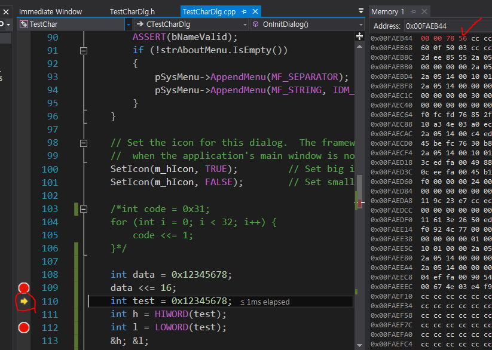
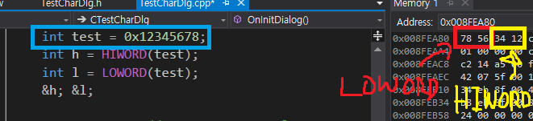
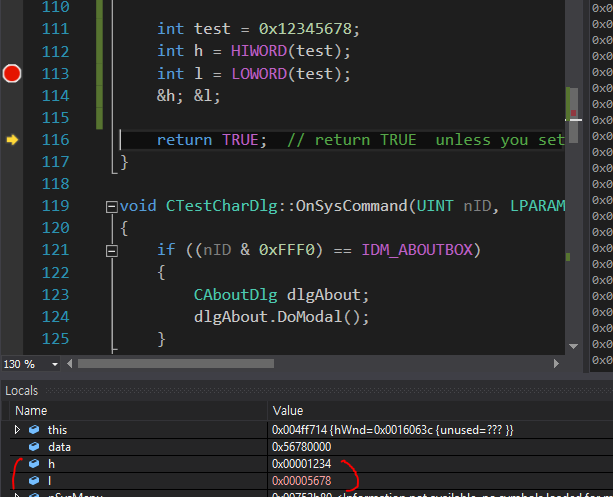

# 리틀엔디언과 관련된 혼동사항

### 비트이동연산
* 리틀엔디언은 작은 주소에서 끝나는 것!
* 0x12345678은 78 / 56 / 34 / 12로 저장
* 그렇담 아래의 코드의 결과는?  

```
int data = 0x12345678;
data <<= 16;
```


* 바이트 단위에서 보면 비트이동방향과 반대방향으로 이동!
* 애초에 거꾸로 저장되었으니까 이동도 거꾸로 되어야 함.

### HIWORD와 LOWORD
* 0x12345678에서 HIWORD는 뭐고, LOWORD는 뭘까?
* HIWORD의 정의
```
#define HIWORD(_dw)     ((WORD)((((DWORD_PTR)(_dw)) >> 16) & 0xffff))
```
* 16만큼 오른쪽 비트 이동! 이 방향과 반대방향으로 움직이니, 34 / 12 / 00 / 00이 됨!
* 34 / 12 == HIWORD  
* 78 / 56 == LOWORD

  


