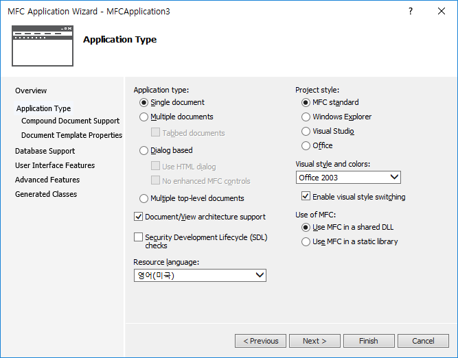
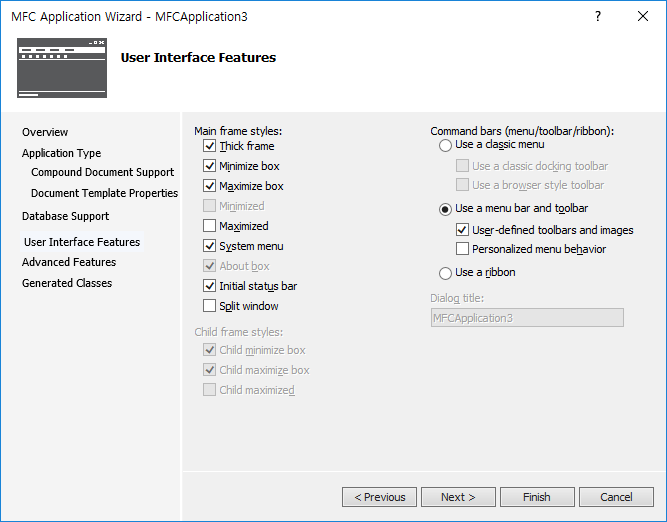

# MFC Feature Pack 1

### Dockable class


#### 사용법





* 클래스 위저드로 도커블 클래스의 자식 클래스를 만든다.  


* 자식 클래스에서 아래와 같이 메시지 처리기를 추가하고, 코딩.  


```
int CStaticPane::OnCreate(LPCREATESTRUCT lpCreateStruct)
{
	if (CDockablePane::OnCreate(lpCreateStruct) == -1)
		return -1;

	// TODO:  Add your specialized creation code here
	m_wndChild.Create(_T("STATIC"), _T("Dockable pane window"),
		WS_CHILD | WS_VISIBLE, CRect(0, 0, 0, 0), this, 1234);
	return 0;
}


void CStaticPane::OnSize(UINT nType, int cx, int cy)
{
	CDockablePane::OnSize(nType, cx, cy);

	if (m_wndChild.GetSafeHwnd()) {
		m_wndChild.SetWindowPos(NULL, 0, 0, cx, cy, SWP_NOZORDER);
	}
}
```

* MainFrame의 OnCreate()에서 아래와 같이 코딩.  


```
CTabbedPane *pTabbedPane = new CTabbedPane(TRUE);
if (!pTabbedPane->Create(_T(""), this, CRect(0, 0, 250, 250)
    , TRUE, (UINT)-1, WS_CHILD | WS_VISIBLE | WS_CLIPSIBLINGS | WS_CLIPCHILDREN
    | CBRS_LEFT | CBRS_FLOAT_MULTI)) {
    return -1;
}

m_wndStaticPane.CreateEx(NULL, _T("Test1"), this, CRect(0, 0, 100, 100),
    TRUE, 1234, WS_CHILD | WS_VISIBLE | WS_CLIPSIBLINGS | WS_CLIPCHILDREN |
    CBRS_LEFT | CBRS_FLOAT_MULTI);

m_wndStaticPane.EnableDocking(CBRS_ALIGN_ANY);
DockPane(&m_wndStaticPane);

pTabbedPane->AddTab(&m_wndStaticPane);
pTabbedPane->EnableDocking(CBRS_ALIGN_ANY);

DockPane(pTabbedPane);
```

### 두 번 실행 이후 GUI 변경이 안될경우
* InitInstance()에서 CleanState() 호출한다. 이 함수는 실행 정보에 대한 레지스트리를 삭제한다.

### 주의
* CTabbedPane 클래스 객체의 포인터를 따로 저장하여 사용하지 말 것.
* CTabbedPane 객체는 사용자가 도킹할 때마다 생성 및 삭제가 되기 때문.
