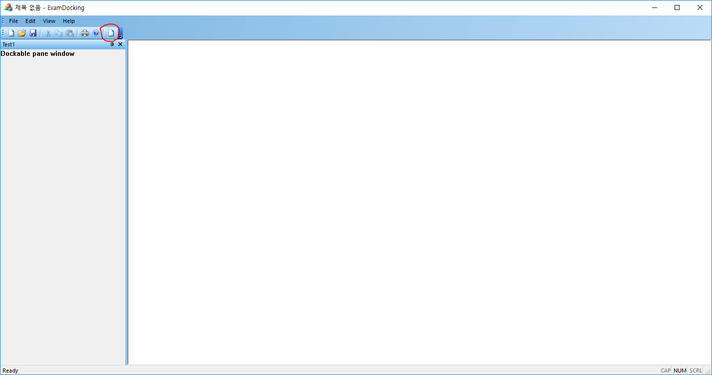
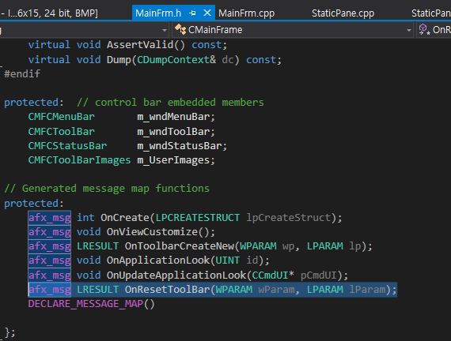
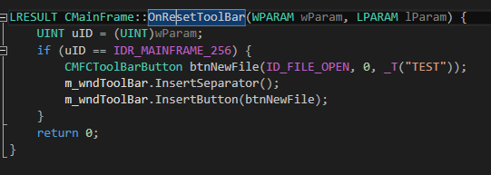
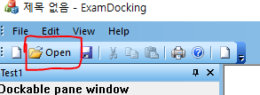
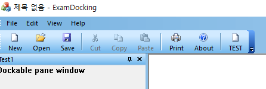
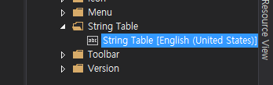
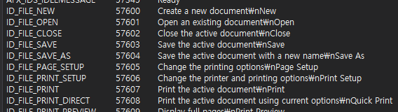
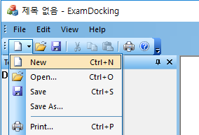
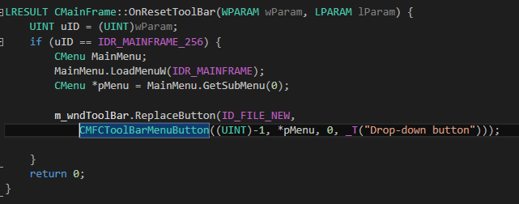
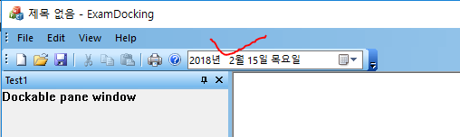

# MFC Feature Pack 2

### ToolBar



* 이 작업은 ToolBar 리소스인 IDR_MAINFRAME_256에서 작업한 것이 반영된다.
* 툴바 버튼을 동적으로 생성한 예제이다.
* 생성하는 루틴은 메시지를 이용하는데, 이 메시지는 클래스 위저드에서 지원하지 않기 때문에 수동으로 추가해야 한다.


  

  

```
LRESULT CMainFrame::OnResetToolBar(WPARAM wParam, LPARAM lParam) {
	UINT uID = (UINT)wParam;
	if (uID == IDR_MAINFRAME_256) {
		CMFCToolBarButton btnNewFile(ID_FILE_OPEN, 0, _T("TEST"));
		m_wndToolBar.InsertSeparator();
		m_wndToolBar.InsertButton(btnNewFile);
	}
	return 0;
}
```

### 이름과 이미지 동시에 출력

  

* OnResetToolBar()에서 아래 코드 추가  


```
m_wndToolBar.SetToolBarBtnText(1, _T("Open"), TRUE, TRUE);
```

* 모든 툴바버튼에 대해서 텍스트와 이미지 출력(텍스트는 아래, 이미지는 위)



```
m_wndToolBar.EnableTextLabels(TRUE);
```  

* 위의 정보는 ToolStrip과 같은 것이며, 문자열 테이블에서 수정할 수 있다.

  
  

* 버튼의 동작을 변경하고 싶다면(버튼이 눌려 있는 상태로 생성, 체크박스 체크상태로 생성 등) SetButtonStyle() 참고


### 드롭다운 메뉴 툴바
  

* 툴바 버튼에 메뉴를 붙일 수 있습니다.

  

```
LRESULT CMainFrame::OnResetToolBar(WPARAM wParam, LPARAM lParam) {
	UINT uID = (UINT)wParam;
	if (uID == IDR_MAINFRAME_256) {
		CMenu MainMenu;
		MainMenu.LoadMenuW(IDR_MAINFRAME);
		CMenu *pMenu = MainMenu.GetSubMenu(0);

		m_wndToolBar.ReplaceButton(ID_FILE_NEW,
			CMFCToolBarMenuButton((UINT)-1, *pMenu, 0, _T("Drop-down button")));

	}
	return 0;
}
```

* 첫 번째 인자는 툴바에서 교체될 버튼의 아이디입니다.
* 두 번째 인자는 교체할 버튼입니다.
* -1은 본래의 버튼 기능을 포기하는 값입니다. 이로써 이 버튼은 메뉴드롭다운으로 기능합니다.
* 0은 이미지 인덱스이며, 다음 인자는 이 버튼에 대한 툴스트립입니다.

### 데이트 타임 피커

  

* 선택하면 아래처럼 값을 알아낼 수 있다.

  

```
OnCreate(){
    m_wndToolBar.ResetAllImages();
	m_wndToolBar.LoadBitmapW(IDB_ToolBarImage);

}

LRESULT CMainFrame::OnResetToolBar(WPARAM wParam, LPARAM lParam) {
	UINT uID = (UINT)wParam;
	if (uID == IDR_MAINFRAME_256) {
		m_wndToolBar.ReplaceButton(ID_DUMMY_DATETIMEBUTTON,
			CMFCToolBarDateTimeCtrl(
				ID_DUMMY_DATETIMEBUTTON,
				0,
				DTS_LONGDATEFORMAT,
				200
			));

	}
	return 0;
}

void CMainFrame::OnDummyDatetimebutton()
{
	CString strTmp = _T("");
	COleDateTime time = COleDateTime::GetCurrentTime();
	int nCount = m_wndToolBar.GetCount();
	CMFCToolBarButton *pButton = NULL;
	CMFCToolBarDateTimeCtrl *pDateButton = NULL;

	for (int i = 0; i < nCount; i++) {
		pButton = m_wndToolBar.GetButton(i);
		if (pButton != NULL && pButton->m_nID == ID_DUMMY_DATETIMEBUTTON) {
			pDateButton = (CMFCToolBarDateTimeCtrl *)pButton;
			pDateButton->GetTime(time);

			strTmp.Format(_T("%d-%d-%d"), time.GetYear(), time.GetMonth(), time.GetDay());
			AfxMessageBox(strTmp);
		}
	}

}
```

* CMFCToolBar에서는 Id를 가지고 객체를 알아내는 메서드가 없기 때문에 일일이 찾아야 한다.
