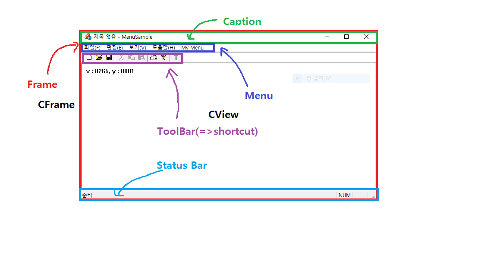
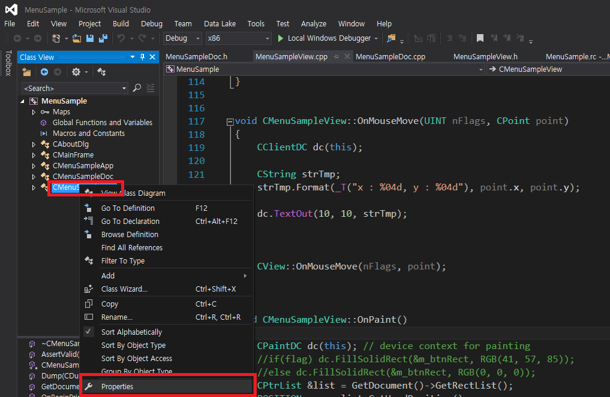
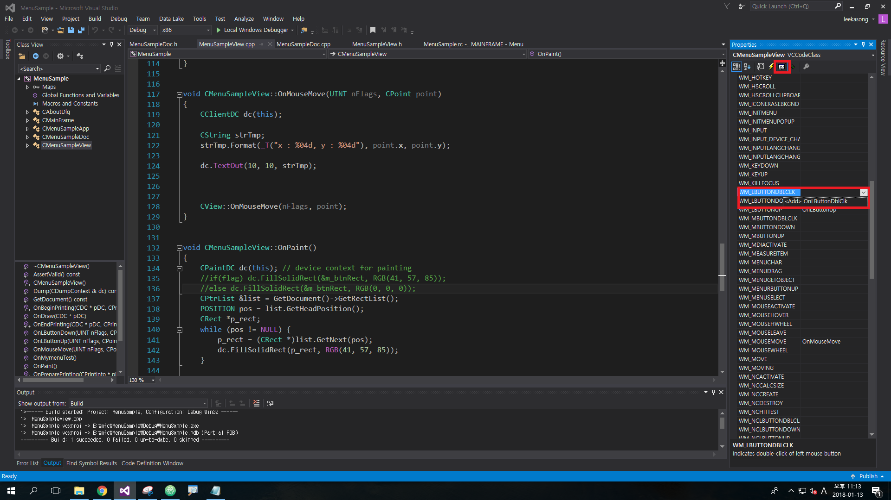
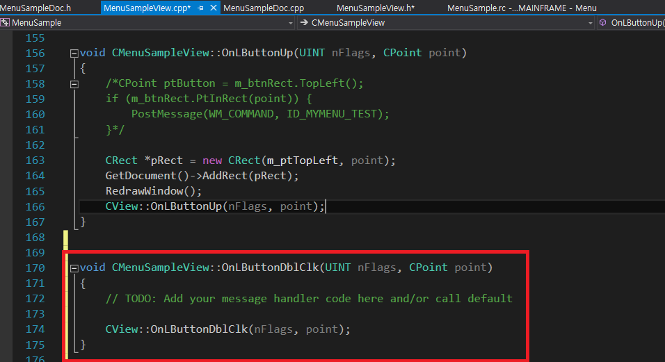
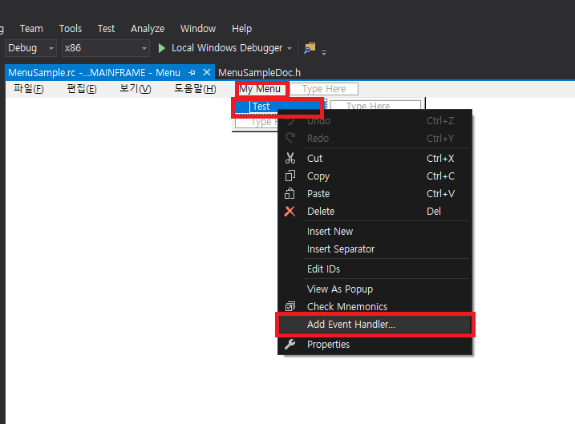
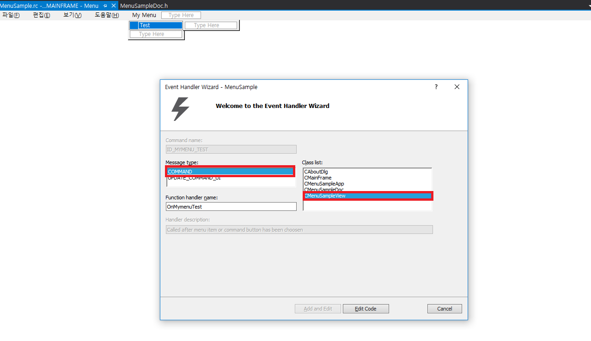
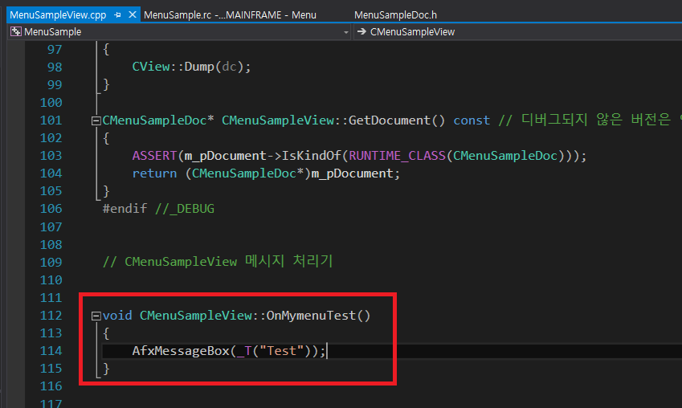
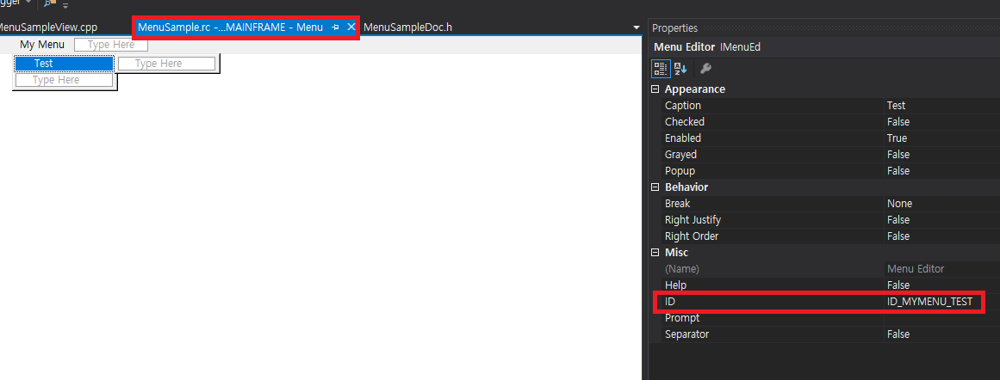
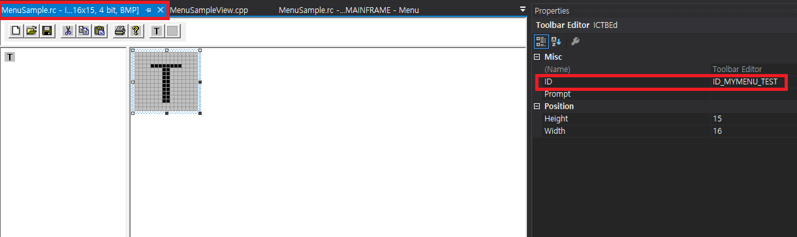

# MFC Structure 1

### MainFrame & View

* status bar and tool bar are docked to the MainFrame.

### Basic SDI programming

 

#### how to add message processor into MFC Class

step 1

 

step 2

 

step 3

 

#### how to add menu handler

step1

 

step2

 

step3

 

#### toolbar handler can be added using id

step1

 

step2

 

#### reference
https://www.youtube.com/channel/UCdGTtaI-ERLjzZNLuBj3X6A
