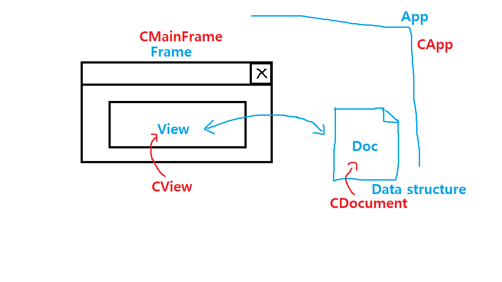

# MFC Structure 2

##### CApp has InitInstance()

InitInstance() instantiate MFC Classes such as CFrame, CView, CDocument etc.
And register window class, create many kinds of objects...

#### reference
https://www.youtube.com/channel/UCdGTtaI-ERLjzZNLuBj3X6A
