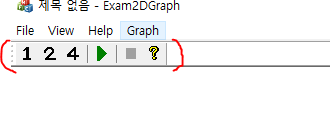
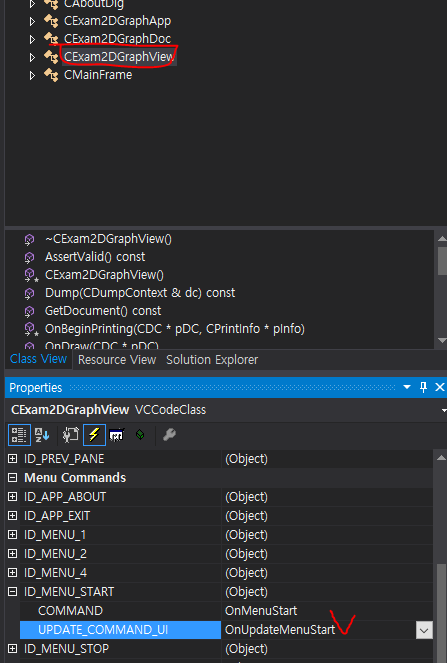

# Menu

* 리소스뷰에서 메뉴 항목을 클릭하여 편집
* ID, 핸들러, 단축키 등을 설정할 수 있음
* 메뉴핸들러는 CView, CMainFrame, CWinApp에서 모두 등록 가능하기 때문에 사용 목적에 따라 클래스를 고른다. 일반적으로 위와 같은 순서로 선택한다.  

```
void CExamMenu1View::OnTestFirst()
{
	AfxMessageBox(_T("눌렸음 첫째!"));
}


void CExamMenu1View::OnUpdateTestFirst(CCmdUI *pCmdUI)
{
	// TODO: Add your command update UI handler code here
}


void CExamMenu1View::OnRButtonDown(UINT nFlags, CPoint point)
{
	CMenu *p_menu = AfxGetMainWnd()->GetMenu();
	CMenu *p_sub_menu = p_menu->GetSubMenu(4);
	CPoint ptMenu = point;
    //팝업 메뉴 생성시, 좌표는 윈도우 좌표를 기준으로 생성해야 함
	ClientToScreen(&ptMenu);
	p_sub_menu->TrackPopupMenu(TPM_LEFTBUTTON | TPM_LEFTALIGN, ptMenu.x, ptMenu.y, this);
	CView::OnRButtonDown(nFlags, point);
}
```


### 메뉴 항목 제어.



* 툴바는 메뉴를 통해 제어
* 메뉴는 핸들러를 통해 제어한다.

#### 메뉴 항목 온오프하기
* 재생 버튼을 누르면 멈춤 버튼이 활성화되고, 재생버튼은 비활성화되게 한다.
* 이는 OnUpdateMenu 핸들러를 통해 구현한다.

  

```
void CExam2DGraphView::OnUpdateMenuStart(CCmdUI *pCmdUI)
{
	pCmdUI->Enable(m_bStart);
}


void CExam2DGraphView::OnUpdateMenuStop(CCmdUI *pCmdUI)
{
	pCmdUI->Enable(!m_bStart);
}
```


#### reference
Visual C++ 2008 MFC 윈도우 프로그래밍
