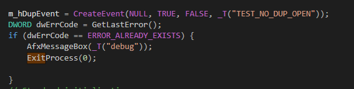
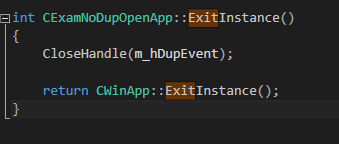

# 중복실행 방지하기
* 이름을 갖는 커널 객체를 통해 구현한다.
* 중복된 이름을 갖는 커널 객체를 생성한다면, 중복 실행이므로 종료하면 된다.
* 아래는 대화 상자에서 구현한 예제입니다.  

#### InitInstance()에서

  

```
m_hDupEvent = CreateEvent(NULL, TRUE, FALSE, _T("TEST_NO_DUP_OPEN"));
DWORD dwErrCode = GetLastError();
if (dwErrCode == ERROR_ALREADY_EXISTS) {
    AfxMessageBox(_T("debug"));
    ExitProcess(0);

}
```

#### ExitInstance()에서
  

```
int CExamNoDupOpenApp::ExitInstance()
{
	CloseHandle(m_hDupEvent);

	return CWinApp::ExitInstance();
}
```
