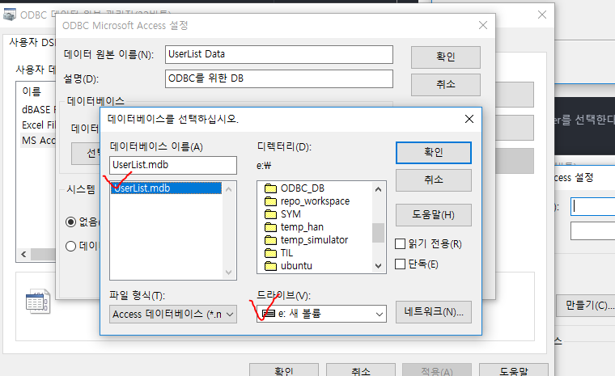

# ODBC 실습하기

* 검색에 "ODBC 데이터 원본"을 타이핑한다.

  

* MS ACCESS Database를 클릭하고 추가버튼을 누른다.

  

* Microsoft Access Driver를 선택한다.

  

* 디비 이름과 설명을 적는다.

  

* mdb 파일이 있는 경로를 선택하면 왼쪽 리스트에 자동으로 파일이 뜨는데, 그것을 선택하고 확인을 누른다.

### 프로젝트 생성

  

* 위 사진과 같이 설정하고 Data Source 클릭

  

* 위에서 만든 데이터베이스를 클릭하고 확인

  

* 로그인 이름이나 암호를 설정하지 않았다면 그냥 확인

  

* 정상적으로 설정했다면 위와 같이 테이블 이름이 떠야 한다.

#### reference
Visual C++ 2008 MFC 윈도우 프로그래밍
