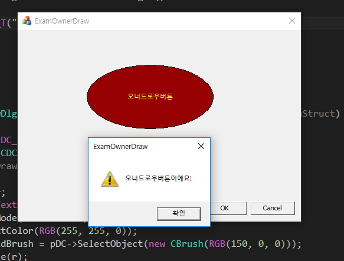
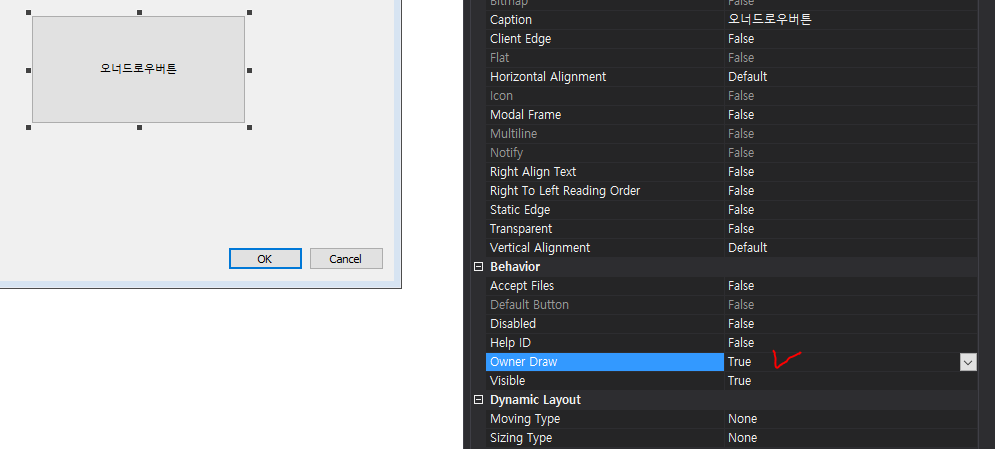
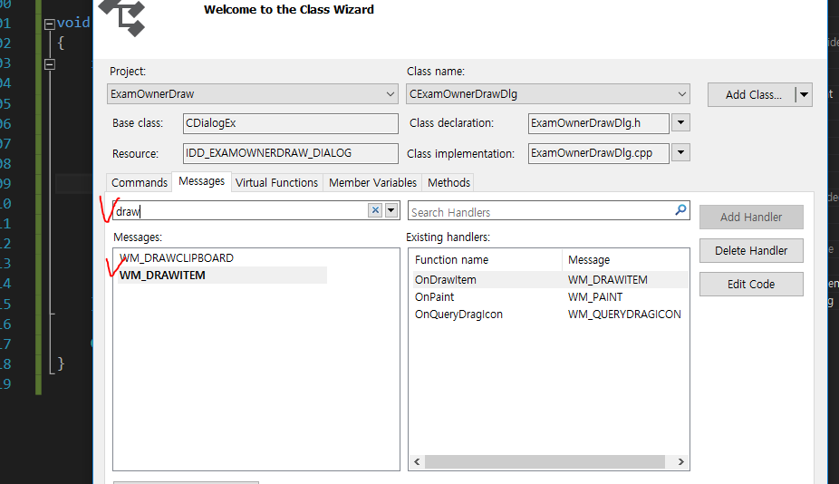
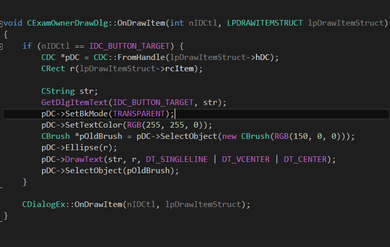

# Owner Draw
    

* 컨트롤이 자신의 형태를 알아서 그리는 게 아니라 프로그래머에게 맡기는 기술
* 이를 이용해 원하는 디자인의 컨트롤을 구현할 수 있다.


### 사용법
* 해당 컨트롤에 대해서 오너드로우 속성을 true로 바꾼다.  

  

* 클래스위저드로 WM_DRAWITEM에 대한 메시지 핸들러를 만든다.

  

* OnDrawItem() 핸들러에서 그리기 코드를 작성한다.
* 인자로 넘어오는 nIDCtl과 lpDrawItemStruct를 통해 해당 윈도우에 대한 아이디와 여러 정보를 알아낼 수 있다.  

  

```
void CExamOwnerDrawDlg::OnDrawItem(int nIDCtl, LPDRAWITEMSTRUCT lpDrawItemStruct)
{
	if (nIDCtl == IDC_BUTTON_TARGET) {
		CDC *pDC = CDC::FromHandle(lpDrawItemStruct->hDC);
		CRect r(lpDrawItemStruct->rcItem);

		CString str;
		GetDlgItemText(IDC_BUTTON_TARGET, str);
		pDC->SetBkMode(TRANSPARENT);
		pDC->SetTextColor(RGB(255, 255, 0));
		CBrush *pOldBrush = pDC->SelectObject(new CBrush(RGB(150, 0, 0)));
		pDC->Ellipse(r);
		pDC->DrawText(str, r, DT_SINGLELINE | DT_VCENTER | DT_CENTER);
		pDC->SelectObject(pOldBrush);
	}

	CDialogEx::OnDrawItem(nIDCtl, lpDrawItemStruct);
}
```

#### reference
http://www.tipssoft.com/bulletin/board.php?bo_table=FAQ&wr_id=645
