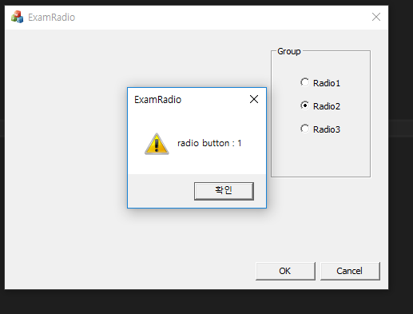

# RadioButton

* 라디오 버튼 추가  

  

* 첫번째 버튼만 group을 true학고, 컨트롤 변수 생성

  

* 아이디 순서 대로 지정 후, 아래 그림과 같이 작성  

  

  

* 핸들러 함수의 내용 작성

  

* 컨트롤 변수를 통해 선택된 값 가져온다.

  

#### reference
http://blog.naver.com/PostView.nhn?blogId=hextrial&logNo=60178968939
