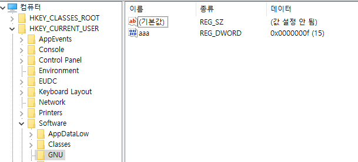

# 레지스트리 1

### 레지스트리 열기
```
void CExamRegiDlg::OnBnClickedButton1()
{
	HKEY hkSub;
	DWORD dwDisposition;
	int key_num = 15;

	// 해당 경로의 레지스트리를 open 한다.
	// 레지스트리를 성공적으로 open 하였다면 ERROR_SUCCESS값이 reg 에 저장된다.
	LONG lRes = RegOpenKeyEx(HKEY_CURRENT_USER, _T("Software\\GNU"), 0L, KEY_WRITE, &hkSub);
	if (ERROR_SUCCESS != lRes) {
		// 레지스트리를 열지 못했다면 새로 생성한다.
		lRes = RegCreateKeyEx(HKEY_CURRENT_USER, _T("Software\\GNU"), 0, _T(""), 0,
			KEY_READ | KEY_WRITE, NULL, &hkSub, &dwDisposition);
		if (ERROR_SUCCESS != lRes) return;
	}

	// 키 값을 입력한다.
	lRes = RegSetValueEx(hkSub, _T("AAA"), 0, REG_DWORD, (BYTE *)&key_num, sizeof(int));
	if (lRes == ERROR_SUCCESS) MessageBox(_T("등록 성공"));
	else MessageBox(_T("등록 실패"));

	RegCloseKey(hkSub);
}
```



### 레지스트리 삭제

```
void CExamRegiDlg::OnBnClickedButton3()
{
	HKEY hKeySub;
	if (RegOpenKeyEx(HKEY_CURRENT_USER, _T("Software\\GNU"), 0, KEY_ALL_ACCESS, &hKeySub)
		!= ERROR_SUCCESS) return;
	RegDeleteValue(hKeySub, _T("AAA"));

	RegCloseKey(hKeySub);

}
```

### 레지스트리 값 가져오기

```
void CExamRegiDlg::OnBnClickedButton2()
{
	HKEY hKeySub;
	DWORD data = 1;
	DWORD size = sizeof(DWORD);
	DWORD res = RegOpenKeyEx(HKEY_CURRENT_USER, _T("Software\\GNU"), 0, KEY_READ, &hKeySub);
	if (res != ERROR_SUCCESS) return;
	RegQueryValueEx(hKeySub, _T("AAA"), 0, NULL, (LPBYTE)&data, &size);

	CString str;
	str.Format(_T("%d"), data);
	AfxMessageBox(str);
	RegCloseKey(hKeySub);

}
```


#### reference
http://www.tipssoft.com/bulletin/board.php?bo_table=update&wr_id=54
