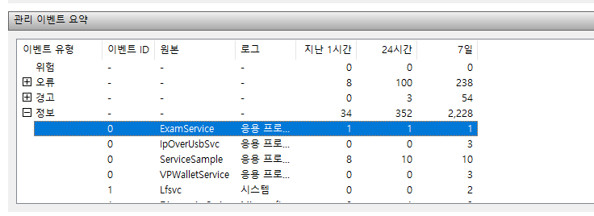
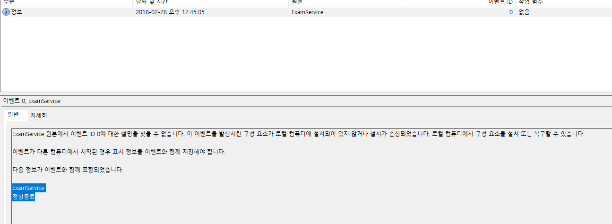

# 서비스

* 서비스는 시스템 프로세스라고 보면 된다.
* 만드는 방법은 정해져 있다.
* 디스패처에 서비스 메인을 등록하고, 서비스 메인에서 서비스 핸들러를 등록한다.
* 서비스 핸들러에서는 SCM이 호출할 때 변경되는 서비스 상태에 따라서 필요한 동작을 구현한다.
* 또한, 시스템 로그를 남겨서 서비스의 동작 상황을 체크할 수 있도록 ReportEvent()를 사용한다.  

### 기본 코드

```
#include <Windows.h>
//서비스 이름
#define SERVICE_NAME TEXT("ExamService")
SERVICE_STATUS_HANDLE g_hServiceStatus = NULL;
DWORD g_dwServiceState = 0;
HANDLE g_hEventExit = NULL;

void TestServiceMain(DWORD argc, LPTSTR *argv);
void LogPrint(LPTSTR szLog, WORD wEventType);
void SampleServiceHandler(DWORD dwOpcode);
void SetSampleServiceStatus(DWORD dwState, DWORD dwError, DWORD dwExError,
	DWORD dwAccept = SERVICE_ACCEPT_STOP | SERVICE_ACCEPT_PAUSE_CONTINUE);
void main() {
	//서비스메인 함수를 등록하기 위한 엔트리 생성
	SERVICE_TABLE_ENTRY DispatchTable[] =
	{
		{"ServiceSample", (LPSERVICE_MAIN_FUNCTION)TestServiceMain},
		{NULL, NULL}
	};
	//서비스 등록
	if (!::StartServiceCtrlDispatcher(DispatchTable)) {
		return;
	}
}

//서비스 메인
void TestServiceMain(DWORD argc, LPTSTR *argv) {
	DWORD dwRes = 0;

	//서비스 핸들러 등록
	g_hServiceStatus = ::RegisterServiceCtrlHandler(
		SERVICE_NAME, (LPHANDLER_FUNCTION)SampleServiceHandler);
	if (g_hServiceStatus == NULL) {
		LogPrint("Cannot install service control handler", EVENTLOG_ERROR_TYPE);
		return;
	}
	//초기화 상태로 명시
	SetSampleServiceStatus(SERVICE_START_PENDING, NO_ERROR, 0);

	g_hEventExit = ::CreateEvent(NULL, TRUE, FALSE, "SAMPLE_EXIT_EVENT");

	//초기화 끝내고 러닝 상태로 명시
	SetSampleServiceStatus(SERVICE_RUNNING, NO_ERROR, 0);

	::WaitForSingleObject(g_hEventExit, INFINITE);

	if (g_hEventExit != NULL) ::CloseHandle(g_hEventExit);

	LogPrint("정상종료", EVENTLOG_INFORMATION_TYPE);
	//종료 상태로 명시
	SetSampleServiceStatus(SERVICE_STOPPED, NO_ERROR, 0);

 }


void SetSampleServiceStatus(DWORD dwState, DWORD dwError, DWORD dwExError, DWORD dwAccept){
	SERVICE_STATUS ss;
	//서비스가 calling 프로세스를 독차지한다.
	ss.dwServiceType = SERVICE_WIN32_OWN_PROCESS;
	//서비스 상태를 받는다.
	ss.dwCurrentState = dwState;
	//서비스가 받아들일 명령을 명시한다.
	ss.dwControlsAccepted = dwAccept;
	//서비스 에러 코드를 넣는다.
	ss.dwWin32ExitCode = dwError;
	//dwWin32ExitCode가 ERROR_SERVICE_SPECIFIC_ERROR일 경우 이 값에 에러 코드가 담긴다.
	ss.dwServiceSpecificExitCode = 0;
	//서비스가 수행되면서 증가되는 값
	ss.dwCheckPoint = 0;
	//서비스 명령을 수행하는 데 요구되는 시간
	ss.dwWaitHint = 2000;

	if (dwError == ERROR_SERVICE_SPECIFIC_ERROR) {
		ss.dwServiceSpecificExitCode = dwExError;
	}

	g_dwServiceState = dwState;
	//서비스 상태를 변경한다.
	::SetServiceStatus(g_hServiceStatus, &ss);

}


//상태 변화시 호출되는 핸들러
//상태를 변화시키는 것은 SCM이다.
void SampleServiceHandler(DWORD dwOpcode) {
	if (dwOpcode == g_dwServiceState) return;

	switch (dwOpcode) {
	case SERVICE_CONTROL_PAUSE:
		SetSampleServiceStatus(SERVICE_PAUSE_PENDING, NO_ERROR, 0, 0);
		SetSampleServiceStatus(SERVICE_PAUSED, NO_ERROR, 0);
		LogPrint(TEXT("정상동작"), EVENTLOG_INFORMATION_TYPE);
		break;
	case SERVICE_CONTROL_CONTINUE:
		SetSampleServiceStatus(SERVICE_CONTINUE_PENDING, NO_ERROR, 0, 0);
		SetSampleServiceStatus(SERVICE_RUNNING, NO_ERROR, 0);
		LogPrint(TEXT("컨티뉴"), EVENTLOG_INFORMATION_TYPE);
		break;
	case SERVICE_CONTROL_STOP:
		SetSampleServiceStatus(SERVICE_STOP_PENDING, NO_ERROR, 0, 0);
		::SetEvent(g_hEventExit);

		break;
	case SERVICE_CONTROL_INTERROGATE:
		SetSampleServiceStatus(SERVICE_STOPPED, NO_ERROR, 0);

		break;
	default:
		SetSampleServiceStatus(g_dwServiceState, NO_ERROR, 0);
		break;
	}
}

void LogPrint(LPTSTR szLog, WORD wEventType) {
	TCHAR *lpszStrings[2];
	TCHAR szMsg[256];
	HANDLE hEventSource;

	DWORD dwError = ::GetLastError();
	hEventSource = ::RegisterEventSource(NULL, SERVICE_NAME);

	if (wEventType == EVENTLOG_ERROR_TYPE) {
		wsprintf(szMsg, TEXT("%s [Error code : %d]"), SERVICE_NAME, dwError);
	}
	else {
		wsprintf(szMsg, TEXT("%s"), SERVICE_NAME);
	}

	lpszStrings[0] = szMsg;
	lpszStrings[1] = szLog;

	if (hEventSource != NULL) {
		//서비스의 이름으로 시스템에 이벤트 로그를 남긴다.
		::ReportEvent(
			hEventSource,
			wEventType,
			0,
			0,
			NULL,
			2,
			0,
			(const char **)(LPTSTR *)lpszStrings,
			NULL
		);

		::DeregisterEventSource(hEventSource);
	}
}
```

### 서비스 설치 및 삭제
* 위 코드는 서비스 프로세스 자체의 루틴이고, 이를 시스템에 설치하고 삭제하기 위한 프로세스가 필요하다.

#### 서비스 프로그램 설치

* SCM을 열고, 서비스 프로그램의 경로를 얻는다.
* CreateService()로 서비스를 만들고, StartService()를 통해 실행시킨다.

```
void CServiceManagerDlg::OnBnClickedButtonInstall()
{
	SC_HANDLE hServiceManager = NULL;
	SC_HANDLE hService = NULL;
	TCHAR curPath[MAX_PATH + _MAX_FNAME] = { 0 };
	hServiceManager = ::OpenSCManager(NULL, NULL, SC_MANAGER_ALL_ACCESS);
	if (hServiceManager == NULL) {
		AfxMessageBox(_T("서비스매니저에 접근할 수 없습니다."));
		return;
	}
	GetCurrentDirectory(MAX_PATH + _MAX_FNAME, curPath);
	_tcscat(curPath, _T("\\ExamService.exe"));
	hService = CreateService(
		hServiceManager,
		_T("ExamService"),
		_T("서비스 예제"),
		SERVICE_ALL_ACCESS,
		SERVICE_WIN32_OWN_PROCESS,
		SERVICE_DEMAND_START,
		SERVICE_ERROR_NORMAL,
		curPath,
		NULL,
		NULL,
		NULL,
		NULL,
		NULL
	);
	if (hService == NULL) {
		DWORD err = GetLastError();
		CString str;
		str.Format(_T("Error code : %d\n"), err);
		AfxMessageBox(str);

	}
	else {
		SERVICE_DESCRIPTION sd;
		sd.lpDescription = _T("서비스 프로그램 예제입니다.");
		ChangeServiceConfig2(hService, SERVICE_CONFIG_DESCRIPTION, &sd);
		AfxMessageBox(_T("서비스가 생성되었습니다."));
		::StartService(hService, 0, NULL);
	}

	CloseServiceHandle(hService);
	CloseServiceHandle(hServiceManager);
}
```

#### 서비스 프로그램 삭제

* 기존에 있는 서비스 핸들을 얻어오기 위해 OpenService()를 사용한다
* QueryServiceStatus()로 해당 서비스의 상태를 받아온 후 STOPPED 상태가 아니면 서비스를 종료한다.
* 종료는 ControlService()를 통해 STOPPED 명령을 내리면 된다.
* 마지막으로 해당 서비스를 삭제하기 위해 DeleteService()를 호출한다.

```
void CServiceManagerDlg::OnBnClickedButtonUninstall()
{
	SERVICE_STATUS ss;
	SC_HANDLE hServiceManager = NULL;
	SC_HANDLE hService = NULL;

	/////////////////////////////////////////////////////////////////////////
	//1. 서비스 (Service Control Manager)매니저에 연결
	hServiceManager = ::OpenSCManager(NULL, NULL, SC_MANAGER_ALL_ACCESS);
	if (hServiceManager == NULL)
	{
		AfxMessageBox(_T("서비스 메니저에 접근할 수 없습니다."));
		return;
	}

	/////////////////////////////////////////////////////////////////////////
	//2. 시스템에 등록되어 있는 서비스를 오픈
	hService = ::OpenService(hServiceManager, _T("ExamService"), SERVICE_ALL_ACCESS);
	if (hService == NULL)
	{
		::CloseServiceHandle(hServiceManager);
		AfxMessageBox(_T("예제 서비스를 열지 못했습니다."));
		return;
	}

	/////////////////////////////////////////////////////////////////////////
	//3. 서비스 중지
	::QueryServiceStatus(hService, &ss);
	if (ss.dwCurrentState != SERVICE_STOPPED)
	{
		::ControlService(hService, SERVICE_CONTROL_STOP, &ss);
		::Sleep(1000);
	}

	/////////////////////////////////////////////////////////////////////////
	//4. 서비스를 시스템에서 제거하고 함수종료
	if (::DeleteService(hService))	AfxMessageBox(_T("예제 서비스가 제거되었습니다."));
	else							AfxMessageBox(_T("예제 서비스 제거에 실패했습니다."));

	CloseServiceHandle(hServiceManager);
	CloseServiceHandle(hService);
}

```

### 이벤트 뷰어

* ReportEvent()로 시스템에 로그를 남길 수 있다.
* 이 로그는 관리도구 - 이벤트 뷰어에서 확인할 수 있다.


  

  

#### reference
윈도우 프로그래밍 - 최호성
