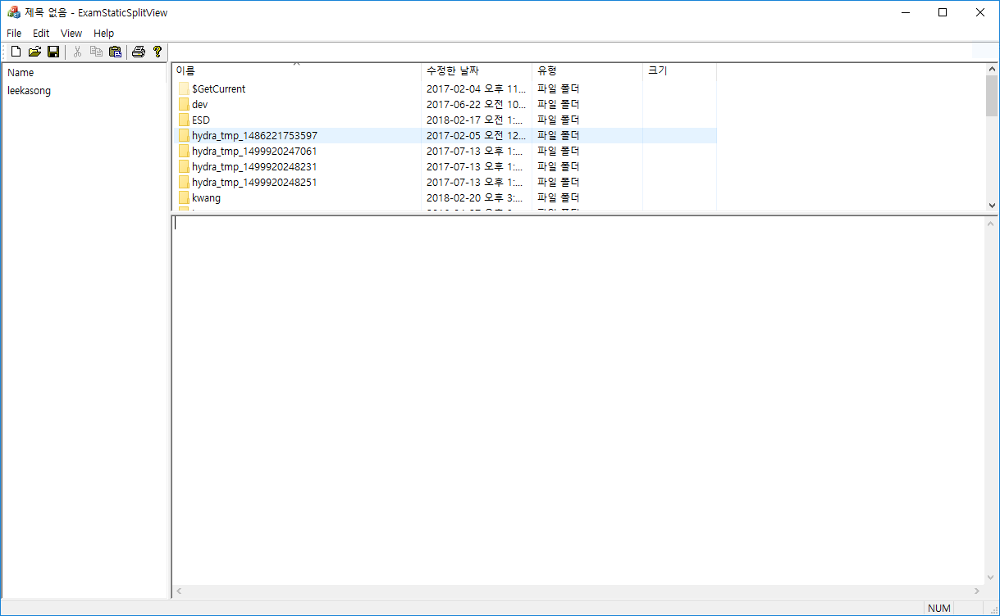

# 분할 뷰

### 동적 분할 뷰
* 사용자가 뷰의 크기를 움직여야 나타남

### 정적 분할 뷰
* 윈도우 생성시 설정한 크기만큼 분할되고, 사용자가 조정할 수도 있음



* MainFrame.h에 분할 윈도우 객체 선언
* OnCreateClient()에서 초기화 작업
* CreateStatic()으로 분할 윈도우 객체 생성
* CreateView()로 분할된 뷰 영역(패인)에 View를 부착
* SetActiveView()로 최초에 활성화될 패인 선택

```
BOOL CMainFrame::OnCreateClient(LPCREATESTRUCT lpcs, CCreateContext* pContext)
{
	if (!m_wndSplitHor.CreateStatic(this, 1, 2)) return FALSE;
	if (!m_wndSplitHor.CreateView(0, 0, RUNTIME_CLASS(CLeftListView), CSize(200, 200), pContext))
		return FALSE;

	if (!m_wndSplitVer.CreateStatic(&m_wndSplitHor, 2, 1, WS_CHILD | WS_VISIBLE,
		m_wndSplitHor.IdFromRowCol(0, 1)))
		return FALSE;

	if (!m_wndSplitVer.CreateView(0, 0, RUNTIME_CLASS(CTopHtmlView), CSize(100, 100), pContext))
		return FALSE;
	if (!m_wndSplitVer.CreateView(1, 0, RUNTIME_CLASS(CBottomEditView), CSize(200, 100), pContext))
		return FALSE;

	SetActiveView((CView *)m_wndSplitHor.GetPane(0, 0));

	return TRUE;

	//CFrameWnd::OnCreateClient(lpcs, pContext);
}

```

#### CreateStatic()
* pParenWnd : 분할 윈도우의 부모 윈도우
* nRows, nCols : 분할할 행, 열

#### CreateView()
* row, col : 어느 패인에 붙일지 명시하는 인덱스
* pViewClass : CRuntimeClass 구조체의 주소.  RUNTIME_CLASS 매크로에 생성할 뷰의 클래스 이름을 주면 반환
* sizeInit : 최초 사이즈
* pContext : 일반적으로 OnCreateClient()의 인자를 넘겨준다.

#### GetPane()
* 특정 패인에 속하는 뷰 윈도우의 주소를 반환

#### reference
Visual C++ 2008 MFC 윈도우 프로그래밍
